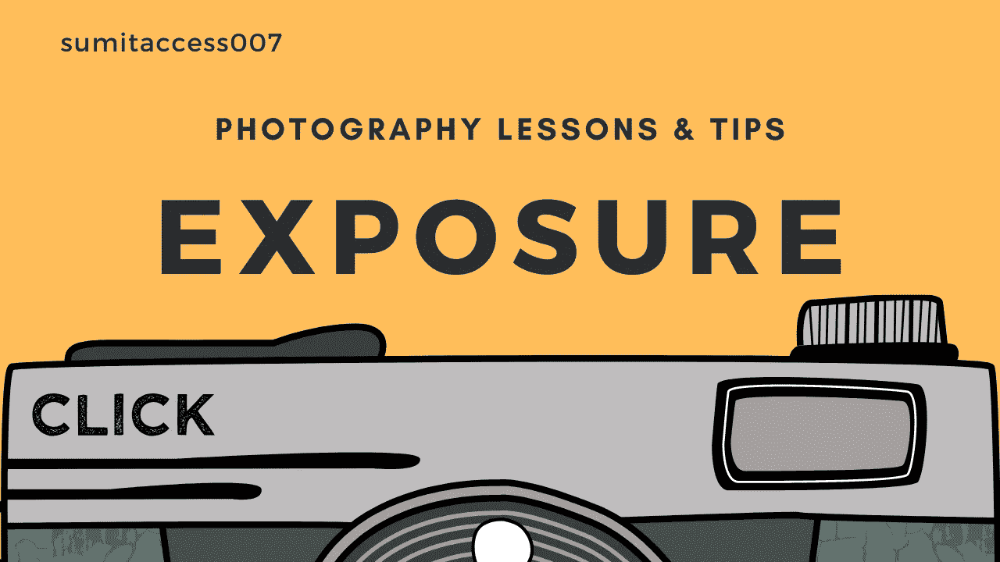
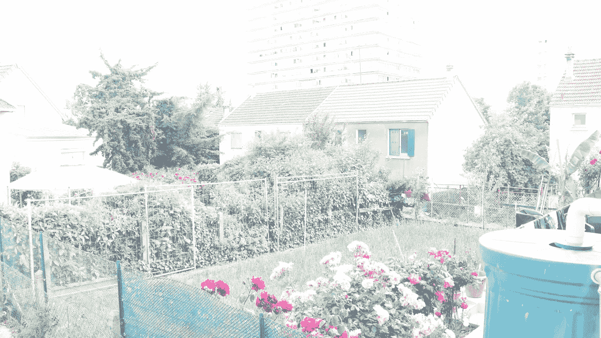
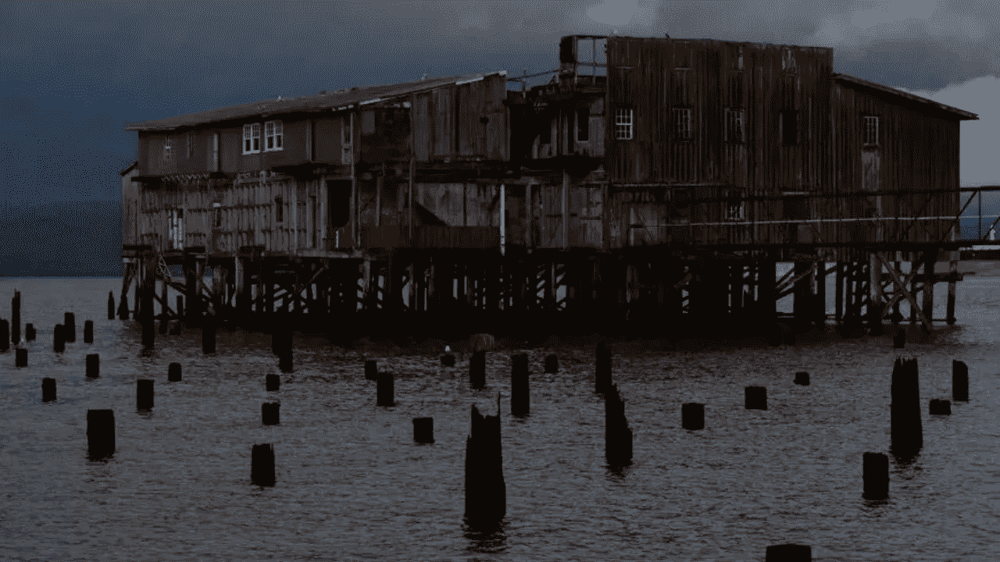
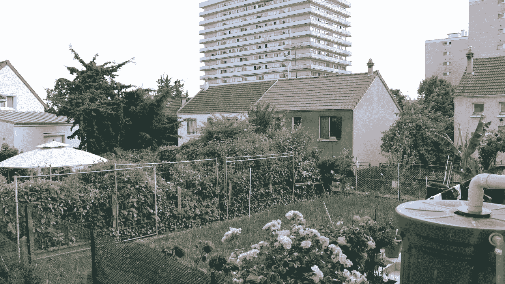
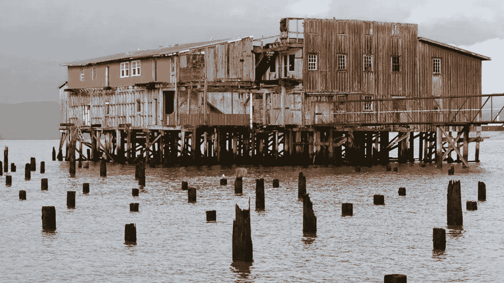
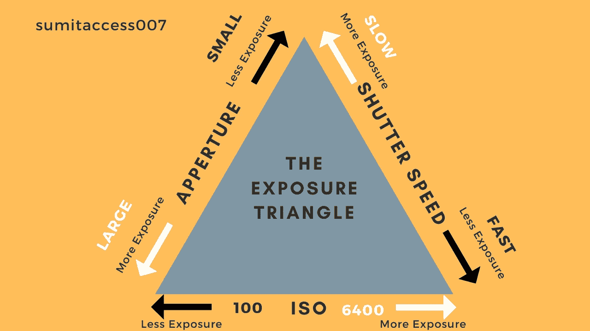
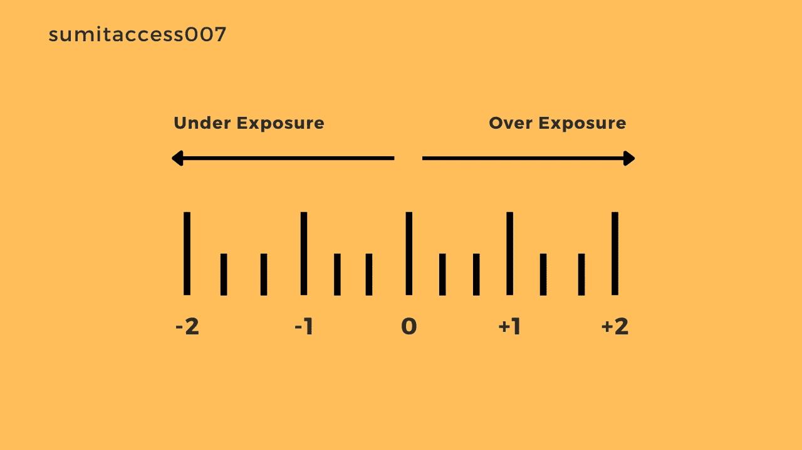
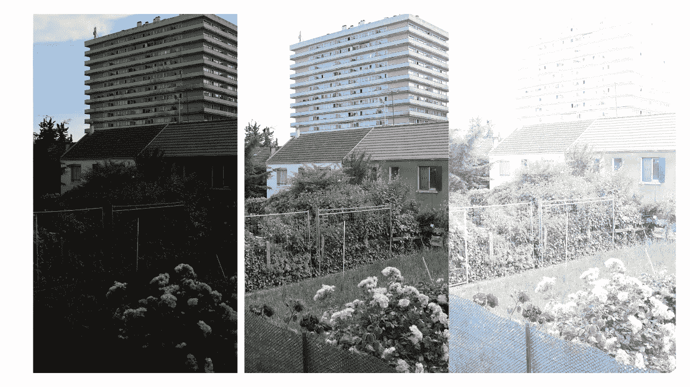
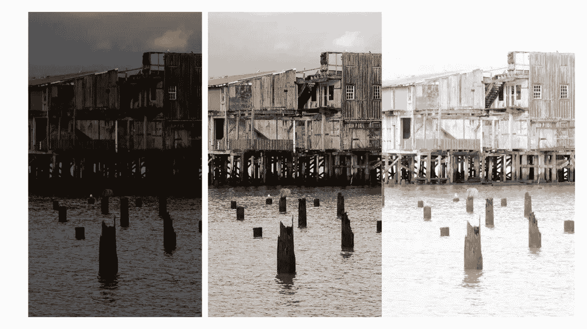

# 摄影 101——了解曝光

> 原文：<https://medium.com/geekculture/photography-101-understanding-exposure-df6eaade7c55?source=collection_archive---------8----------------------->

## 摄影中曝光是什么意思？

## 摄影生活——什么是曝光？

**Photography Life — What Is Exposure ?**

H *ere 在这篇文章中你将了解到* ***曝光*** *。而且我们会明白* ***摄影的不同方面*** *如何走到一起形成一个* ***曝光*** *。以及不同的环境如何对结果产生不同的影响。*我们的目标是了解拍照时我们实际在做什么。

这是一个摄影学习系列，在这里我分享了我自己的经验，我从其他专业摄影师那里学到的知识。因此，为了让你了解摄影，我们将利用大量的例子，这将打开你的眼睛。如果你准备好了，那么享受这篇文章吧。如果你有不明白的地方，不要犹豫，留下你的评论。

> 提示:重复是理解的关键。

# 什么是曝光？

曝光量实际上是我们允许到达光敏摄影介质——胶片或数字传感器——的光量。或者拍摄照片或视频时允许照射到相机图像传感器的光量。

正确曝光图像就是在场景中捕捉适量的光线。我们允许的光越多，图像看起来就越亮，反之亦然，我们允许的光越少，图像就越暗。

照片中的**—我们处理一次曝光。**

****在视频中**——我们处理持续的曝光流(我们也称之为**帧速率**——在后续系列文章中解释)**

****

****Over Exposed Image — Too Bright****

****

****Over Exposed Image — Too Bright (From shotkit.com)****

**这张图像太亮了，用摄影术语来说，我们称之为曝光图像上的**。****

****

****Under Exposed Image — Too Dark****

****

****Under Exposed Image — Too Dark (From shotkit.com)****

**另一方面，这个图像太暗，用摄影术语来说，我们称它为曝光图像下的**。****

****

****Well Exposed Image — Balanced****

****

****Well Exposed Image — Balanced (From shotkit.com)****

**这就是我们想要捕捉的——我们的目标是捕捉**曝光良好的图像**，即具有良好的光线平衡。**

# **曝光是如何工作的？**

**曝光由相机中的三个主要因素控制——曝光有三个因素，这是我们在这里要学习的。所以实际上我们需要控制三样东西来使图像变暗或变亮。**

1.  **光圈—控制有多少光线照射到相机传感器上**
2.  **快门速度—控制光线照射相机传感器的时间**
3.  **ISO —控制传感器对光线的敏感度**

****

****How Does Exposure Work — The Exposure Triangle****

> **我将占用您 10-15 分钟的时间，并要求您浏览接下来的三篇文章(链接如下),我保证您会完全理解暴露的因素，因为所有这三个因素都有更详细的讨论。**

# **我们如何知道曝光设置是否正确？**

**为此，我们将看看相机内部的**曝光计**。通过查看仪表刻度，您应该会看到中间有一个零，零的两侧分别有一个和两个数字。**

**仪表刻度上的每个数字代表一个**光阑**，这是我们拍照时让光量增加一倍或一半。这些是光的停止点。**

**因此，如果我们在摄影中听到一个人增加了一个光圈的曝光，这仅仅意味着通过减少光圈来捕捉两倍于前一次拍摄的光线或一半的光线。**

****

****Exposure Meter****

****过度曝光** —移动到零的右侧会产生过度曝光的图像。**

****曝光不足** —移动到零的左侧会产生曝光不足的图像。**

**我们在相机中有不同类型的测光模式，这些模式会影响您的相机感应光线的方式以及在测光标尺上的显示。**

# **目标—正确的曝光图像**

**所以目标是适当地曝光图像。但是有时候曝光不足很有效，因为一旦我们过度曝光任何东西，尤其是皮肤，我们就无法恢复这些信息。但另一方面，如果镜头曝光不足，当我们在编辑过程中将其变亮时，它会很快开始变得模糊。**

**因此，正确的曝光对照片的美观至关重要。**

****

****Different Exposures****

****

****Different Exposures****

# **结论-**

***了解曝光我们知道，我们的目标应该始终是捕捉光线平衡良好的图像。曝光实际上随每个场景而变化，所以我们可以说没有所谓的“正确”曝光。因此，当曝光设置正确时，其中一个因素/设置的任何变化都需要一个或多个其他设置的相应变化，为了控制所有这些设置，我们需要在手动模式下拍摄。***

***我们必须注意的另一件事是，较长的曝光时间会导致更亮的图像和更多的运动模糊。而较短的曝光时间导致较暗的图像和较少的模糊。***

****希望你喜欢，谢谢****

**如果你喜欢阅读这样的文章，并希望支持我成为一名作家，请[考虑成为一名媒体成员](https://sumitaccess007.medium.com/membership)。每月支付 5 美元，你就可以无限制地访问 Medium 的内容。如果你通过我的链接注册，我会收到一小笔佣金。**

****下篇—** [摄影 102 —理解光圈【上篇】](/geekculture/photography-102-understanding-aperture-part-1-48c5c5c62cfa)**