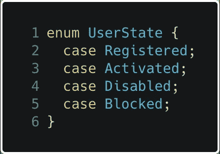
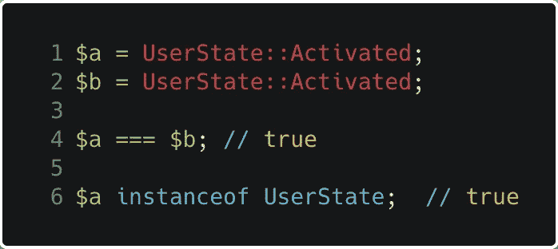
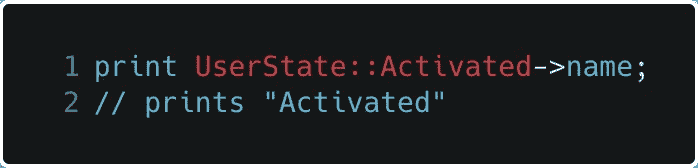
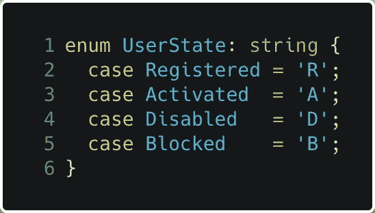
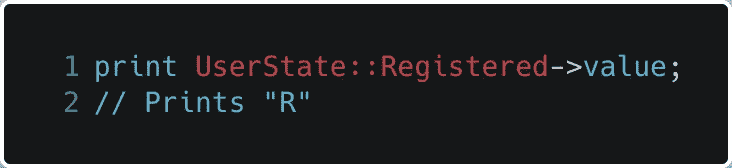
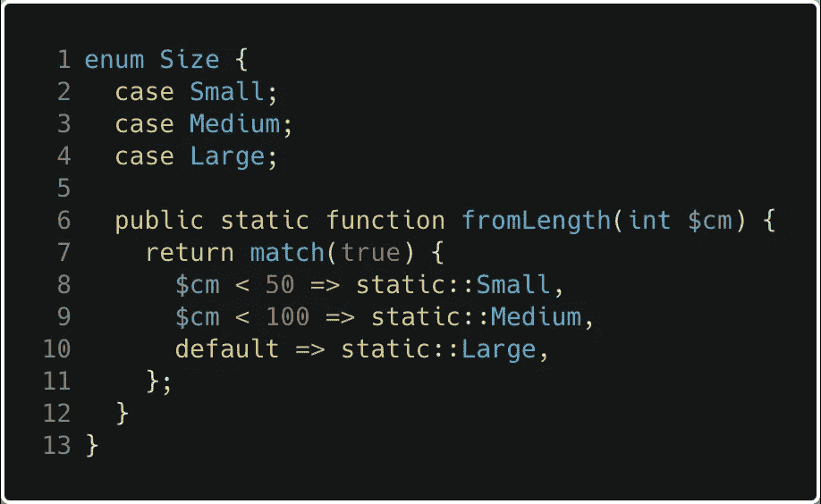
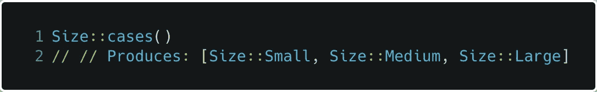

# PHP 8.1 —欢迎枚举

> 原文：<https://medium.com/geekculture/php-8-1-welcome-enumeration-5b9ed1063ec0?source=collection_archive---------11----------------------->

Photo by [SpaceX](https://unsplash.com/@spacex?utm_source=medium&utm_medium=referral) on [Unsplash](https://unsplash.com?utm_source=medium&utm_medium=referral)

这是一个软件开发人员的故事，一个非常普通的人，过去用 Java 写代码，喜欢用枚举来定义一个封闭的数据集。

同一个开发人员有一天开始使用 PHP，并意识到他们丢失了，这让他很难过:(

但是，开发人员终于不再难过了，因为 PHP 8.1 版本给语言增加了枚举功能。

# 它是如何工作的？

枚举类似于类，它定义了一种新的类型，这种类型有固定的、数量有限的可能允许值。

这个声明创建了一个新的简单枚举类型`UserState`，它有四个有效值:`UserState::Registered`、`UserState::Activated`、`UserState::Disabled`和`UserState::Blocked`。

可以根据枚举类型对函数进行类型检查，在这种情况下，只能传递该类型的值。

默认情况下，事例本身没有标量值支持。也就是`User::Registered`不等于 0。相反，每种情况都由同名的单例对象支持。

这种没有相关数据的事例称为*纯事例*，仅包含纯事例的枚举称为*纯枚举*。

所有案例都有一个只读属性`name`，这是案例本身的区分大小写的名称。这在很大程度上是一个实现工件，但也可以用于调试目的。

## 支持枚举

默认情况下，枚举事例没有等价的标量。然而，在有些情况下，枚举的案例需要能够*往返*到数据库或类似的数据存储，因此具有一个内置的标量*(因此是平凡的可串行化的)*等价的内在定义是有用的。

若要为枚举定义标量等效项，语法如下:

具有标量等价的情况称为支持情况，因为它由更简单的值“支持”。包含所有支持案例的枚举称为“支持枚举”支持的枚举可能只包含支持的事例。纯枚举可能只包含纯事例。

支持的枚举可以由类型`int`或`string`支持，一个给定的枚举一次只支持一种类型。如果一个枚举被标记为具有标量等价，那么**所有情况**都必须有一个明确定义的唯一标量等价。

没有自动生成的标量等价物*(例如，连续整数)*。价值案例必须是唯一的；两个支持的枚举事例不能有相同的等效标量。

值案例有一个额外的只读属性`value`，它是定义中指定的值。

为了将`value`属性强制为只读，不能将变量指定为对它的引用。

Backed enums 实现了一个内部的`BackedEnum`接口，它公开了两个额外的方法:

*   `from(int|string): self`将接受一个标量并返回相应的枚举例。如果找不到，它会抛出一个`ValueError`。这主要在输入标量可信且缺少枚举值应被视为应用程序停止错误的情况下有用。
*   `tryFrom(int|string): ?self`将接受一个标量并返回相应的枚举例。如果没有找到，它将返回`null`。这主要在输入标量不受信任并且调用者想要实现他们自己的错误处理或缺省值逻辑的情况下有用。

## 方法

枚举可以包含方法，也可以实现接口。如果一个枚举实现了一个接口，那么该接口的任何类型检查也将接受该枚举的所有情况。

方法可以是公共的、私有的或受保护的，尽管实际上私有的和受保护的是等价的，因为不允许继承。

## 静态方法

枚举也可以有静态方法。对枚举本身使用静态方法主要是为了替代构造函数:

静态方法可以是公共的、私有的或受保护的，尽管实际上私有的和受保护的是等价的，因为不允许继承。

## 价值列表

纯枚举和后台枚举都实现了一个名为`UnitEnum`的内部接口。`UnitEnum`包含一个静态方法`cases()`，它按照声明的顺序返回所有已定义案例的打包数组。

# 最后的艰难

我希望这篇文章能帮助你们中的一些人了解枚举的潜力，我认为这是对语言的一个很好的补充，我很想知道这个新的构造将如何用于我们每个人每天都在使用的库，以创建伟大的产品！

感谢您的阅读，并随时添加关于您的体验的评论:)

# 资源

*   [https://wiki.php.net/rfc/enumerations](https://wiki.php.net/rfc/enumerations)
*   [https://github.com/php/php-src/pull/6489](https://github.com/php/php-src/pull/6489)
*   [https://carbon.now.sh/](https://carbon.now.sh/)