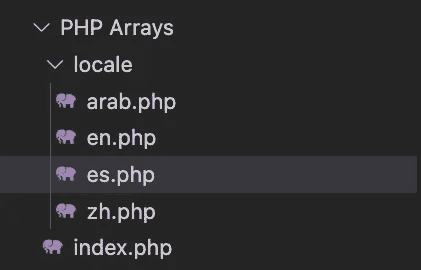
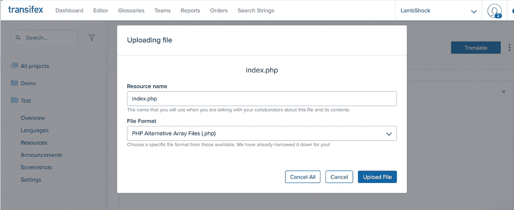
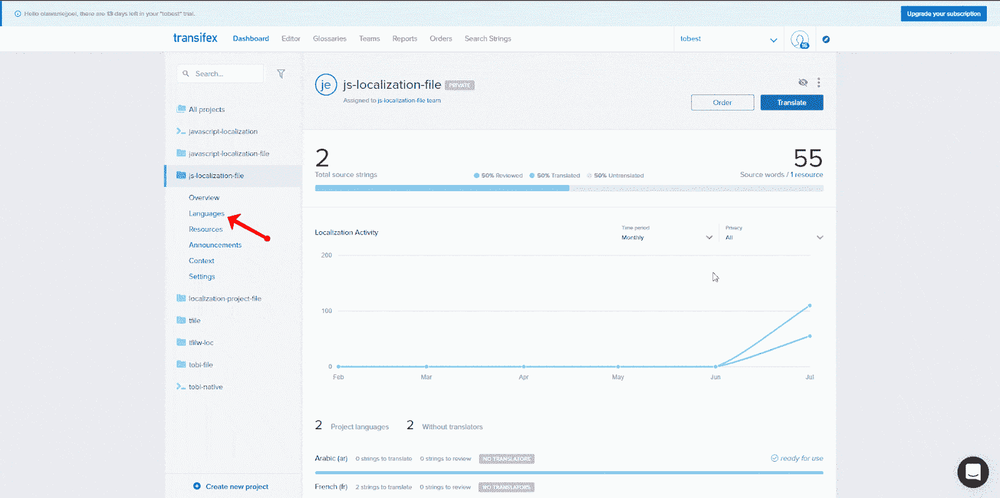

# PHP 本地化:终极指南

> 原文：<https://medium.com/geekculture/php-localization-the-ultimate-guide-ed8498510aa?source=collection_archive---------14----------------------->


PHP 是软件开发领域中一种稳定且公认的编程语言。尽管有来自其他后端编程语言(如 Node.js、Python、Ruby 等)的许多竞争，但目前部署或仍在开发中的许多应用程序都是在没有使用框架的情况下用平面 PHP 构建的，这在一定程度上是 PHP 本地化流行的原因。

由于 PHP 语言的流行，学习和了解 PHP 中的本地化技术是每个开发人员或开发团队必须考虑和采用的一个非常重要的过程。

这就是为什么在这篇文章中，我们将学习不同的方法来实现 PHP 的本地化。

# 什么是本地化？

[本地化(L10n)](https://www.transifex.com/blog/2021/what-is-localization/) 是调整内容以适应特定位置的过程，以便该位置的目标受众能够理解所述内容。简而言之，本地化意味着以一种能够处理多种地点、语言和地区的方式来设计软件。

同样重要的是要注意，本地化不只是停留在语言上。它还可以用于处理其他形式的媒体，如图像、数字格式、日期格式、货币等。

当谈到 PHP 本地化时，有几种不同的方法可以使用。

不可否认，选择正确的工具、框架、方法或库可能有点令人困惑。

在这个循序渐进的指南中，您将了解到关于 PHP 本地化的所有知识。

# 本地化 PHP 项目的不同方法

在这一节中，我们将继续通过展示以下方法来探索如何实现 PHP 项目的本地化:

1.  PHP 数组
2.  在 PHP 中定义语句
3.  基于 Transifex 文件的方法

# PHP 数组

使用数组对 PHP 项目进行本地化是一种已经存在很长时间的方法。

为了使这种方法有效，您必须为您要将内容翻译成的每种语言创建一个相应的数组，例如，用于西班牙语、阿拉伯语、葡萄牙语等等的数组。

然后，这些数组用于将源语言或键映射到本地化内容。

# 用 PHP 数组进行纯文本翻译

我们将在这里看一个特殊的用例，我们将实现四种不同语言的本地化，包括:英语、中文、阿拉伯语和西班牙语。英语将是这里的基础语言，因为它是大多数应用程序和系统的主要语言。每个数组使用一个单独的 PHP 文件，以增加可读性。然而，同一个文件也可以用来存储所有的数组。

在这个例子中，我们将用 PHP 数组将句子“欢迎来到本教程”翻译成上面提到的所有语言。首先，创建一个类似下图的文件结构:



请注意，**阿拉伯语**、**英语**、**英语**和**中文**分别是阿拉伯语、英语、西班牙语和汉语的地区代码。在**index.php**文件中，您将创建一个包含下拉列表的简单表单，以确保用户可以轻松选择语言。

```
<form name="langSelect" action="" method="get" > <select name="langID" id="langID" > <option>Select Language</option> <option value="arab">Arabic</option> <option value="zh">Chinese</option> <option value="en">English</option> <option value="es">Spanish</option> </select> <br/><br/> <button type="submit">Submit</button></form>
```

# 创建翻译文件

## 数组/区域设置/en.php

​​

```
<?php $langArray = array( "welcome" => "Welcome to the tutorial", );?>
```

**PHP-Array/locale/zh . PHP**

```
<?php $langArray = array( "welcome" => "欢迎使用本教程", );?>
```

**PHP-Array/locale/Arab . PHP**

```
<?php $langArray = array( "welcome" => "مرحبًا بكم في البرنامج التعليمي", );?>
```

**PHP-Array/locale/es . PHP**

```
<?php $langArray = array( "welcome" => "Bienvenida al tutorial", );?>
```

在这里，我们创建了一个名为 **langArray** 的数组，并将键映射到我们所有四种语言中的相应字符串。

接下来，我们将返回到 **PHP-Array** 文件夹中的 index.php 文件，让它显示“欢迎使用教程”行。内容的语言应该根据用户从下拉列表中选择的语言进行更改。为此，让我们将下面的 PHP 代码片段添加到**index.php**文件中。

```
<?php if (!isset($_GET['langID'])) $lang = 'en'; else $lang = $_GET['langID']; include('locale/'. $lang . '.php'); echo $langArray['welcome'];?>
```

在这里，您可以获取所选语言的代码并导入特定的翻译文件。最后，我们从导入的文件中获得了“welcome”键的内容。

# 基于文件的 PHP 本地化方法

顾名思义，基于文件的本地化意味着您必须以文件的形式提取您的内容，并将其上传到 Transifex [翻译管理系统(TMS)](https://www.transifex.com/blog/2021/what-is-a-translation-management-system/) 。

然后，您通常会翻译内容，从 TMS 下载回来，上传回您的应用程序/网站，并部署更改。

如上所述，在本地化和内部化以适应多种语言的过程中，您的方法可能是在不使用库、CDN 或几次配置练习的情况下对代码进行本地本地化。这个本地过程非常可行，因为它涉及到创建由几个人翻译成不同语言的本地文件。

对于“*PHP 数组的纯文本翻译，*”中的同一个例子，Transifex 允许上传一个源文件，该文件是我们的演示内容的英文版本**(en.php)**。

在这个初始阶段之后，您可以使用 Transifex 来翻译您的内容，之后您可以下载它并将更改部署到您的网站或应用程序。

我们将看看如何在 Transifex 上创建一个基于文件的项目，然后上传我们的源内容进行翻译。Transifex 会负责翻译，然后我们可以下载翻译后的内容。

# 如何在 Transifex 上创建基于文件的项目

进入 Transifex 世界的第一步是创建一个账户。你可以[用你的 GitHub、Google 或 LinkedIn 账户注册](https://www.transifex.com/signup/)，15 天免费，开源项目永远免费。

创建帐户后，您需要创建一个项目。确保选择“基于文件”作为这部分的项目类型，然后您可以按照自己认为合适的方式命名您的项目。


最后，您必须指定您的应用程序的主要语言和我们将翻译成的语言。我们将使用**英语**作为本指南的主要语言，使用**阿拉伯语**、**西班牙语**和**中文**作为我们的目标语言。

**注意**:取消勾选询问您是否要自动添加演示文件的复选框，除非您想先用它来测试 Transifex 平台。

完成后，点击“**创建项目**按钮。

接下来，我们将引导您进入下一页，在这里您可以上传任何支持格式的源文件。但是我们会使用 [PHP](https://developers.transifex.com/docs/cakephp-file-based) 文件[格式](https://docs.transifex.com/formats/json)。

创建项目后，选择**上传文件**按钮上传解压后的 PHP 文件:

完成后，您就可以开始将内容翻译到编辑器中了！



**从 Transifex 下载您翻译的内容**

上述过程完成后，我们可以在成功翻译成应用程序的内容后继续下载翻译后的文件。

要下载已翻译的文件，请导航到您项目的语言选项卡，单击该文件，然后选择“**仅下载已审阅的翻译**”Transifex 将允许我们下载您的翻译语言的 PHP 文件:



**注意**:请务必将带有地区名称的文件保存在我们之前创建的` **lang** 文件夹中，例如`**。/lang/ar.php** `。

# 结论

我们已经成功地用 PHP 数组实现了 PHP 本地化，并向您展示了使用 Transifex 的基于文件的方法实现本地化的最佳方式。基于文件的方法对大型和小型项目都有效。

有关我们支持的本地化文件格式的更多信息，请随时查看[开发者文档](https://docs.transifex.com/formats/introduction)！

本文原载于页面[。](https://www.transifex.com/blog/2022/php-localization/)