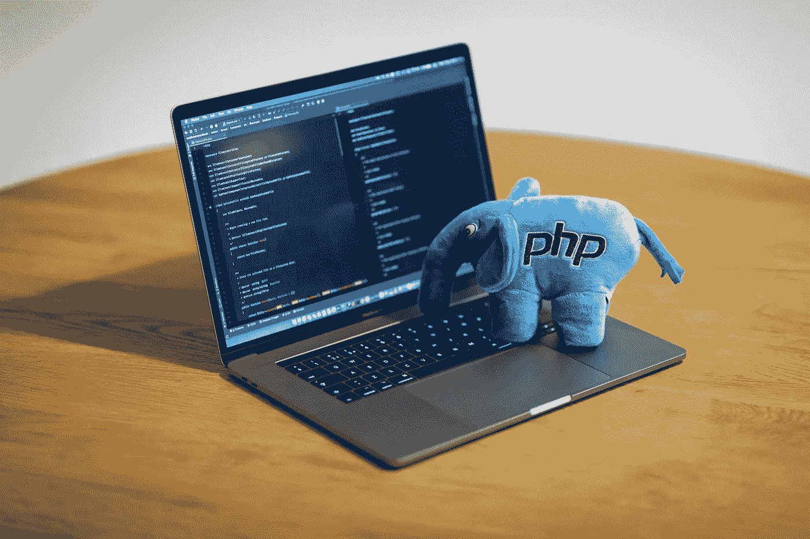

# PHP 教程:连接到数据库

> 原文：<https://medium.com/geekculture/php-tutorial-connecting-to-a-database-tutorial-5771aa64ec10?source=collection_archive---------9----------------------->

Photo by [benofthenorth](https://unsplash.com/@benofthenorth) on [Unsplash](https://unsplash.com/)

PHP 有三种方式连接 MySQL 数据库。这些被称为数据库 API。有一个使用简单函数的过程化版本(mysqli_*)。有两个使用类的面向对象版本(MySQLi、PHP 数据对象(PDO))。它们是相似的，并且返回相同的结果。

对于可能还不了解面向对象编程的初学者来说，过程版本通常是更好的选择…