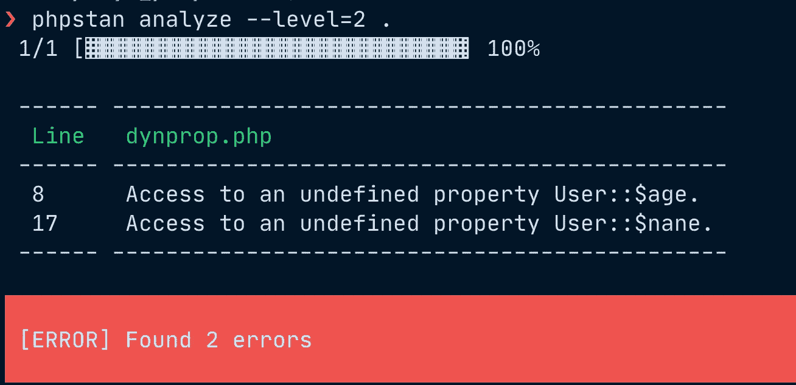

# PHP，什么是动态属性？

> 原文：<https://medium.com/geekculture/php-what-are-dynamic-properties-2509c6fbccf8?source=collection_archive---------2----------------------->

最近我们听到很多关于 PHP 中的动态属性，以及它在 8.2 版本中被弃用的可能性，只是在 9 版本中消失了。这个提议被记录在一个专门的 RFC[https://wiki.php.net/rfc/deprecate_dynamic_properties](https://wiki.php.net/rfc/deprecate_dynamic_properties)中，并且在社交网络(如 twitter 等)上引起了很多讨论。).

# 什么是动态属性？

属性是在类中声明的属性/变量。例如， *$name* 是类*用户*的属性。我们可以在类的开头声明 *$name* ，我们可以声明可见性(在本例中为 *public* )，我们可以声明属性的类型(在本例中为 *string* ):

```
class User {
    public string $name;
} 
```

在类的方法中，我们可以访问声明的属性:

```
class User {
    public string $name; public function __construct($name="") {
        $this->name = $name;
    }
}
```

动态属性是未在类中声明的属性，但在类的代码中，您希望使用未声明的属性:

```
class User {
    public string $name; public function __construct($name="", $age = 0) {
        $this->name = $name;
        // Assigns the not existent property age
        $this->age = $age;
    }
}
```

在上面的例子中，在构造函数方法中，我通过 *$this- > age* 访问了 *age* 属性。在这种情况下，PHP 将动态创建属性。

# 具有动态特性的示例

```
class User {
    public string $name;public function __construct($name="", $age = 0) {
        $this->name = $name;
        // Assigns the not existent property age
        $this->age = $age;
    }
}$user = new User;
// Assigns declared property User::$name.
$user->name = "foo";// Oops, a typo:
$user->nane = "foo";
// PHP <= 8.1: Silently creates dynamic $user->nane property.
// PHP    8.2: Raises deprecation warning, still creates dynamic property.
// PHP    9.0: Throws Error exception.
echo $user->nane;
```

该示例取自[https://wiki.php.net/rfc/deprecate_dynamic_properties](https://wiki.php.net/rfc/deprecate_dynamic_properties)，并修改为添加*年龄*参数，以显示您在访问该物业时出现打字错误的示例。这是一个“隐藏的”bug，因为您认为您执行了一个正确的赋值，但是最后由于输入错误(nane 而不是 name)导致了一个意外的行为。

在 PHP 8.0 和 8.1 中，PHP 将创建一个名为 *nane* 的动态属性。

对于 PHP 8.2，在执行过程中会有一个警告，但是会创建动态属性。

在 PHP 9.0 中，你会有一个例外。

# 你今天能做什么？

我强烈建议使用一个代码静态分析工具，比如 PHPstan 或 Psalm。

使用 PHPstan，您可以用级别 2 来执行它，以捕捉任何动态属性的使用。

```
phpstan analyze --level=2 .
```

最新的例子是:

*   *访问未定义的属性用户::$age* 因为访问构造函数中的 age；
*   *访问一个未定义的属性用户::$nane* 因为输入错误(nane 代替 name)。



# 我的考虑

这是一个很好的特性，目标是提高质量和降低隐藏的错误。

这个特性可能会对现有的代码产生很大的负面影响。我们确定吗？

一些注意事项:

*   看了 PHP 8 的路线图和预测，我们可以用 PHP 8 进行多年的“遗留代码”；
*   如果你使用静态代码分析，很可能你的代码不使用动态属性；
*   如果您没有使用静态代码，那么首先要做的是用 level 2 启动 phpstan。

所以…欢迎来到“PHP RFC:不赞成动态属性”让我们为未来做好准备；)

你喜欢还是不喜欢「不赞成动态属性」？