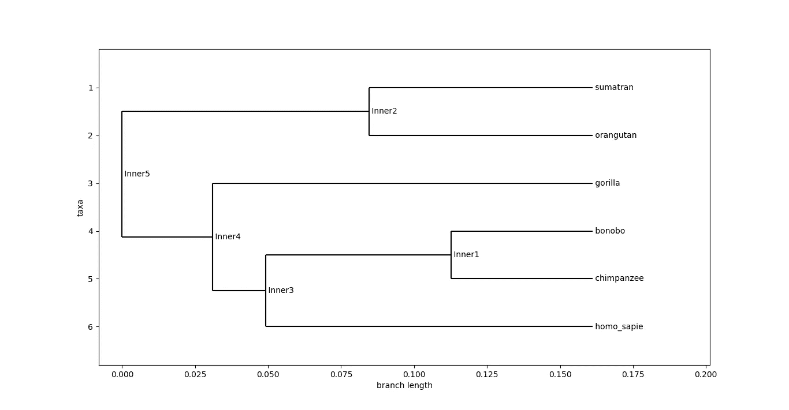
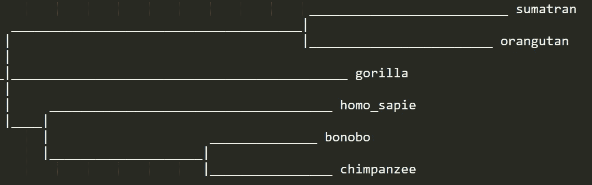

# 系统进化树:用 Python 实现

> 原文：<https://medium.com/geekculture/phylogenetic-trees-implement-in-python-3f9df96c0c32?source=collection_archive---------1----------------------->

读者你好！本文将带您通过一个简单的例子，逐步实现 python 中的进化树。

进化树的系统发生树显示了被认为具有共同祖先的各种生物物种或其他实体之间的进化关系。

有三种方法来构建这样的树:距离矩阵、最大简约和最大似然。在本文中，我们将使用距离矩阵法。

在开始编写代码之前，让我们导入一些本实验需要的库。

```
# Importing necessary libraries from BioPython
from Bio import Phylo, AlignIO
from Bio.Phylo.TreeConstruction import DistanceCalculator, DistanceTreeConstructor
```

它有一个扩展名为的输入文件。phy 文件文件的第一行包含物种的数量(n)和每个物种基因的长度(m)。

例如:5 100，这意味着该文件有 5 个基因长度为 100 的生物体。

接下来的“n”行描述了生物体的名称，然后是每个生物体的 DNA。

例如:

人类 _ 黑猩猩猩猩猩猩猩猩猩猩猩猩猩猩猩猩猩猩猩猩猩猩

首先，我们将使用 AlignIO 读取文件。

```
# Read the sequences and align
align = AlignIO.read('msa.phy','phylip')
print(align)
```

在打印 align 时，您将得到如下输出:

```
Alignment with 6 rows and 3331 columns
CATGCTACTCCACACACCAAGCTATCTAGCCTCCCCAATCCAAA...ATA homo_sapie
CATACTACTCCACACACCAAACTACCTAGCCTCCCCAATCCAAA...ATA chimpanzee
CATGCTACTCCACACACCAAGCTACCTAGTCTCCCCAATCCAAA...ACA bonobo
CATACTACTCCACACACCAAATCATCTAGCCTCCCCAGTCCAGA...ACA gorilla
CATACCACTCCACACCCTATACCATCCAACTTCCCCTATCCGAA...ACA orangutan
```

接下来，我们使用距离计算器计算距离矩阵。

```
# Calculate the distance matrix
calculator = DistanceCalculator('identity')
distMatrix = calculator.get_distance(align)
print(distMatrix)
```

您将获得如下距离矩阵:

```
homo_sapie 0
chimpanzee 0.22695887120984692 0
bonobo 0.22095466826778742 0.09696787751425995 0
gorilla 0.2668868207745422 0.25788051636145304 0.24977484238967274 0
orangutan 0.31732212548784144 0.32182527769438607 0.3161212848994296 0.322425697988592 0
           homo_sapie chimpanzee bonobo gorilla orangutan
```

然后我们用 UGMA 和 NJ 算法构建了系统进化树。

关于 UPGMA 和 NJ 算法的一些要点:

*   UPGMA(带算术平均值的未加权分组方法)是一种从最相似的事物开始的顺序聚类算法。这种平均链接聚类方法中的距离是作为算术平均值计算的。UPGMA 生成一棵有根的树。它假设所有生物的进化速度是一样的。
*   NJ(邻居加入)也考虑到了到其他叶子的平均距离。它生成一棵无根树，并且在实践中运行得相当好。

```
# Create a DistanceTreeConstructor object
constructor = DistanceTreeConstructor()# Construct the phlyogenetic tree using UPGMA algorithm
UGMATree = constructor.upgma(distMatrix)# Construct the phlyogenetic tree using NJ algorithm
NJTree = constructor.nj(distMatrix)
```

我们可以使用 Phylo.draw()在新窗口中绘制树，也可以使用 Phylo.draw_ascii()函数在终端上绘制树。为了测试这两个功能，我们将在窗口中绘制 UPGMA 树，在终端上绘制 NJ 树。

```
# Draw the phlyogenetic tree
Phylo.draw(UPGMATree)# Draw the phlyogenetic tree using terminal
Phylo.draw_ascii(NJTree)
```

您最终的系统发生树输出将如下所示:



UPGMATree



NJTree

你可以在 https://github.com/risg99/Phylogenetic-trees-python 的[找到完整的代码和输出](https://github.com/risg99/Phylogenetic-trees-python)

*感谢阅读！！！*

阅读本文中使用的理论和库的一些附加链接，您可以随意浏览以下内容:

1.  [https://en.wikipedia.org/wiki/Phylogenetic_tree](https://en.wikipedia.org/wiki/Phylogenetic_tree)
2.  [https://biopython.org/wiki/Phylo](https://biopython.org/wiki/Phylo)