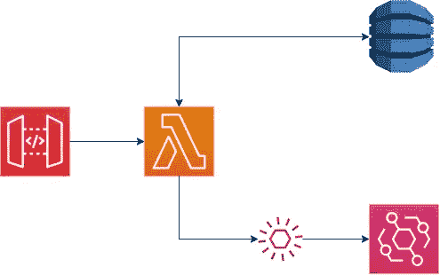
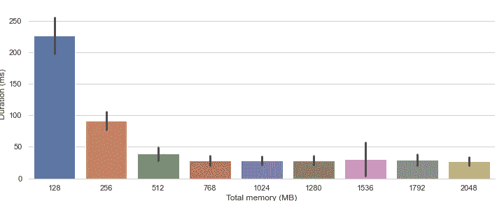
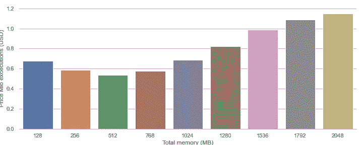
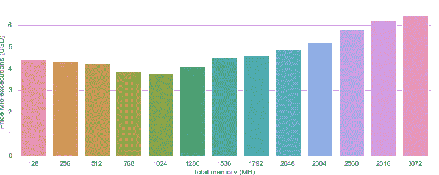
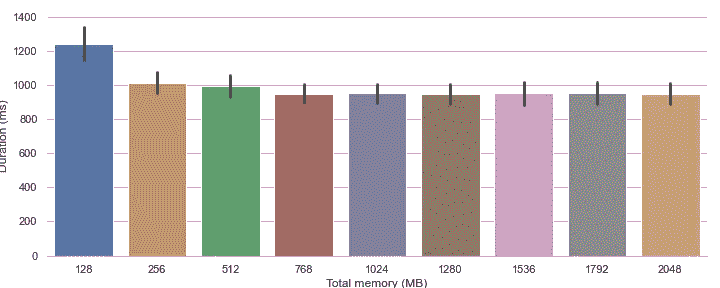

# 为 AWS Lambda 函数选择合适的内存大小

> 原文：<https://medium.com/geekculture/pick-the-right-memory-size-for-your-aws-lambda-functions-682394aa4b21?source=collection_archive---------2----------------------->

## 做好这件事可以提高速度，降低成本。但这并不像看起来那么简单。

Photo by [Julian Hochgesang](https://unsplash.com/@julianhochgesang) on [Unsplash](https://unsplash.com/photos/3-y9vq8uoxk)

AWS 唯一的性能参数是内存大小。但是对于你的真实世界的函数来说，什么是理想的大小呢？为了说明其重要性，我们将回顾一下作为 [ShortrLink](https://shortr.link/BcTD6) 一部分的无服务器 API 函数，并比较内存大小对性能和成本的影响。

# AWS 结合了内存大小和 CPU 能力

Lambda 只允许我们直接配置内存大小。但是，这一指标与您获得的 CPU 能力直接相关。简而言之，在达到大约 1.7 GB 的内存之前，您获得的功率是线性增长的。此时，Lambda 提供了 1 个完整的 vCPU 内核。此后，每增加一个 MB 仍然意味着更多的功率，但需要更多的 CPU 内核。理论上只有多处理功能受益于 1.7GB 以上的内存！

这听起来很简单，但是在现实世界中这意味着什么呢？大多数 Lambda 函数都是[，不仅仅是计算斐波那契数列](https://dashbird.io/blog/lower-aws-lambda-bill-increasing-memory/)，而是与其他服务相连，并受到这些外部 API 响应时间的限制。您是否曾经为 GET API 部署过一个功能，该功能除了从数据库中获取一个项目并执行一些基本的数据转换之外什么也不做？如果是这样，你可能想知道你是否真的*需要*更多的 CPU 能力。

# 实验设计:一个基本的无服务器 GET API

为了测试收益递减点，我使用了一个真实的函数:

1.  从 API 网关接收 HTTP 事件
2.  从 DynamoDb 获取一项(使用 Pynamodb)
3.  将事件发布到 EventBridge(使用 Boto3)
4.  返回 HTTP 响应

因此，我们依赖于 Lambda 函数同一区域内的另外两个 AWS 服务。我们不(直接)执行任何计算，但是在运行时有多个转换步骤。我测试的 Lambda 配置是 128MB、256MB、512MB、768MB、1024MB、1280MB、1536MB、1792MB 和 2048MB。

用 Python 编写的 Lambda 函数在我的本地机器上使用 API 网关 HTTP 端点被调用了 500 次。所有请求都是按顺序发出的，因此每次执行都将重用相同的运行时。这样，我们仍然通过限制我们必须排除在分析之外的冷启动次数来测试纯执行持续时间。

当然，在现实应用中，冷启动是一个相关因素。特别是对于一个较小的项目，你不能期望每天每 5 分钟至少调用一次 API 端点。因此，第二轮执行会调用每个配置 20 次，每次都强制冷启动。

信息的主要来源是 AWS Cloudwatch 日志。此外，我还测量了从发出 GET 请求到收到应答所花费的时间，从而从最终用户的角度测量了 API 的响应性。需要注意的是，所有资源都在 AWS 的 eu-west-1 区域，而发出 API 请求的机器位于东南亚。因此，在查看数字时，您必须记住一般的网络延迟。

# 结果:768MB 针对速度进行了优化，512MB 针对成本，1024+MB 针对多次冷启动

实验设计结束后，让我们来看看数字:

Average duration per AWS Lambda execution in ms

在较低的区域，增加内存大小(从而增加 CPU)的影响是极端的。虽然 128MB 内存的平均执行时间是令人自豪的 226 毫秒，但 256MB 将这一时间降低了 60%，降至 91 毫秒。不过 512MB 关口周围也有明显的肘子。将内存从 512MB 增加一倍到 1GB 只会将我们的性能提高 30 %到 27 毫秒。事实上，在达到 768MB 后，p50 和 p90 分位数的执行时间保持不变。

这也暗示了我们的 lambda 函数的成本:

Price per 1 Mio AWS Lambda executions in USD (incl. request costs)

虽然 768MB 为我们提供了最佳的性能，但我们可以看到 512MB 的最低成本。在这里，您必须决定是否愿意支付更多费用来获得更快的响应时间。与此同时，我们还观察到，资源调配过少会推高成本。

## 冷启动问题

到目前为止，我们只考虑了最好的情况:总是热函数，所有的模型都预装了 Lambda 来使用。但是可怕的冷启动怎么办？在这里，事情看起来有点不同:

与我们的预热功能不同，冷启动持续时间会随着内存/CPU 内核的增加而持续减少。但即使在这里，我们也看到收益递减。从 1GB 升级到 2GB 只会带来 40%的速度提升。因此，添加更多资源并不总是经济高效的:

同样，我们观察到一个局部最优值，但这次是 1024MB，是以前的两倍。因此，分析您的特定用例并估计执行频率对于您的设计过程变得很有必要。

## 别忘了现实世界的体验。

最后，这种增长对我们的最终用户意味着什么？假设服务器和客户端之间的距离为 9500 公里，可以想象，并不算远:

Measured response times in ms

在我们的图表中，仅观察 Lambda 持续时间时看似巨大的差异变得几乎不可见。从 128 MB 升级到 256MB 仍然可以减少大约 15%的延迟，从 512 MB 升级到 768MB 只会减少 6%的延迟。
当然，这是一个极端的例子。然而，它表明，虽然我们很容易沉迷于优化我们核心功能的性能，但外部因素对我们最终用户的体验也有同样甚至更大的影响。

# 结论:了解您的用例

最后，我们有三个选择:如果你知道你的函数几乎不会变冷，并且你纯粹地优化执行持续时间:768MB 是我们的赢家。然而，如果成本是您最关心的问题，将内存大小减少到 512 MB 将会降低 7.4%的成本，但也会增加 36%的执行时间。)

对于很少使用的功能，越多越好。当然，您可以通过选择 1GB 来达到最佳成本，但即使是 3GB，平均每小时执行 1 次，您的每月成本也将低于 1ct/月。因此，建议至少选择 3GB，甚至更多(当然是在测试进一步扩展之后)。

对第三方服务延迟的依赖意味着您的功能的数字将会不同。每当您的函数等待另一个服务的响应时，它就处于空闲状态(除非是线程化的。)最后，你还得自己测试一下你个人的甜蜜点是什么样的。