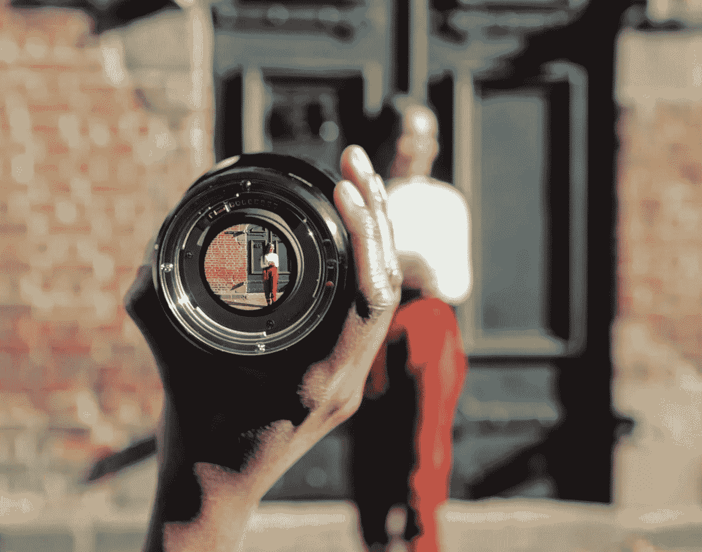
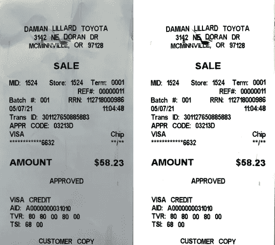
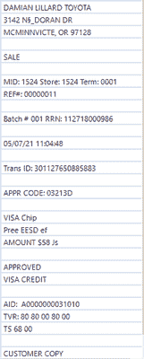
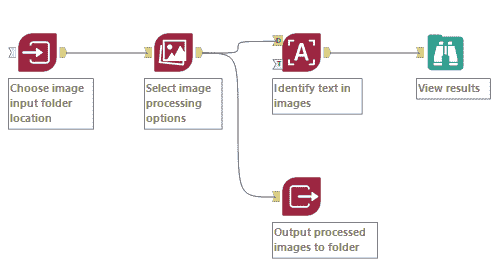
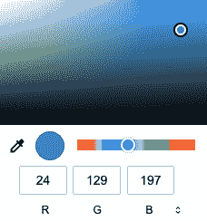
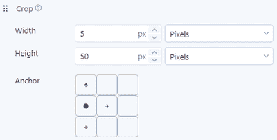
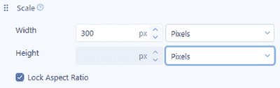
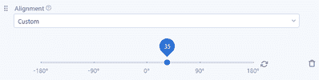
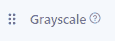
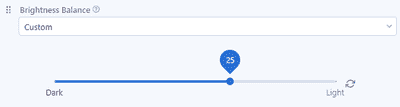

# 图像完美:内部图像处理

> 原文：<https://medium.com/geekculture/picture-perfect-inside-image-processing-3d15c04049a1?source=collection_archive---------71----------------------->

## 计算机可能“看得见”，但我们可以帮助它们改善视力。了解如何将图像转换为数字，以及如何对其进行处理以进行更好的分析。

Photo from nappy.co

吓人的红眼睛。过度曝光。模糊的宠物。我小时候的照片都是这些摄影瑕疵；当时一般人不会当场调整照片。但现在我们都例行公事地编辑照片——更令人印象深刻的是，我们可以大规模地编辑照片，快速准备许多图像，以便从中提取有用的信息。

Alteryx Intelligence Suite 中的计算机视觉工具调色板现在将以前称为 PDF Input 的工具与一系列工具结合起来，使基于图像的数据更加易于访问。因为让我们面对现实吧:你可能想分析的许多文件和图像有点像我童年的照片——模糊、不协调或者难以解读。

图像处理工具可以帮助我们处理这些问题。让我们仔细看看它是如何清理你的图像输入的。理想情况下，这种更深入的理解将帮助您充分利用图像处理选择，然后充分利用图像中的数据！

# 之前和之后

为了向你展示这个工具有多棒，我给你举了一个例子。查看并排比较，体验一下这个工具可以为你不完美的图像做些什么。

Image by author

在最近一次去我们当地的丰田经销店服务后，这张收据被钉在一张发票上，折叠好，塞进了我的钱包里(是的，对你们这些篮球迷来说，这真的是达米恩·利拉德丰田！).然后我用手机拍了一张光线很差的照片。

尽管有这样的虐待和悲伤的摄影，图像处理仍然使收据图像足够整洁，可以从中提取近乎完美的文本(它的错误是完全合理的——很难在纸张上有实际漏洞的地方找到文本！).然后，我将文本解析成行，如果我愿意，可以在分析中使用它。

Image by author

# 美化你的形象

这里有一个小小的工作流程，演示如何将图像放入 Designer，并为光学字符识别(OCR)做准备，OCR 是从图像中提取文本的过程。图像输入工具可以接受 BMP、JPEG、PNG 或 PDF 文件。

Image by author

一旦图像输入工具连接到图像处理工具，您将有相当多的配置选项来决定如何修复您的图像。由于这是数据科学博客，我们将深入了解每个选项在幕后的实际作用。

# 图像作为数字

首先，我们来谈谈当你把一幅图像变成数据时会发生什么。显而易见，你的计算机拥有“视觉”的唯一方式是将图像转换成数字。对于利用 OpenCV 包的图像处理工具，图像被转换成数组。这些数组是代表图像中每个像素值的数字排列。

如果您的图像尺寸为 200 像素乘 200 像素，并且是灰度图像，那么您只需要一个数字来表示每个像素。如果图像是彩色的，您将需要三个数字(“通道”)来表示每个像素，这三个数字分别表示像素中应该有多少蓝色、绿色或红色(BGR)来生成您看到的颜色。(只是为了让我们保持警惕，OpenCV [使用 BGR 颜色格式](https://learnopencv.com/why-does-opencv-use-bgr-color-format/)，而不是 RGB 或红/绿/蓝，这种格式可能更熟悉，因为在其他照片或图形应用程序中选择具有 RGB 值的颜色。)然后，这三组数字中的每一组都被放置在数组中，以匹配图像中像素的配置。你的计算机将各种颜色的像素转换并重新组合成一幅图像。

如果我们将 Alteryx 社区徽标转换为一个数组，我们可以提取单个像素，并查看它们的 BGR 值如何转化为这些像素的颜色。例如，代表图像的行 320 和列 786 中的像素(朝向右下角)的阵列中的位置具有 BGR 值[197，129，24]。

*额外收获:想看看如何将一幅图像视为一个数组，反之亦然吗？打开下面链接的 Kaggle 笔记本，获取一些 Python 代码，您可以用自己喜欢的图像进行尝试。*

 [## 图像示例

### 使用 Kaggle 笔记本探索和运行机器学习代码|使用来自[私有数据源]的数据

www.kaggle.com](https://www.kaggle.com/susancurriesivek/image-example) 

如果我从顶部矩阵中取出第二组三个数字，并将它们插入[颜色选择器](https://www.w3schools.com/colors/colors_picker.asp)，调整 RGB 的顺序，结果看起来很熟悉……它是“Alteryx Blue”！

Image by author

# 通过处理数字来处理图像

知道图像对计算机来说只是一组数字，有助于理解算法如何处理、分析和使用图像进行预测。现在，让我们回到图像处理工具，看看当您使用它的每项功能时会发生什么。

*裁剪*

Image by author

裁剪选项就像在你的日常摄影生活中裁剪一个图像；它会删除图像中您不想要的部分。但是现在你知道了图像是如何用数字表示的，你就可以想象幕后发生了什么。由这些数字行和列表示的一些像素被从阵列中切掉。仅保留代表所需像素的部分。

*刻度*

Image by author

此选项使您的输入图像变大或变小，以匹配您输入的大小。这个有点难以想象。你实际上是在告诉算法，“嘿，这是一张 200 像素 x 200 像素的图像——但是要做成 400 像素 x 400 像素的。”你要求它把 4 万个像素变成 16 万个像素。该算法如何知道在所有这些新像素中放入什么颜色，以使您的图像看起来相同，但更大？

答案是[插值](https://en.wikipedia.org/wiki/Interpolation):生成符合你已知数据范围的新数据。如果你想知道更多关于哪种类型的插值用于增加和减少图像的尺寸，查看 [OpenCV 文档](https://docs.opencv.org/master/da/d54/group__imgproc__transform.html#ga47a974309e9102f5f08231edc7e7529d)了解这一功能。

或者，如果算法在缩小图像的尺寸，它如何知道要保留哪些像素的信息？你还是需要一个可识别的结果，所以它不能随便挑一些像素删除。在这种情况下，该算法执行的操作类似于对原始像素中的值进行平均，“重新采样”图像。

想看看这些程序在实践中的效果吗？看看[这个例子](https://chadrick-kwag.net/cv2-resize-interpolation-methods/)。

您可以选择在重新缩放的图像中保持与原始图像相同的纵横比，这将防止失真。

*对准*

Image by author

理解缩放是如何工作的有助于我们理解对齐是如何工作的。本质上，该工具在图像中寻找称为“关键点”的“稳定”点，当图像被重新缩放或旋转时，这些点保持不变。一旦它识别出这些关键点，它就能够一起移动它们的位置，以及它们周围的一切。(每日一词:这个过程利用了[单应](https://en.wikipedia.org/wiki/Homography_(computer_vision))。)

您的图像保持完整且可识别，但基本上是沿着新的垂直和水平轴重新对齐的，这些轴已从原始位置旋转了您输入的度数。

*灰度*

Image by author

将彩色图像转换为黑白阴影可以在 OCR 中提供更好的结果。它还可以加快您的分析过程，因为不需要三个数字来描述每个像素，只需要一个数字来表示要使用的黑/灰/白的阴影。令人惊讶的是，OpenCV 将这个转换与[变成了一个简单的等式](https://docs.opencv.org/4.4.0/de/d25/imgproc_color_conversions.html):

> 灰色← 0.114*B + 0.587*G + 0.299*R

如果我们将徽标转换为灰度，我们从上面的社区徽标中选择的 BGR 值为[197，129，24]的像素将简单地表示为[105]。

*阈值处理*

Image by author

阈值处理是一种去除图像中的噪声、创建简化的黑白图像并使您的分析专注于主要图像元素的方法。你可以在我上面的示例图像中看到它的工作，收据纸颜色的阴影和污点被去除，大大提高了清晰度。应用阈值处理时，无论您是否明确选择灰度作为图像处理工具中的一个步骤，您的图像都会转换为灰度。

用最简单的阈值方法，二进制，像素不符合一定的灰度阈值被转换成白色；那些做的被转换成黑色。在某些情况下，其他方法可能更有效；你可以[在 OpenCV 文档中阅读更多关于它们的](https://docs.opencv.org/master/d7/d4d/tutorial_py_thresholding.html)并查看[一些例子](https://docs.opencv.org/3.4/db/d8e/tutorial_threshold.html)。

对于上面我的收据图像，我使用了自适应高斯阈值，当图像的不同部分光照不同时会更好；理想情况下，这种方法将有助于解决我的模糊，混乱的收据。

*亮度平衡*

Image by author

这个选项有自动或自定义模式，正如你所料，它会使整个图像变暗或变亮。

在自动模式下，使用了一种称为 [Yen 的方法](https://ieeexplore.ieee.org/document/366472?arnumber=366472)的技术。该方法认为图像具有多个片段，并调整它们的颜色强度，以使每个片段以最佳亮度显示。然而，为了最小化计算需求，该方法还考虑了增加分段数量将如何增加表示调整后的图像所需的比特数量，并且该方法寻求这些因素之间的折衷。在实践中，您应该会看到这种方法在各种图像和不同照明条件下的良好效果。

# 准备好特写了吗

您可以测试处理步骤的组合和顺序，看看什么最适合您独特的图像集。理想情况下，您会找到一种能够生成清晰图像的配置，如果这是您工作流程的一部分，还会有可靠的 OCR 结果无缝地反馈到您的分析中。

# 推荐阅读

*   [OpenCV 获取和设置像素](https://www.pyimagesearch.com/2021/01/20/opencv-getting-and-setting-pixels/)了解更多关于像素如何转换为颜色和灰度的信息
*   [使用 OpenCV 的基于特征的图像对齐](https://learnopencv.com/feature-based-image-alignment-using-opencv-c-python/)
*   [OpenCV 调整图像大小](https://www.pyimagesearch.com/2021/01/20/opencv-resize-image-cv2-resize/)
*   [CV2 调整大小插值方法](https://chadrick-kwag.net/cv2-resize-interpolation-methods/)
*   [使用 Python 进行图像处理:阈值处理](https://datacarpentry.org/image-processing/07-thresholding/index.html)

*原载于* [*Alteryx 数据科学门户*](https://community.alteryx.com/datascience?utm_source=tds) *。*