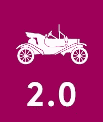
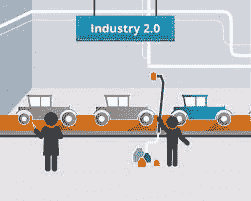

# 计件和装配线工业 2.0

> 原文：<https://medium.com/geekculture/piecework-and-assembly-line-industry-2-0-2c4b3fe9fdf5?source=collection_archive---------8----------------------->

# 介绍

第二次工业革命始于 19 世纪，起因是电和流水线生产的发现。亨利·福特(1863-1947)从芝加哥的一个屠宰场获得了大规模生产的想法:农场的动物挂在传送带上，每个屠夫只做屠宰动物的一部分工作。亨利·福特在汽车生产中接受了这些主要信念，并在此过程中对其进行了重大改变。然而，在一个工作站组装一辆完整的汽车之前，现在车辆是在传送带上分步骤制造的，速度更快，成本更低。

# 描述

工业 1.0 的成就导致城市人口爆炸。许多工人现在受雇于逐渐兴起的工业。19 世纪 30 年代，工业 2.0 的早期工业化开始。

引入电力作为驱动力是第二次工业革命的初步迹象。19 世纪末，蒸汽机被电力驱动的机器所取代。这一发展也提出了装配线工作。工厂车间现在可以在创纪录的时间内生产出大量商品。

亨利·福特在 1913 年提出的汽车生产装配线主要是功能强大的。每位员工只需进行一次手工操作，因此，单个零件的生产速度大大提高。以前，一辆完整的汽车是在一个工位组装的。从现在开始，汽车在装配线上以有限的步骤生产，这样更快更便宜。这一发展是劳动力市场的一次起义。从那时起，需要特定的工人。无论是过去还是现在，缺乏熟练工人一直是个问题。

办公场所的交流也更发达了。这不再包含信件，而是更新鲜的电话和电报，增强了许多工作流程。此外，打字机是额外开发的，从现在起也被大规模使用。

简而言之，工业 2.0 见证了电信的开始，装配线改变了工厂的工作，第一辆汽车可以生产出来。[随着空运和海运使穿越各大洲成为可能，交通运输也同样得到了发展。与此同时，德国发展成为世界上主要的工业强国之一。它的成就不仅革新了这个行业，也革新了其他许多领域。这些增长是走向全球化的第一步——至今对我们仍很重要。](https://www.technologiesinindustry4.com/)

# 对工作安排的特殊影响

大规模生产的发展在三个重要方面改变了工作的组织。首先，任务被紧密地细分，由非熟练或半熟练工人完成，因为大部分技能是由机器制造的。此外，制造企业规模的发展需要形成一个监督和管理阶层。第三，日益增长的经营困难刺激了管理层员工的就业，他们致力于会计、工程、研发、人力资源、信息技术、分销、营销和销售等领域。

大规模生产同样加剧了国际分工的趋势。新工厂的巨大规模使得从一个国家进口原材料并在另一个国家生产变得很便宜。突然之间，国内市场的饱和导致了对国外客户的寻找。因此，一些国家转变了原材料出口国和制成品进口国，而另一些国家则相反。在 20 世纪 50 年代和 60 年代，一些以农业为主的国家开始制造商品。由于装配线任务的技能要求较低，任何背景的居民都可以在新的制造部门工作。新兴国家的生活标准如此之低，以至于工资水平都低于工业化国家。这使得整个生产过程成本更低。因此，美国国内外的许多大制造商开始外包——也就是说，在发展中国家制造零件或组装整个产品。因此，这些国家的发展改变了世界经济共同体的面貌。

# 大规模生产的优越性

## 科学管理

弗雷德里克·w·泰勒(1856-1915)是一位美国工业工程师，他领导了一门全新学科的发展，即工业工程或科学管理。在这种方法中，计划和协调的管理职能贯穿于整个生产过程。

泰勒认为，工厂经理的主要目标是控制工人完成工作的最佳方式，提供良好的工具和培训，并为良好的绩效提供激励。泰勒将单个工作分解成基本动作，研究这些动作以控制哪些动作至关重要，并用秒表为工人计时。去除多余的动作后，工人们，接下来是机器般的例行工作，变得更有生产力。在某些情况下，泰勒建议进一步分工，给专家一些任务，例如磨工具。

这些研究是由泰勒在美国的两位同事 Frank B. Gilbreth 和 Lillian E. Gilbreth 完成的，几位管理工程师将运动研究的发明归功于他们。1909 年，吉尔布雷斯在研究砌砖工作时发现，每当工人弯腰捡起一块砖时，运动就被浪费了。他们设计了一个适应性很强的脚手架，去掉了排架，将砌砖过程从每小时 120 块砖提高到 350 块。工业工程最终在工厂运营的所有要素中发挥作用，比如布局、材料处理、产品设计以及人工操作。

科学管理理论家们期望工人们能被巧妙地利用，用最少的力气完成他们的工作，并得到更多的钱。他们同样理所当然地认为工人会服从身体运动和思维过程的标准化。然而，从一边到另一边发展起来的科学管理程序忽略了人的感觉和动机，使工人对工作不满意。此外，一些雇主将时间和动作研究作为加速生产线和提高生产力水平的一种手段，同时仍然保持低工资。

更多详情请访问:[https://www . technologiesinindustry 4 . com/2022/09/piece work-and-assembly-line-industry-2-0 . html](https://www.technologiesinindustry4.com/2022/09/piecework-and-assembly-line-industry-2-0.html)