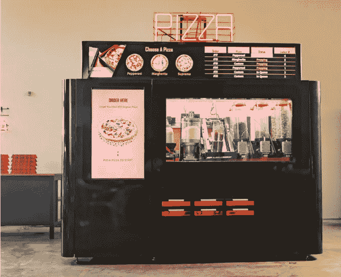

# Piestro 以 8000 万美元的估值启动新一轮融资，为 StartEngine 投资者带来 4 倍的未实现收益

> 原文：<https://medium.com/geekculture/piestro-launches-new-funding-round-at-80m-valuation-resulting-in-4x-unrealized-gains-for-29434ab6545f?source=collection_archive---------7----------------------->

对于任何在 StartEngine 轮投资的人来说，都有一些巨大的未实现收益。

在 Piestro 与 800 Degrees Kitchens 成立合资企业后，有人对 Piestro 目前的估值提出了一些猜测。这笔价值 5.8 亿美元的交易启动了自己的筹资活动…