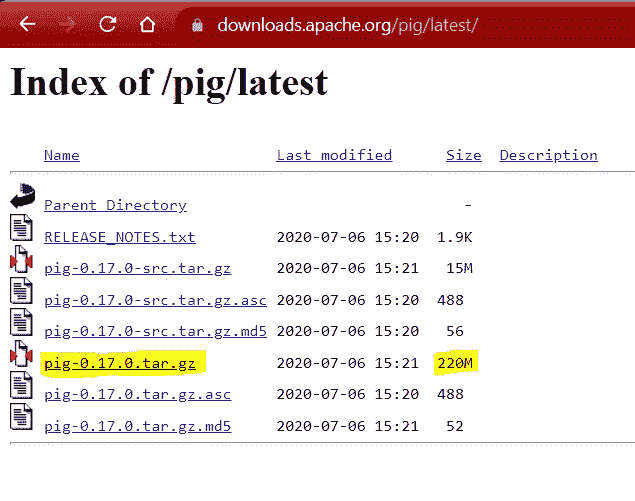
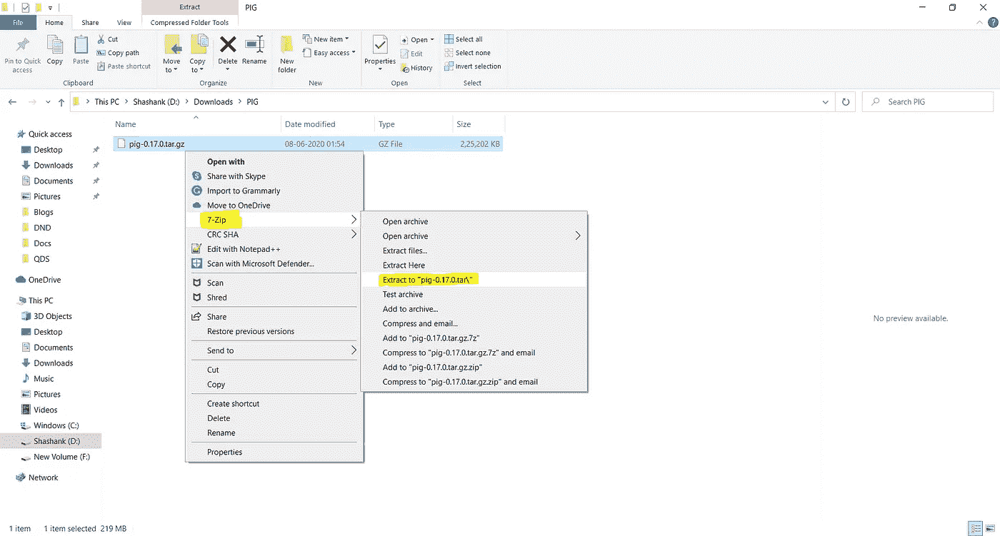
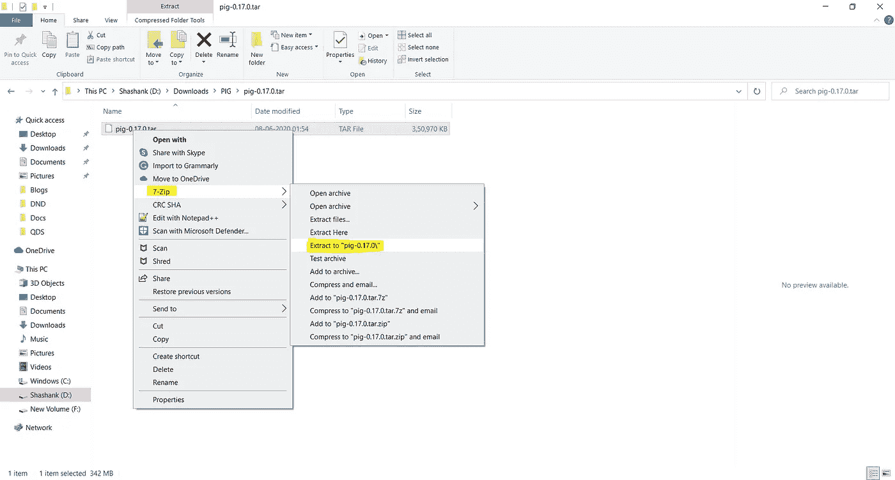
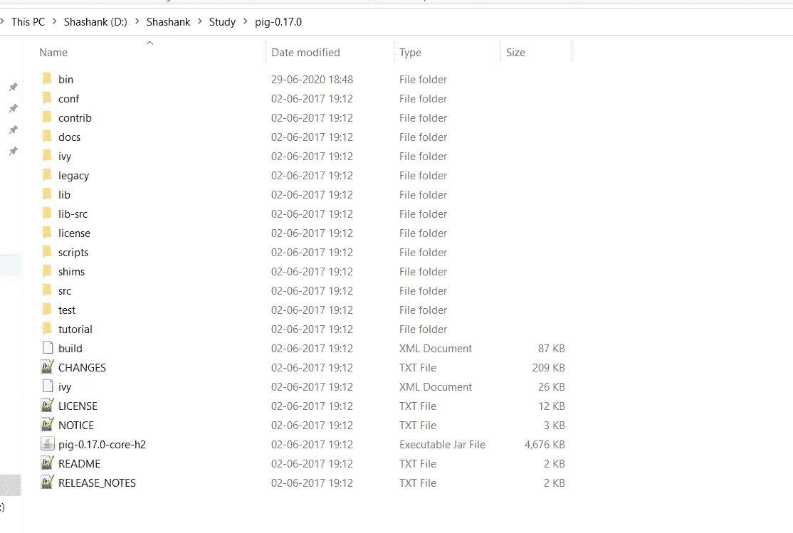
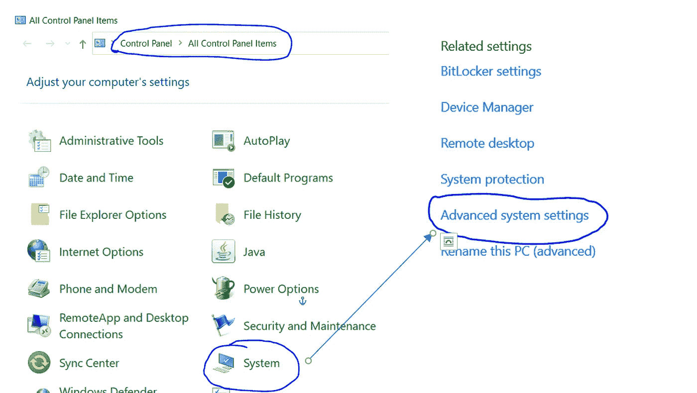
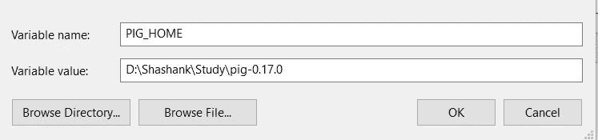
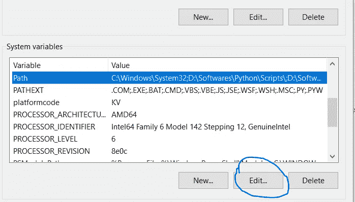
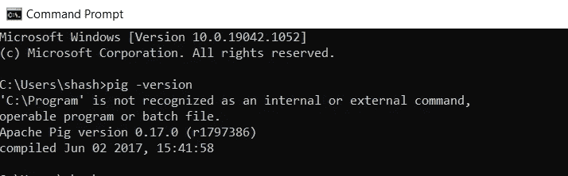
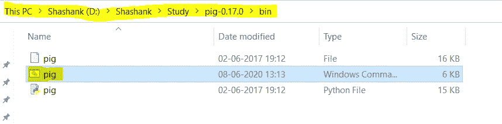
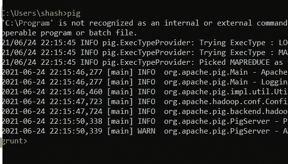

# 小猪:如何在 Windows 10 中 5 步安装

> 原文：<https://medium.com/geekculture/pig-how-to-install-in-5-steps-in-windows-10-c12deeca45a2?source=collection_archive---------7----------------------->

在 Windows 10 中安装 PIG 的简单指南。


Image taken from Google images

# 1.先决条件

1.  硬件要求
    * RAM —最小值。8GB，如果您的系统中有 SSD，那么 4GB RAM 也可以。
    * CPU —最小值。四核，至少 1.80GHz
2.  [JRE 1.8](https://www.java.com/en/download/windows_offline.jsp)—JRE 的离线安装程序
3.  [Java 开发套件— 1.8](https://www.oracle.com/java/technologies/javase/javase-jdk8-downloads.html#license-lightbox)
4.  我将使用 64 位 windows 操作系统，请检查并下载您的系统 x86 或 x64 支持的所有软件版本。
5.  [Hadoop](https://archive.apache.org/dist/hadoop/core/hadoop-2.9.2/)
    *我使用的是 Hadoop-2.9.2，你也可以使用任何其他稳定版本的 Hadoop。
    *如果没有 Hadoop，可以参考从 [Hadoop:如何在 Windows 10 中 5 步安装](/analytics-vidhya/hadoop-how-to-install-in-5-steps-in-windows-10-61b0e67342f8)安装。
6.  [MySQL 查询浏览器](https://dev.mysql.com/downloads/mysql/)
7.  [下载 PIG zip](https://downloads.apache.org/pig/latest/)
    *我用的是 PIG-0.17.0，也可以用其他任何稳定版本的 [Apache Pig](https://pig.apache.org/) 。



Fig 1:- Download PIG-0.17.0

# 2.解压缩并安装清管器

下载完小猪后，我们需要解压[pig-0.17.0.tar.gz](https://downloads.apache.org/pig/latest/pig-0.17.0.tar.gz)文件。



Fig 2:- Extracting PIG Step-1

*   一旦提取，我们将得到一个新的文件**pig-0.17.0.tar**。现在，我们再次需要提取这个 tar 文件。



Fig 3:- Extracting PIG Step-2

*   现在，我们可以组织我们的 PIG 安装，我们可以创建一个文件夹，并将最终提取的文件移动到其中。比如说



Fig 4:- PIG Directory

*   请注意，创建文件夹时，不要在文件夹名称之间添加空格。(这可能会导致以后出现问题)
*   我已经把我的猪放在 D: drive 中了，你也可以使用 C:或者任何其他的驱动器。

# 3.设置环境变量

设置工作环境的另一个重要步骤是设置系统环境变量。

进入控制面板>系统>点击“高级系统设置”链接编辑环境变量。
或者，我们可以右键单击这台电脑的图标，点击“属性”,然后点击“高级系统设置”链接
,或者，最简单的方法是在搜索栏中搜索环境变量😉



Fig. 5:- Path for Environment Variable


Fig. 6:- Advanced System Settings Screen

**3.1 设置 PIG_HOME**

*   打开环境变量，点击“用户变量”中的“新建”。


Fig. 7:- Adding Environment Variable

*   单击“新建”，我们会看到下面的屏幕。



*   现在如图所示，在变量名中添加 PIG_HOME，在变量值中添加 PIG 的路径。
*   点击 OK，我们就完成了 PIG_HOME 设置的一半。

**3.2 设置路径变量**

*   设置环境变量的最后一步是在系统变量中设置 Path。



Fig. 9:- Setting Path Variable

*   在系统变量中选择路径变量并点击“编辑”。


Fig. 10:- Adding Path

*   现在我们需要将这些路径添加到路径变量:-
    * %PIG_HOME%\bin
*   单击确定和确定。&我们已经完成了环境变量的设置。

> 注意:-如果您想要为所有用户设置路径，您需要从系统变量中选择“新建”。

**3.3 验证路径**

*   现在我们需要验证我们所做的是正确的和反映的。
*   打开一个**新的**命令窗口
*   运行以下命令

```
echo %PIG_HOME%
```

# 4.验证设置

祝贺..！！！！！
我们已经完成了在系统上设置 PIG 的工作。

现在我们需要检查是否一切顺利…

打开 cmd 窗口，运行以下命令来测试连接和 PIG。

```
pig -version
```

运行该命令后，我们应该得到 PIG 的版本。在我们的例子中是 0.17.0。



Fig 11:- Checking PIG version

恭喜…我们已经成功地在 WIndows 10 上安装了 PIG-0.17.0。

不要担心，我们中的一些人在运行`pig -version`后会得到下面的错误

```
'-Xmx1000M' is not recognized as an internal or external command,operable program or batch file.
```

要解决这个问题，我们需要执行以下步骤

1.  打开猪。编辑模式下的 cmd 文件。我们可以在 bin 文件夹中找到该文件。



Fig 12:- pig.cmd file

2.现在我们需要更改 HADOOP_BIN_PATH 的值

```
Old value:-   %HADOOP_HOME%\bin
New Value:-   %HADOOP_HOME%\libexec
```

3.保存文件。

下一步是再次验证设置。所以，我们需要再次执行
`pig -version`命令。

# 5.起始猪

现在我们需要启动一个新的命令提示符，记住以管理员身份运行它，以避免权限问题，并执行以下命令

```
pig
```

是的，就这么简单……一旦猪开始，我们就能看到`grunt>`。



Fig 13:- Starting PIG

# 6.恭喜..！！！！🎉

恭喜你！我们已经成功安装了清管器。

有可能我们中的一些人可能会面临一些问题…不要担心，这很可能是由于一些小失误或不兼容的软件。如果您遇到任何此类问题，请仔细访问所有步骤，并验证正确的软件版本。

如果你仍然不能让 PIG 运行起来，不要犹豫，在评论区描述你的问题。

你可以在这里了解更多关于我的信息...

通过 5 个步骤了解 [Hadoop 安装](/analytics-vidhya/hadoop-how-to-install-in-5-steps-in-windows-10-61b0e67342f8)

学习[5 步安装 SQOOP】](/analytics-vidhya/sqoop-how-to-install-in-5-steps-in-windows-10-ca2f17e11e75)

学习[蜂箱安装的 5 个步骤](/geekculture/hive-installation-aa191dfee3f)

快乐学习…！！！🙂