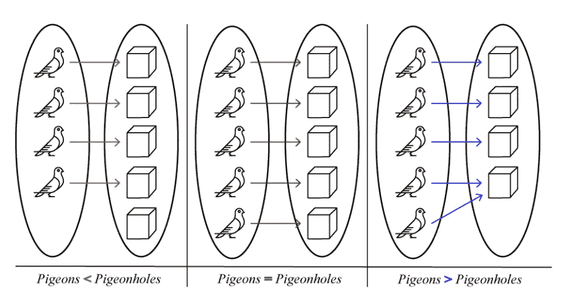

# 鸽笼原理和功能

> 原文：<https://medium.com/geekculture/pigeonhole-principle-and-functions-5dfcbd3cc3bb?source=collection_archive---------6----------------------->

Image by [https://jineralknowledge.com/](https://jineralknowledge.com/)

虽然鸽子洞原理是组合学的主要思想之一，但它有着广泛的应用，而且理解起来非常简单。

> **鸽巢原理:**如果将 n 个物品放入 m 个容器，n 个> m，那么至少有 1 个容器会有 1 个以上的物品。

这篇文章讨论了鸽子洞原理如何应用于研究函数。当你理解一个函数的定义域和共定义域(值域)的维数时，鸽子洞原理可以帮助确定函数的性质，例如它是内射的还是满射的。

# 职能 101

当你第一次学习的时候，你可能认为函数是 *f(x)=x +5* ，但是函数的概念更为普遍。

> 函数 f : X → Y 是从集合 X 到集合 Y 的映射，使得 X 中的每一个元素都恰好映射到 Y 中的一个元素。

集合 *X* 称为定义域，集合 *Y* 称为 *f* 的共定义域或值域。函数的一个重要性质是集合 *X* 中的每个元素只能映射到集合*y*中的一个元素

## 内射:1–1

> 当 Y 中的每个元素至多能被 x 中的 1 个元素映射时，这个函数是内射的。

这是一个重要的性质，因为如果一个函数不是内射的，那么就没有逆。

例如，考虑函数 *f(x)=x* ，它从作为定义域的实数集映射到作为共定义域的实数集。由于 *f(2)=2 =4=(-2) =f(-2)，*函数有 2 个输入产生相同的输出，所以这个函数是**不是**内射的。然而，函数 *f(x)=x* 是内射的，因为只有一个输入值可以产生任何输出值。

## 满射的:继续

> 当 *Y* 中的每个元素至少被 *X.* 中的一个元素映射时，函数是满射的

例如，再次考虑 *f(x)=x .* 注意，对于 *x 的任何值，x* 必须大于零。因此， *Y < 0* 中的任何值都不能被*f(x)*映射，所以这个函数是**而不是**满射的。然而，函数 *f(x)=x* 是满射的，因为只有 1 个输入值可以产生任何输出值。

当一个函数既是内射的又是满射的，我们称之为双射。双射函数很好，因为它们是可逆的。

# 鸽笼原理和功能

为了将鸽子洞原理应用于函数，考虑一个将“鸽子”映射到“鸽子洞”的函数。在下面的 3 张图中，鸽子的集合是域，箭头是函数，鸽子洞的集合是共域。

Image by [CalcWorkshop](https://calcworkshop.com/combinatorics/pigeonhole-principle/)

在左边，结构域中的元件比共结构域少，或者换句话说，结构域更小。从箭头来看，没有 2 只鸽子被映射到同一个鸽子笼，所以这个函数是内射的。但是有一个鸽笼没有分配鸽子，所以函数不是满射的。

在右边的例子中，域大于共域。每个鸽笼都有一只鸽子映射到它，所以函数是满射的。然而，底部的 2 只鸽子映射到同一个鸽子洞，所以函数不是内射的。

中间的例子中，结构域和共结构域的大小是相同的。每一个鸽笼都被恰好一只鸽子映射到，使得函数是内射的，并且每一个鸽笼都被映射到，使得函数是满射的。因为函数是满射和内射的，所以它是双射的或可逆的。

它是可逆的重要性在于，如果给你一只特定的鸽子，你知道它最终会在哪个鸽笼里，如果给你一只特定的鸽子，你知道哪只鸽子会去那里。

# 扩展ˌ扩张

鸽子笼原理，功能，以及以这种方式思考集合是非常强大的。这些想法给了代数、组合学和集合论中的其他概念一个强有力的直觉。它在数据压缩方面有应用，并且可以是学习更多数学的一个很好的起点。如果你对它的其他用途感兴趣，请点击这里查看这篇文章！

*如果你做到了这一步，按下鼓掌按钮。我刚接触媒体，正试图写出一些关于我如何看待数学、数据科学和计算机的内容。跟我来，如果你喜欢的话。*