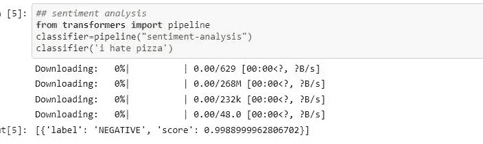
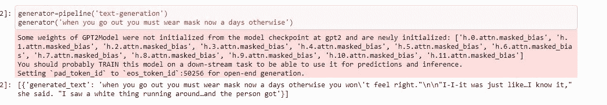
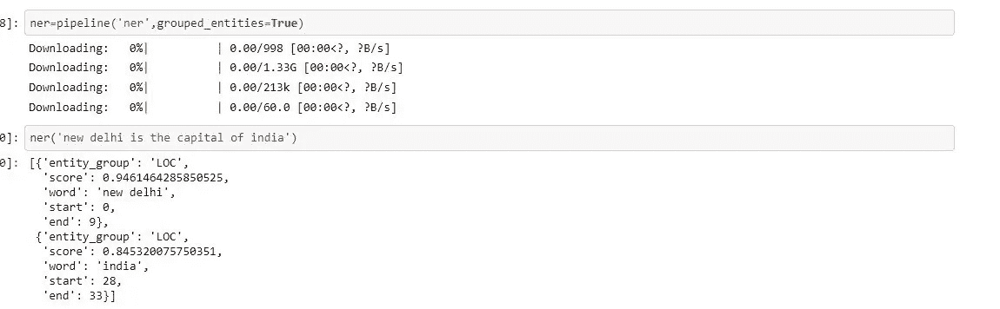
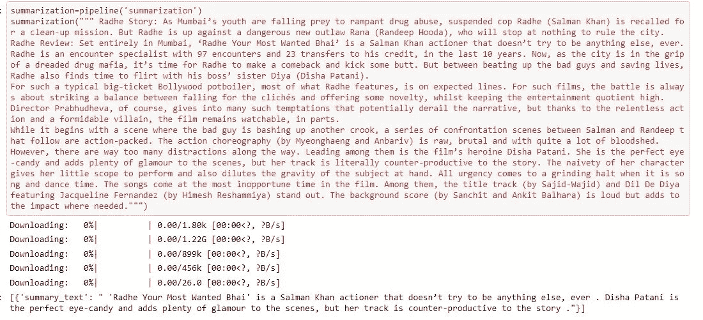
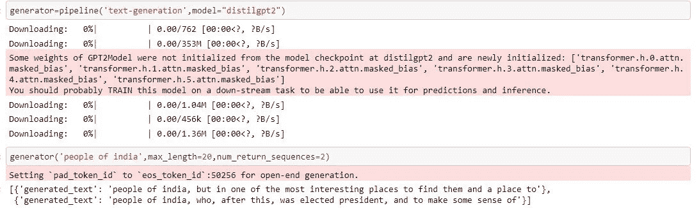
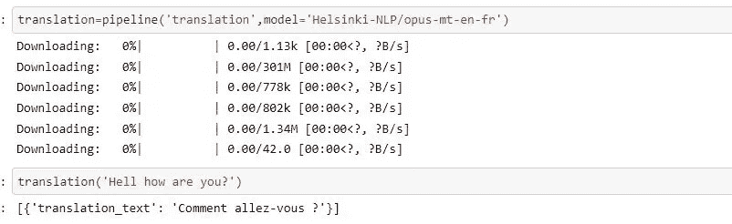

# 变形金刚中的管道对象🤗

> 原文：<https://medium.com/geekculture/pipeline-object-in-transformers-using-hugging-face-6577f57a4c18?source=collection_archive---------20----------------------->

上周，我完成了一门来自拥抱脸的免费课程，在那里我学到了许多新事物，如变形金刚和许多预训练的 NLP 模型。

在这篇博客中，我将分享管道对象在变形金刚库中可以做什么。

[https://utilityanalytics.com/2020/07/natural-language-processing-talking-in-a-way-machines-can-understand/](https://utilityanalytics.com/2020/07/natural-language-processing-talking-in-a-way-machines-can-understand/)

**什么是抱抱脸？**

拥抱脸提供了许多预先训练的模型，这些模型是在数十亿文本语料库和各种各样的 NLP 任务上训练的。一个你可能已经知道的预训练模型是 BERT。还有一种更轻便的 BERT 版本，即 DSITIL BERT。

所有这些预训练模型都基于转换器架构，一些模型仅使用转换器的编码器部分，如 BERT，而其他一些模型仅使用解码器或编码器-解码器(两者都使用)。

您可以使用简单的代码行导入所有这些预训练模型，并在您的自定义数据集上对它们进行微调。

您可以查看 hugging face 的 hub，它包含更多针对各种 NLP 任务的预训练模型。

 [## 拥抱脸-人工智能社区建设未来。

### 我们正在通过开源和开放科学来推进和民主化人工智能的旅程。

huggingface.co](https://huggingface.co/models) 

让我们看看什么是变形金刚中的管道对象:

## 管道

Pipeline 对您的输入文本数据执行所有预处理和后处理步骤。它执行一些预处理步骤，如将文本转换成数值，以及后处理步骤，如生成文本的情感，并且这些步骤可以根据预训练模型的任务而变化。

**安装**:

可以用**安装！像许多其他库一样，pip 安装变形金刚**,但这次只安装了一个较轻的版本。也可以用**安装开发版！pip 安装 transformers[sentencepiece]，**它提供了深度学习框架，如 PyTorch 和 tensorflow，或者您也可以使用 google collaboratory。

让我们看看 pipeline 对象可以执行的一些任务。

1.  **情绪分析**

sentiment analysis

您可以看到，使用 pipeline 执行情感分析是多么简单。在这里，我们只是从变压器库导入管道，并将我们的文本传递给分类器对象，它将下载默认的预训练模型进行情感分析，并输出我们文本的情感。

以下是变压器库中可用的管道列表

*   特征提取(获得文本的矢量表示)
*   填充遮罩
*   命名实体识别
*   问答
*   情感分析
*   摘要
*   文本生成
*   翻译
*   零射击分类

在本文中，我们将研究其中的一些管道。

2.**文本生成**

这里的主要思想是，如果您提供一些不完整的文本，它将通过生成剩余的文本来自动完成。

Text Generation

您也可以使用参数 **max_length** 指定输出文本的长度。

**3。命名实体识别**

命名实体识别(NER)是一项任务，其中模型必须找到输入文本的哪些部分对应于诸如人、位置或组织等实体。

**Named Entity Recognition**

我们在管道创建函数中传递 grouped_entities=True 选项，告诉管道将句子中对应于同一实体的部分重新组合在一起。(例如:新德里)

**4。总结**

摘要的任务是将一篇文章缩减成一篇更短的文章，同时保留文章中提到的所有(或大部分)重要方面。

**Summarization**

在这里，我已经通过了萨尔曼汗的拉德赫电影评论。

所有这些管道都从给定任务的中心选择默认模型，但是我们也可以使用管道中的**模型**参数选择不同的模型。

让我们看一个文本生成的例子。

choosing custom model

**5。语言翻译**

这是一项将属于一种特定语言的文本转换成另一种语言(如法语)的任务。

English to French language Translation

我分享了管道可以执行的非常少的任务，但是管道可以执行更多的任务。

这个博客到此为止！我会在我的下一个博客里看到你

你可以找到拥抱的脸🤗免费课程在这里:

 [## 设置-拥抱面部课程

### 欢迎来到拥抱脸课程！这一介绍将引导你建立一个工作环境。如果…

huggingface.co](https://huggingface.co/course/chapter0?fw=pt) 

我的 Github 个人资料:

 [## manoj567 -概述

### 阻止或报告 7 月 8 月 9 月 10 月 11 月 12 月 1 月 2 月 3 月 4 月 5 月 6 月 1 日周三 Fri 在 2 个存储库中创建了 5 个提交

github.com](https://github.com/manoj567) 

我的 Linkedin 个人资料:

 [## Manoj Gadde - Kaggle 投稿人- Kaggle | LinkedIn

### 查看 Manoj Gadde 在世界上最大的职业社区 LinkedIn 上的个人资料。Manoj 有 2 份工作列在他们的…

www.linkedin.com](https://www.linkedin.com/in/manoj-gadde/)