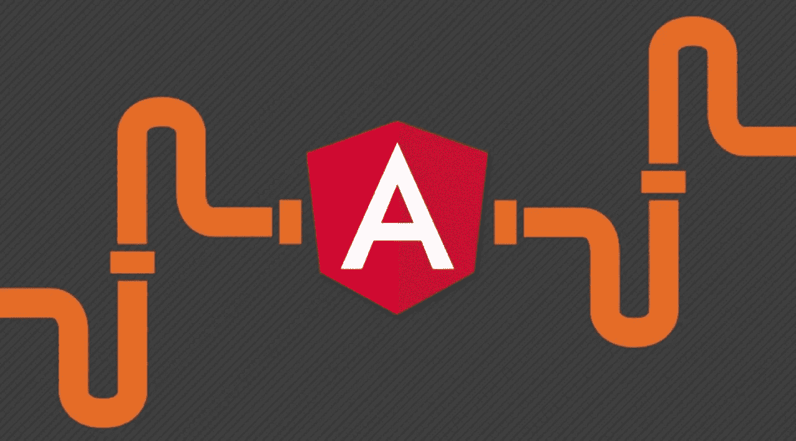
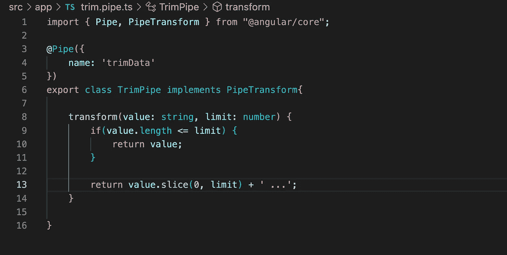
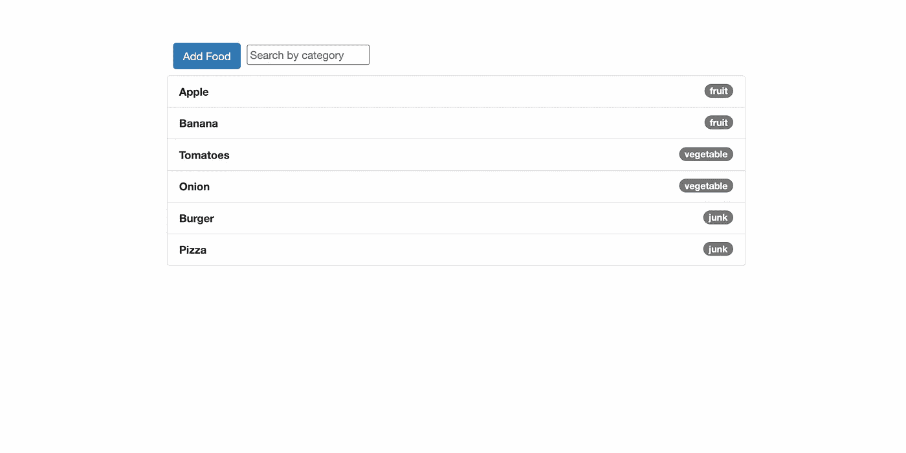
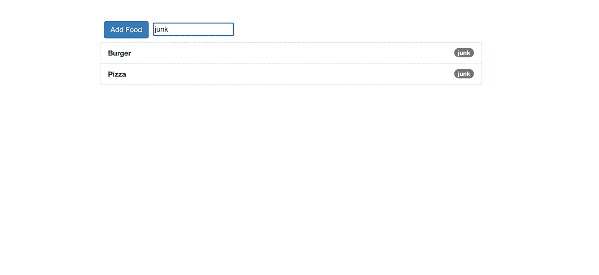
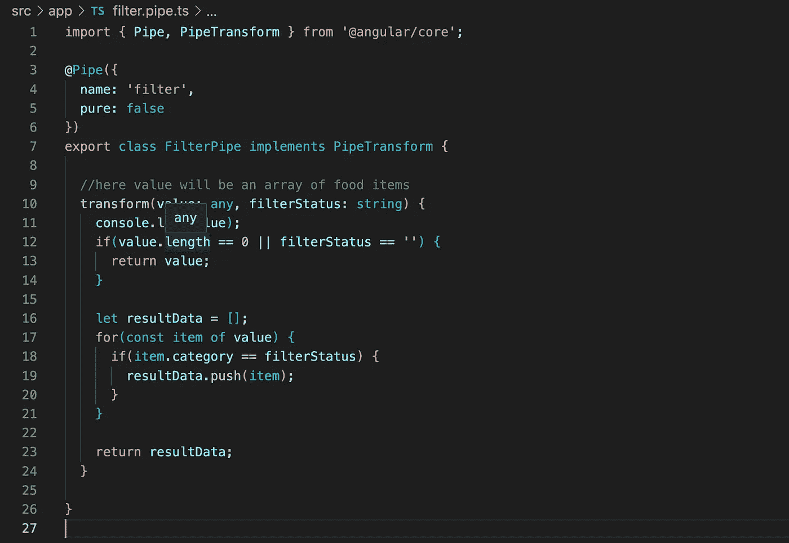
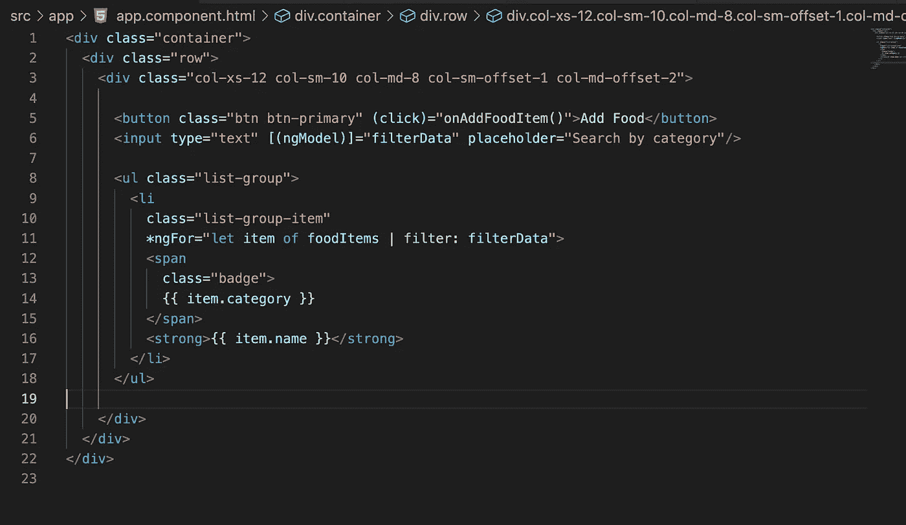

# 角形管道

> 原文：<https://medium.com/geekculture/pipes-in-angular-547c28f0e236?source=collection_archive---------4----------------------->

## 了解内置管道，在 Angular 中创建自定义管道和过滤管道



Understanding built-in pipes and creating custom pipes in Angular

Angular 中的管道用于转换数据，而不会直接影响保存数据的属性。

我们可以转换字符串、货币金额、日期和其他数据进行显示。管道是在模板表达式中使用的简单函数，用于接受输入值并返回转换后的值。

我们可以使用内置管道，也可以创建自定义管道。

# 内置管道

一些内置管道包括:

*   `*uppercase*` (将字符串转换成大写)
*   `*lowercase*` (将字符串转换成大写)
*   `*date*` (将日期格式化成不同的类型)
*   `*Async*`(订阅一个`Observable`或`Promise`，并返回其发出的最新值)

让我们用一个例子来理解它们:

```
<p>{{ userName | uppercase }}</p>
<p>{{ userCountry | lowercase }}</p>
```

我们所要做的就是写下管道符号|后跟管道名称,就像大写或小写一样。

这里用户名和用户国家是角度组件中定义的属性，并保存一些数据。

假设**用户名持有- >测试用户**，它将被**转换为- >测试用户**，因为**大写管道**正在被使用，尽管持有数据的属性保持不变。

同样地说**用户国持有- >印度**，它将**转换为- >印度**，因为**小写管道**正在被使用。

日期管道用于格式化日期值。像 *date、currency* 这样的管道将接受管道函数的参数，要传递参数，需要在管道名称(`*date*`)后面加上冒号(`***:***`)和参数值(`‘fullDate’`)。要检查所有参数，请参考[角度文件](https://angular.io/api/common/DatePipe)。

例如:

```
<p>{{ loginDateTime | date: 'fullDate' }}</p>
```

它将输出一个格式化的日期，类似于:**2022 年 5 月 28 日星期六**而不是时间戳。

# 链接多个管道

要将多个管道链接在一起，我们只需在不同的管道名称之间使用一个管道操作符(`***|***`)，参见下面的代码示例

```
<p>{{ loginDateTime | date | uppercase}}</p>
```

它将输出**格式的日期，后面跟着所有大写的内容**，比如:

**2022 年 5 月 28 日星期六**

# 创建自定义管道

我们还可以创建自己的管道，并为其定制转换逻辑。使用命令*ng g p<name _ of _ pipe>*，假设我们创建自定义管道，该管道将数据修剪到某个限制，然后如果值超出该限制，则在末尾添加…。

从在终端中运行 **ng g p trim** 开始:

这将创建一个 trim.pipe.ts，并在 app.module.ts 声明数组中声明它。它将接受该值，并考虑限制参数和值长度，它将决定是直接返回该值还是返回后跟…字符的分片值



trim.pipe.ts code

为了执行转换，它实现了 **PipeTransform 接口**。Angular 调用`transform`方法，将绑定的值作为第一个参数，将任何参数作为列表形式的第二个参数。

我们还定义了 **@Pipe decorator** ，它将一个类标记为管道并提供配置元数据。通过编写管道符号|后跟 trimData，管道名称可直接用于模板绑定。

# 角形过滤管

除了转换我们的数据，我们还可以使用管道使用过滤管道过滤我们的数据。

让我们通过在 Angular 中创建一个由食物列表组成的基本应用程序来理解这个概念。

每个食品都是一个对象，其中包含名称和类别属性。我们将添加一个搜索过滤器来过滤我们的食品列表，并返回与输入框中提供的类别相匹配的项目。

我们还将有一个添加食物按钮，在垃圾类别中添加一个预定义的食物项目。



Running Angular application showing Filter Pipe

现在，如果我输入垃圾，它将触发我的过滤管道逻辑，并返回垃圾类别的食品。



Running Angular application showing Filter Pipe with junk category being searched

让我们看看如何实现这一点:

从在你的终端中运行 **ng g p 过滤器**开始。这将创建 filter.pipe.ts 并将其添加到 app.module.ts 中的声明数组中

如上所述，FilterPipe 类实现了 **PipeTransform 接口**，以便执行转换或数据过滤。Angular 调用`transform`方法，将一个绑定的值作为第一个参数，这里将是一个食物项目的数组，将任何参数作为第二个参数。

我们还定义了 **@Pipe decorator** ，它将一个类标记为管道并提供配置元数据。在模板绑定中直接使用管道名称，方法是编写管道符号|后跟管道名称—这里是 filter。

纯属性默认为真。为 true 时，管道是纯的，这意味着只有当输入参数改变而不是数据改变时，才会调用`transform()`方法。因此，如果我触发了过滤管道，比如在输入中键入垃圾，在此期间，如果我们将更多属于垃圾类别的数据推送到食品数组，它不会反映在结果中。

因此，我将 pure property 设置为 false，这可能会影响我们的性能，但是当我们的输入参数发生变化或者数据发生变化时，我们的过滤管道逻辑将被触发。



最后，将这个过滤管道添加到我们的 HTML 模板中。

