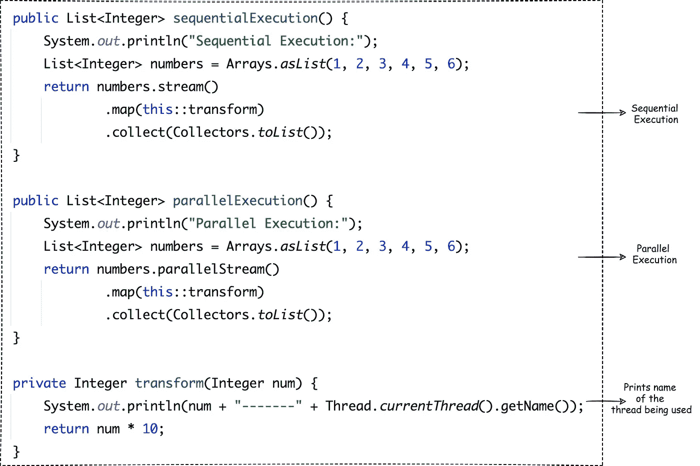
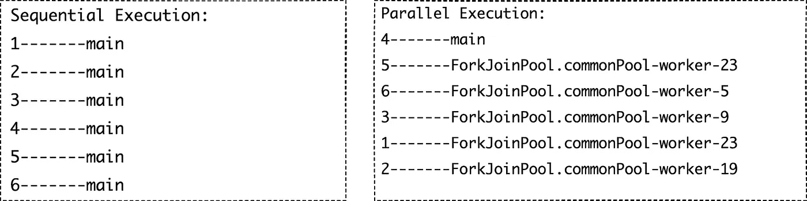
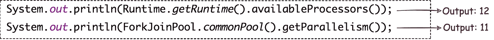
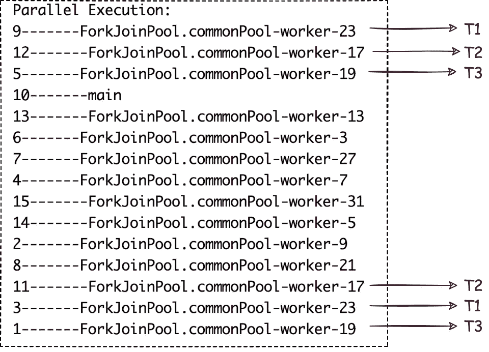

# Java 并行流的内部结构

> 原文：<https://medium.com/geekculture/pitfalls-of-java-parallel-streams-731fe0c1eb5f?source=collection_archive---------6----------------------->

## 为什么并行流不一定总是更快

Photo by [John Anvik](https://unsplash.com/@redviking509?utm_source=unsplash&utm_medium=referral&utm_content=creditCopyText) on [Unsplash](https://unsplash.com/?utm_source=unsplash&utm_medium=referral&utm_content=creditCopyText)

Java 8 中引入了流 API，作为操作集合的有效方式。并行流作为并行处理的一部分被引入，以使应用程序运行得更快。虽然并行流被认为可以通过在多个线程之间分割任务并比顺序执行更快地完成任务来提高应用程序的性能，但是并行流有时也有可能会降低整个应用程序的速度。

# 顺序和并行执行中的线程

考虑一个例子，一个流在一列数字上运行，它通过将数字乘以 10 来转换数字并返回结果。正在使用的线程的名称打印在 *transform()* 中。

运行上述程序会产生以下输出:

Output of sequential and parallel execution

顺序执行只使用主线程，而并行执行同时使用主线程和来自 ForkJoinPool 的线程。

# **叉加入池**

Java 7 中引入的 *fork/join 框架*，通过分而治之的方法，尝试使用所有可用的 ***处理器内核*** ，帮助加速并行处理。 **Fork** step 将任务分割成更小的子任务，这些任务由不同的线程并发执行。执行完所有子任务后， **Join** 步骤会将所有结果组合成一个结果。与顺序执行相比，这些步骤给并行执行增加了更多的开销。

fork/join 框架使用由 *ForkJoinPool 管理的线程池。*当使用 Java 并行流并行运行任务时，它在内部使用来自 *ForkJoinPool* 的默认线程池(称为 *commonPool()，*的线程，这是一个静态线程池。

## **在公共池中有多少线程可用于并行执行？**

***forkjoinpool . common pool()***中的线程数量比您机器中可用的**逻辑 CPU 内核**的数量少一个。

Code to get the available processors on the machine and the amount of parallelism provided by ForkJoinPool

我的机器上的逻辑 CPU 数量是 12，ForkJoinPool 可以并行执行的线程数量是 11。因此，总共 12 个任务可以在这里并行执行(main + ForkJoinPool)，使用所有 12 个 CPU 内核。**并行流被配置为使用与运行程序的计算机或虚拟机中的核心数量一样多的线程。**

为了说明这一点，考虑上面列表中有 15 个数字的相同程序运行，这是并行运行的 15 个任务。因为在我的机器上可以并行执行的任务数量是 12，所以首先执行前 12 个任务，剩下的 3 个任务将等待另外 3 个正在运行的线程完成执行。在下面给出的输出中，标记为 **T1、T2 和 T3** 的线程被使用了两次。**因此，如果要执行的任务数量大于 commonPool 中的线程数量，剩余的任务将等待正在运行的任务完成。**

Output of parallel execution with 15 numbers in list

# 平行流的副作用

假设一个并行流在一个 *cpu 密集型/阻塞任务*上运行。在此任务完成之前，用于此操作的 ForkJoinPool 中的线程不会被释放回 commonPool。因此，当这个请求在每秒处理数千个请求的服务器上运行时，该服务器并行运行许多 parallelStreams，少量请求将占用 ForkJoinPool 的 commonPool 中的整个线程，并导致其余请求排队，从而降低整个应用程序的速度。

使用 ForkJoinPool 线程时，任务不应处于阻塞状态，而应在合理的时间内结束。因此，对于需要同时处理多个请求的应用程序，应该谨慎使用并行流。