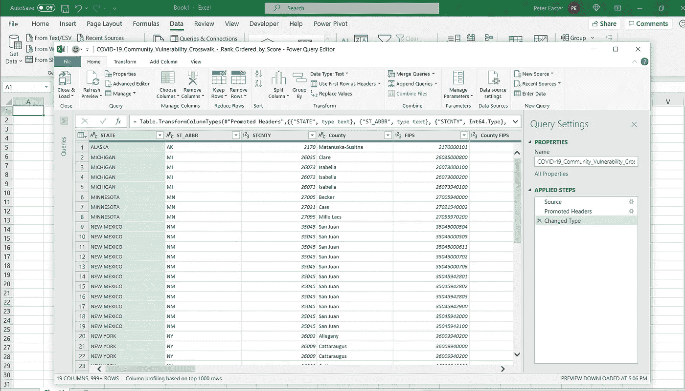
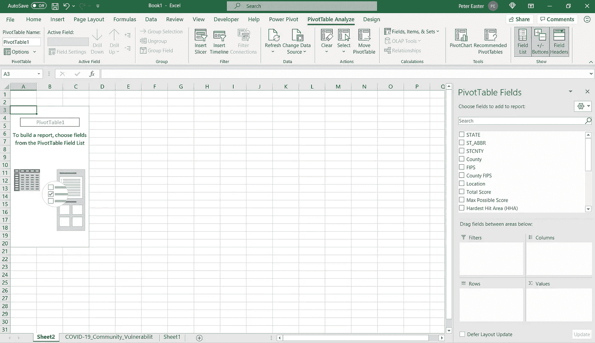
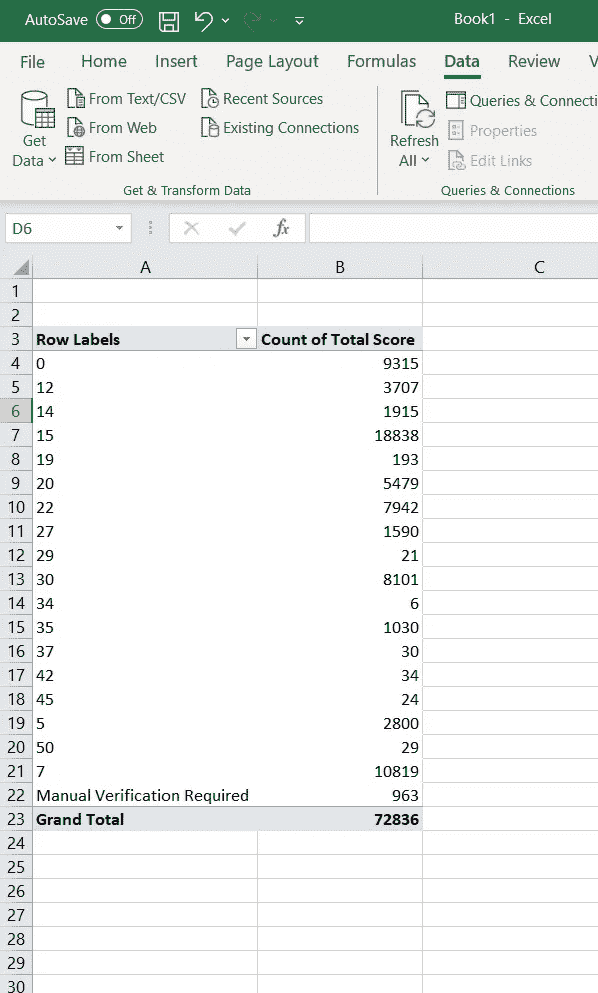
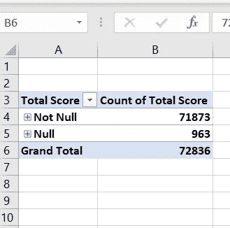
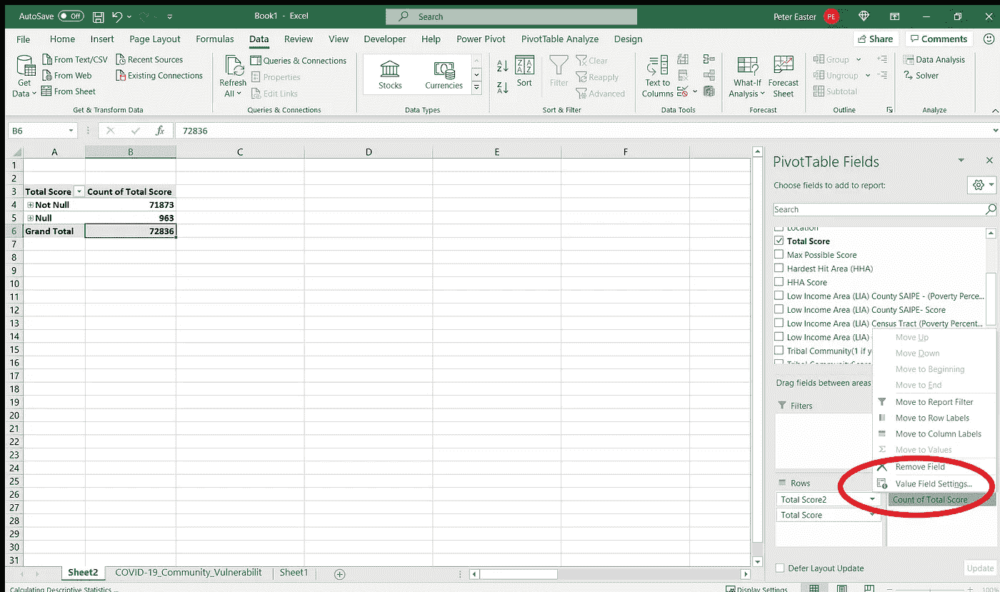
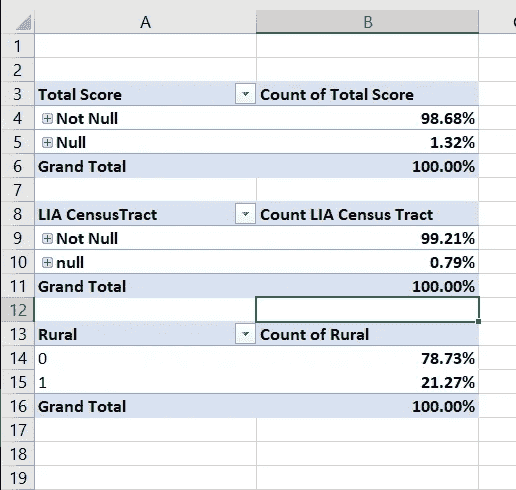

# 数据透视表 101:第一部分

> 原文：<https://medium.com/geekculture/pivot-tables-101-part-one-6a4730d14832?source=collection_archive---------53----------------------->

90 秒后，您的第一张 Excel 数据透视表…

Image by [Free-Photos](https://pixabay.com/photos/?utm_source=link-attribution&utm_medium=referral&utm_campaign=image&utm_content=336373) from [Pixabay](https://pixabay.com/?utm_source=link-attribution&utm_medium=referral&utm_campaign=image&utm_content=336373)

如果您不熟悉 Excel 等电子表格软件的基本功能和用法，本系列将为您提供一些快速示例，帮助您轻松加载数据、清理数据以及将数据转化为有意义的见解。这意味着没有多余的，快速的指令，所以让我们跳进去。

# 正在加载数据:

今天，我使用的是来自 HealthData.gov 的数据集，名为“[新冠肺炎社区脆弱性人行横道——按得分排序](https://healthdata.gov/Health/COVID-19-Community-Vulnerability-Crosswalk-Rank-Or/rnkf-8dm6)”。加载这样的数据集可以通过一些简单的方法来完成。

1.  直接打开你下载的”。csv "文件与 Excel 程序。这是最快的方法，但是不能保证数据是您想要的格式(文本数据类型可能被解释为数字，日期被解释为整数，等等。).
2.  在电子表格应用程序中导入数据。对于 Excel，您可以通过以下方式完成:在新工作簿中，选择“数据”选项卡>选择“从文本/CSV 获取数据”>选择”。csv”文件，并按照提示导入您的数据。这样做的好处是，您可以在加载之前选择“转换您的数据”,以确保您按照预期的方式加载数据。

Loading Data through the “Get Data” functionality in Excel

# 从数据中获得快速洞察力:

一旦加载了数据，首先要做的事情之一就是验证数据是否有意义。在“总分”栏下有许多“需要手动验证”的单元格。这些本质上是“空”数据字段，应该如此对待。“低收入地区(LIA)人口普查地区(贫困百分比)”一栏也缺少数据。但是我们如何确切地知道 excel 中丢失了多少呢？一种方法是利用数据透视表。

1.  单击数据表中的单元格，选择“插入”选项卡，然后选择“数据透视表”。数据透视表是一种简单的汇总或分组数据的方式，可以快速获得洞察力。
2.  向新工作表添加数据透视表。它应该是这样的:

在这种情况下，我希望看到我的数据集中几列的总“Null”或“NaN”。为此，我将首先向行中添加“总分”,向“总值”框中添加“总分”。最终结果是这样的:

我对查看我的数据中的所有变量不感兴趣，只有“非空”和“空”是“需要手动验证”单元格的计数。为此，我简单地将数据分组:

并将其重命名为:

为了更改为百分比，我更改了数据透视表字段的“汇总值”框中的数据类型:

不要从“汇总值”列表中选择，单击“显示值为”选项卡，选择“列合计的百分比”或您感兴趣的任何计算。现在，总分列的百分比为“空”

冲洗并重复其他感兴趣的色谱柱。

Excel 是一个优秀的工具，可以快速操作小型数据集，并获得对这些数据集的总体了解。不幸的是，与 Python 或 R 相比，对于大多数数据科学任务来说，Excel 既乏味又缓慢。尽管如此，考虑到电子表格在大多数业务应用程序中的普遍使用，了解如何在这些应用程序中快速有效地生成这些类型的见解是值得的。

在“数据透视表 101:第二部分”中，我们将深入探讨如何链接多个图表并在仪表板中操纵它们。下次再见，干杯！