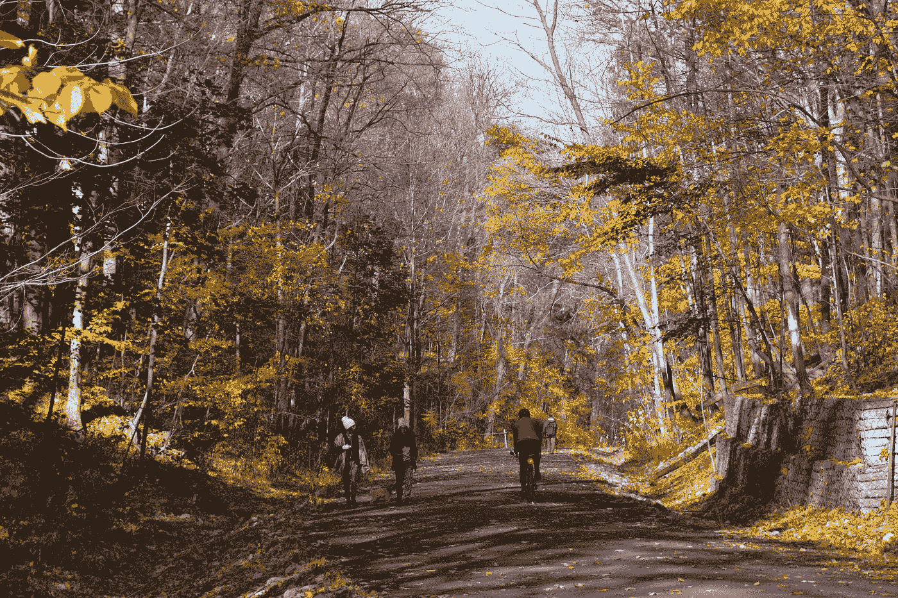

# 像规划汽车一样规划自行车

> 原文：<https://medium.com/geekculture/plan-for-bikes-as-you-would-for-cars-15f7a9921e4a?source=collection_archive---------39----------------------->

## 视角的转变在中西部郊区产生了巨大的效果。

Photo by [Jeffrey Eisen](https://unsplash.com/@jeisen?utm_source=medium&utm_medium=referral) on [Unsplash](https://unsplash.com?utm_source=medium&utm_medium=referral)

如果你像设计汽车一样全面地设计自行车，自行车在经济上是有意义的。

如果你想象说最后一句话的人，你会看到什么？