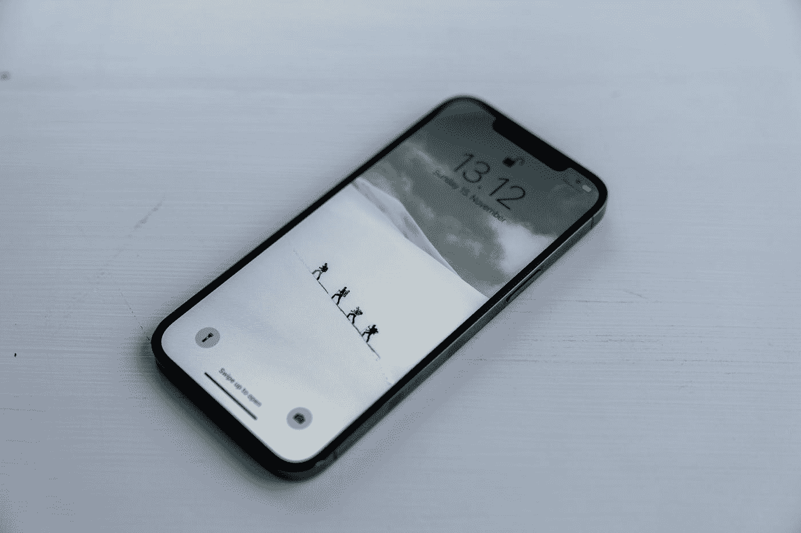

# 智能手机计划淘汰

> 原文：<https://medium.com/geekculture/planned-smartphone-obsolescence-a0786ee8b133?source=collection_archive---------10----------------------->

## 我可能不得不升级我完美的手机，因为我的安卓版本太旧了

Photo by [Hendrik Morkel](https://unsplash.com/@hendrikmorkel?utm_source=medium&utm_medium=referral) on [Unsplash](https://unsplash.com?utm_source=medium&utm_medium=referral)

我刚刚接种了第二次疫苗，之后，你会得到一个二维码，你可以用一个特殊的智能手机应用程序扫描它，以证明你已经完全接种了疫苗。

然而，当我想下载应用程序时，我再次被拒绝。我的手机没有…