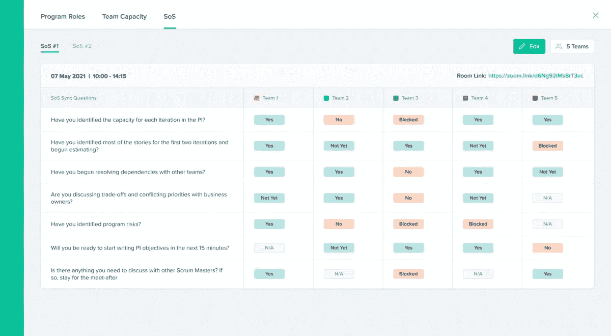

# 在 PI 规划期间规划 Scrum 的 Scrum

> 原文：<https://medium.com/geekculture/planning-scrum-of-scrums-during-pi-planning-2c9dcbfc9737?source=collection_archive---------13----------------------->

成功的 PI 计划会议的基础是与所有团队成员良好的协调和合作，团队成员可能包括 100 多个组成敏捷发布系列的个人。这种团结一致实现共同愿景的感觉，以及能够顺利地进行有洞察力的公开讨论以解决涵盖更大范围的障碍的感觉，才是举办一次伟大的 PI 规划会议的真正目标。

在 PI 规划的过程中，有一些同步点对于保持实现项目增量目标的一致性和一致性非常重要。在本文中，我们将深入讨论这些同步点中的一个，称为 Scrum(S . o . S)的**计划 Scrum。除了揭示 Scrum 的规划 Scrum 是什么，为什么和如何，我们将阐明它在 PI 规划中的重要性。**

Scrum of Scrum View — Kendis

# 什么是 Scrum 中的规划 Scrum？

当敏捷发布系列中各个团队的所有 scrum 大师聚在一起回顾 PI 过程中必须实现的进度和里程碑时，Scrum 的计划就完成了。这发生在 PI 计划活动的团队分组会议期间。这个事件是由发布系列工程师促成的，他可以被认为是敏捷发布系列的首席 scrum 大师。

# Scrum 的规划 Scrum 是怎么做的？

类似于 scrum，scrum master 向团队提问，持续大约 15 分钟，scrum 的规划 Scrum 会议的时间限制为 1 小时，并遵循一个议程。这个议程由发布培训工程师从所有团队的 scrum 大师那里询问的问题组成。这些问题可以简单到像“这件事做完了吗？”一些复杂的问题。每个组织都有自己独特的问题。

下面是一个在 Scrum 会议的规划中可以提出的问题的例子。

*   您是否已经确定了 PI 中每个迭代的容量？
*   您是否已经确定了前两次迭代的大部分故事，并开始进行评估？
*   你开始解决与其他团队的依赖关系了吗？
*   你是否在和企业主讨论取舍和冲突的优先级？
*   你已经识别出项目风险了吗？
*   你准备好在接下来的 15 分钟内开始写 PI 目标了吗？
*   你有什么需要和其他 Scrum 大师讨论的吗？如果是这样，留下来参加见面会。

# 计划 Scrum 的 Scrum 的目标

缩放敏捷框架的美妙之处在于它非常强调一致性和透明性，这就是为什么 Scrum 的计划 Scrum 非常重要。

许多组织经常忘记或者不太重视在 PI 计划期间进行 Scrum of Scrums 会议的计划。计划 Scrum of Scrums 会议的目标是了解团队是否能够实现他们的迭代(sprints)目标，最终明确项目增量的目标是否能够实现，而不仅仅是一个状态检查。

它提供了一个很好的机会，可以在早期讨论和识别可能的依赖和障碍，从而确保持续的集成。它保持了团队之间的一致性，并提供了一个公开讨论的平台，这不仅有利于团队本身，也有利于整个项目的增长。

# 数字化解决方案，让 Scrum 的计划成为 Scrum

在 PI 计划期间，计划 Scrum 的 Scrum 相当依赖于面对面的交流。但不完全是。如果你的团队分散在全球不同的地方，远程进行 PI 规划，那么如果你的日程已经确定，那么进行一次建设性的规划 Scrum 不是问题。这项活动可以通过使用正确的数字工具来辅助。

Kendis 是一个一站式解决方案，用于指导和可视化 Scrum 会话的规划 Scrum。有了这个新的[特性](https://kendis.io/updates/scrum-of-scrums-during-pi-planning/)，你可以为你的计划 Scrum 进行无缝和透明的体验。

# 结论

看一眼这个计划 Scrum of Scrums 会议就足以了解整个敏捷发布系列的脉搏。可视化的计划 Scrum of Scrums 会话增强了透明度，因为它允许发布培训工程师和相关的 scrum masters 识别、跟踪每个敏捷团队的进度和瓶颈并采取行动。这也使他们能够为项目增量的未来做出更明智的决策。