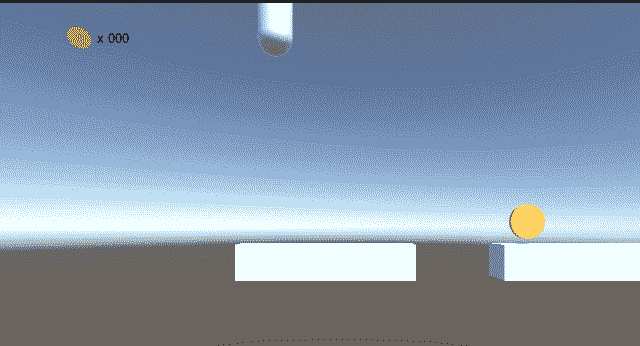

# 平台用户界面

> 原文：<https://medium.com/geekculture/platform-ui-49c0ba2f27a2?source=collection_archive---------16----------------------->

目标:构建一个有趣的动态用户界面

我的想法是在这里有一个 UI **显示**的生命和硬币，就像真正的游戏玩家和硬币一样！

创建画布后，我以这种方式设置它:

通过选择这个**渲染模式**，UI 将被绘制在相机上，而不是覆盖在屏幕上。这允许我们在画布上放置 3D 对象和 2D 对象。**平面距离**也是…