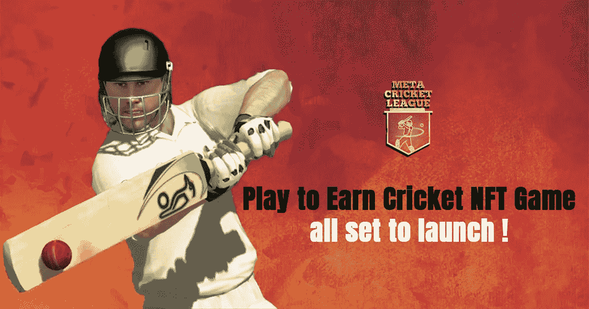
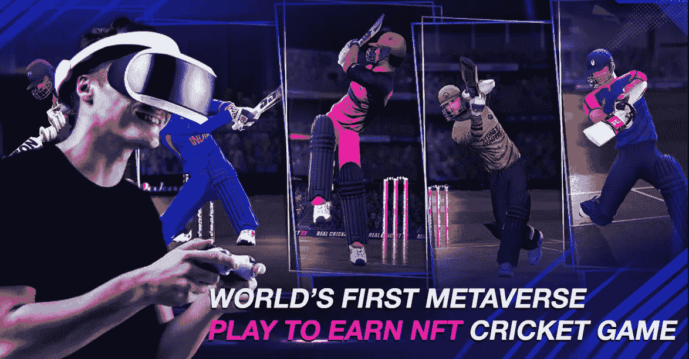
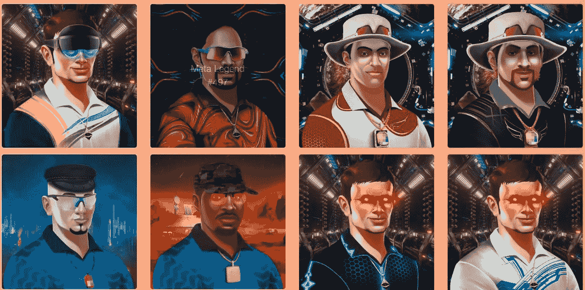
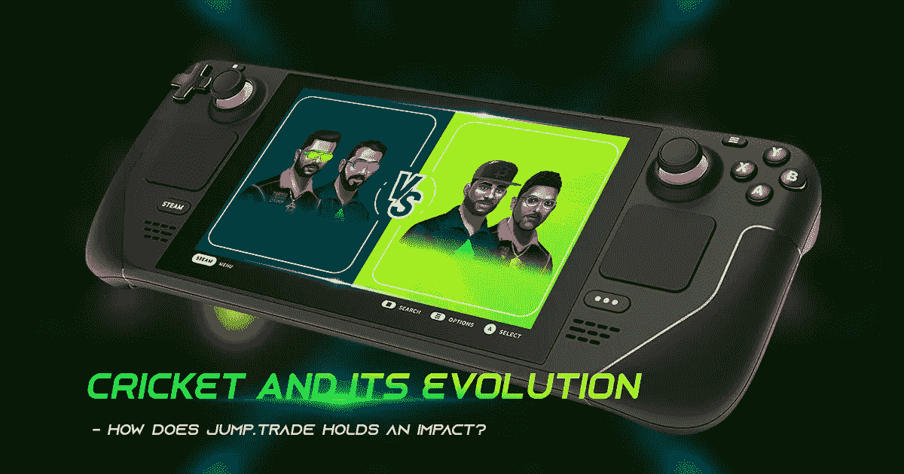

# 玩赚取板球 NFT 游戏都设置为启动！

> 原文：<https://medium.com/geekculture/play-to-earn-cricket-nft-game-all-set-to-launch-97d14e3646b0?source=collection_archive---------12----------------------->

## 等待终于结束了！世界上第一场 NFT 板球比赛将统治 NFT 世界！

**Meta Cricket League Play to Eanr Cricket Game**

你是板球迷还是狂热的游戏玩家？还是你们两个都是？如果是这样的话，这里有一些好消息给你。独一无二的市场，跳跃。一段时间以来，贸易一直是头条新闻。自从 MCL 板球 NFTs 推出以来，围绕市场已经建立了巨大的牵引力。MCL 即玩即赚 NFT 是成为 [**元板球联盟**](https://www.jump.trade/?fsz=Karthik) 一部分的门户。请继续阅读，了解更多关于 MCL 的发布和即将推出的内容。

**游戏背后**

要理解这个游戏，重要的是理解游戏背后发生了什么。

跳的时候。trade 推出了世界上第一款“玩赚”板球 NFTs，包括板球粉丝在内的所有 NFT 爱好者都为之疯狂，在不到 9 分钟的时间里，大约 52，000 张 NFTs 被抢购一空。从那时起，社区一直在等待游戏的推出。

**World’s First Cricket NFT Game- Meta Cricket League**

体育运动在印度备受推崇。虽然有许多其他 NFT 游戏与狩猎和战斗有关，跳。贸易决定探索板球。由此， [**世界第一板球 NFT 赛的根源——元板球联赛**](https://www.jump.trade/?fsz=Karthik) ，诞生于板球精神与对 NFTs 的狂热结合。经过长时间的等待和宣传，这款游戏将于 2022 年 7 月 22 日推出。

**旅程**

跳跃之旅。这项交易始于拥有不同技能的板球 NFT。这些 NFT 充当了游戏的入场券。每一个 NFT 都有一套属性和特长，让游戏更上一层楼。

**Meta Cricket NFTs**

然后蝙蝠来了！蝙蝠是最有价值的资产。该市场还推出了已签署的英美烟草 NFT。这些球棒上有板球领域的一些传奇人物和先驱的签名。市场也有来自标志性事件的多个玩家叹息的蝙蝠。因此，围绕游戏的炒作和狂热是有道理的。

**推动边界&设定新标准**

在首次推出后，marketplace 决定在 NFT 游戏领域拓展边界并设定更高的标准。从仅仅关注蝙蝠和球，焦点转移到通过分散的元宇宙板球生态系统为用户提供更有益健康的体验。凭借高端运动图形和 VFX，游戏体验肯定会让玩家大吃一惊。

**Meta Cricket League**

**机构群体回应**

随着游戏的大肆宣传，毫无疑问社区会很好地接受这个游戏。跳。trade 坚持自己的愿景，正在尽最大努力让每个人都能接触到 NFTs。社区参与和及时更新保持了社区的高昂情绪。

市场已经发布了游戏的测试版。这款游戏见证了社区的热烈反响，也让社区更加兴奋。

然而，毫无疑问，这个游戏将继续发展，在未来提供更好更先进的游戏性，并将继续给社区留下深刻印象。

**第 D 天**

这一天终于来了！每个板球迷和 NFT 游戏爱好者都在等待这一天。2022 年 7 月 22 日，NFT 博彩世界据说将见证 [**世界首次 NFT 板球比赛**](https://www.jump.trade/?fsz=Karthik) 的启动。

跳。在游戏发布前几周，trade 已经发布了他们的白皮书。该白皮书提供了关于市场愿景和使命的清晰信息，以及对游戏的清晰概述。他们也一直在给社区及时更新游戏。白皮书的发布为机构群体提供了急需的清晰度。

在此之后，marketplace 推出了游戏的下注版本。参与游戏的人对整体体验、身临其境的游戏性和奖励印象深刻。因此，他们的社区对实际的游戏没有第二个想法。

**Cricket and it’s Evolution**

带着兴奋和期待，社区期待着 MCL 游戏的推出。

**结尾**

你已经兴奋了吗？别再等了，拿上你的 NFTs！玩游戏，体验游戏。然后，保持高度的兴奋和能量，因为你需要大量的兴奋和能量来体验即将发生的事情。