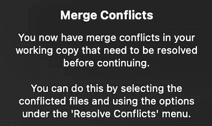
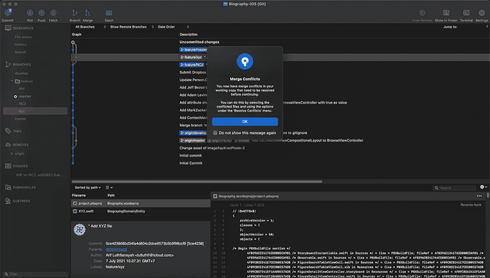

# 使用 XcodeGen 避免 pbxproj 文件冲突⚠️

> 原文：<https://medium.com/geekculture/play-with-xcodegen-to-avoid-pbxproj-file-conflicts-%EF%B8%8F-7e658443fee7?source=collection_archive---------25----------------------->

# 🙂介绍

大家好，我希望你们都平安健康。嗨，iOS 开发者们，你们在团队中工作吗？你和`pbxproj`文件有冲突吗？如果是的话，这次我想邀请你玩 XcodeGen，避免`pbxproj`文件冲突。

# 😵‍💫问题

你和`pbxproj`文件有冲突吗？例如，您和您的队友都在同一个目录位置添加文件。当你想将你的工作分支合并到一个`development`分支或`feature`分支时，冲突就发生了💥🤯。

# 💡想法

我们可以通过使用支持工具来避免`pbxproj`文件冲突。这里推荐大家使用 [XcodeGen](https://github.com/yonaskolb/XcodeGen) 。

## 为什么？

*   操作起来很好用。这意味着当您的项目配置就绪时，您只需要打开您的终端并运行`xcodegen`。
*   它支持创建`Info.plist`
*   它支持定制你的项目`Build Setting`和`Build Phase`。是的，它还支持授权配置。
*   允许您在生成`xcodeproj`文件之前运行任何命令。
*   允许您在生成`xcodeproj`文件后运行任何命令。
*   不再需要按`xcodeproj`和`xcworkspace`，`Info.plist`是可选的。

## 为什么不呢？

*   定制项目`Build Settings`和`Build Phase`有点麻烦。因为你需要知道你要设置的值的配置键。我的方法是你需要用另一个编辑器应用程序打开`pbxproj`文件来查看完整的密钥。

# 🎯行动

我将分享我个人已经实现了 [XcodeGen](https://github.com/yonaskolb/XcodeGen) 的项目配置。项目配置将被写入一个`project.yml`文件。您可以将我的作为您进行项目配置的参考。

# 🎉摘要

有几种方法可以避免`pbxproj`文件冲突。但对我来说，这是最好的方法，可能是你避免冲突的答案，也是你想要合并时的担忧。

大概难的是当你要设置`Build Setting`或者`Build Phase`的时候，脑子里会出现一个问题，“可能吗，可能吗？”。采取行动，试着帮助你。祝您好运👍🏻

# 👋🏻关闭

谢谢大家！希望这对你有帮助。请让我知道你是否有任何麻烦或关于这的任何讨论。永远不要停止学习！🔥