# 来自 Mixamo.com 的玩家动画

> 原文：<https://medium.com/geekculture/player-animations-from-mixamo-com-4e65ef7cd81a?source=collection_archive---------20----------------------->

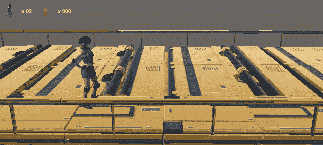

**目标**:搜索、获取并应用动画到人形角色

自上一篇教程以来，已经有了一个巨大的、不有趣的飞跃。我将项目升级到类似生产的阶段，尽可能保留原型的逻辑。

例如，我设法保留了 *PlayerMovement* 的脚本，即使它需要一些调整。

一个主要的变化是从资产商店引入了一个**人形角色**。我确保它是一个. fbx 模型，这意味着它是一个以 Autodesk Filmbox 格式保存的 3D 模型。对于动画来说，这将非常有用。

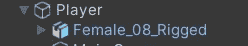

与上一个游戏中的角色 [The Great Fleece](https://danioquero.itch.io/the-great-fleece) 一样，3D 模型是玩家游戏对象的**子对象**。发生这种情况有很多原因，其中大部分都与玩家(父对象)运动和模型(子对象)动画之间的独立性有关。

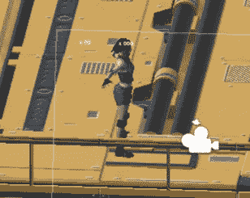

角色将以经典的 T 型姿势出现在场景中。确保你调整了角色控制器碰撞器的大小和偏移量。

## 动画片

现在我们要做一点动画。我知道，我不是艺术家，尤其不是 3D 艺术家或动画师。幸运的是，我们为角色选择的**格式**帮了我们很大的忙，因为在网上有太多其他具有相同格式的角色。还有动画。我要给你表演一个魔术！

进入[Mixamo.com](https://www.mixamo.com/)网站并登录(Adobe 账户)或免费订阅。在这个网站上，我们可以搜索到一部**动画**，这部动画很有可能会和我们的 fbx 角色一起工作！很简单:首先，搜索一个动画，比如说“奔跑”。

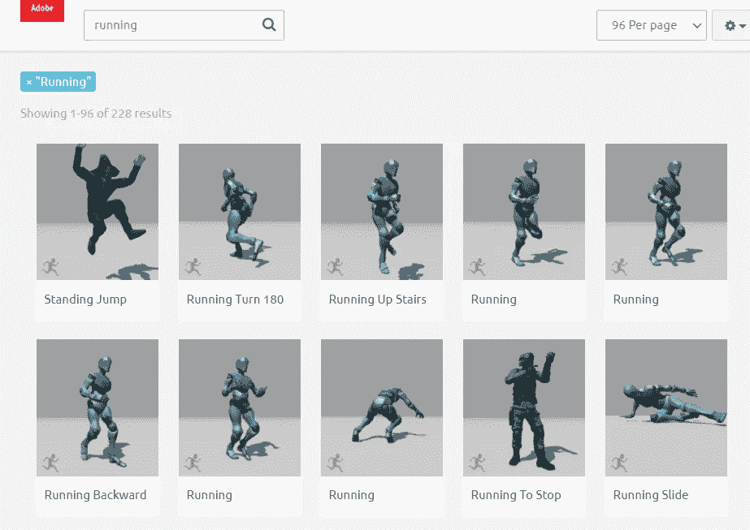

因此，大量的动画预览将向您展示该网站提供的内容。你可以点击其中一个来获得一个更大的预览，带有一些微调滑块(剪切动画长度和类似的)。

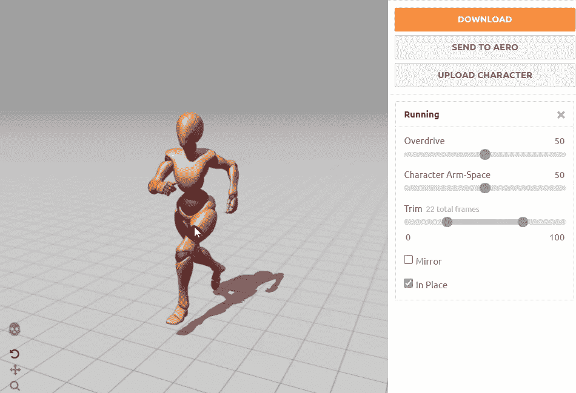

在一些动画中，还会出现一个超级有用的**就位复选框**。如果有，检查一下。这将强制动画在处**发生，因此角色实际上不会因为动画而移动，将编写脚本的工作留给您(这是更可取的)。在其他一些情况下，将不会有这样的选择，我们将不得不团结一致地工作，以获得同样的结果。**

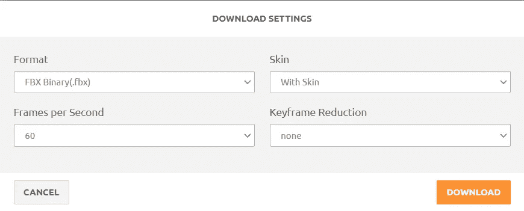

您现在可以下载动画了。其实你正在下载一个 fbx **模型**有这样的动画。如果可以，尽量保持快照中的设置。下载完成后，您可以在 Unity Editor 中通过简单的拖放操作导入 fbx。你需要多少就拿多少。

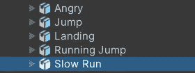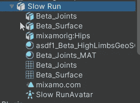

如果您从项目视图中打开一个，您会看到您导入了一个 3D 模型，包括材质(红色机器人外观)和一个动画，这里称为 mixamo.com。

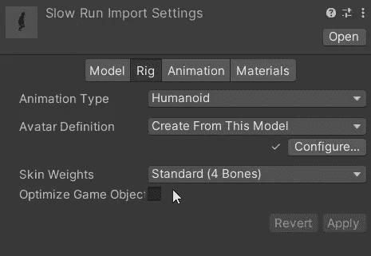

在检查器视图中，您会看到这些标签。选择**钻机**一台。**装配**也被称为骨骼动画:3D 模型由一个骨骼(内部)和一个表面(外部)组成。许多动画只涉及角色的骨骼(例如跑步)。为了让这个动画和我们的角色一起工作，我们必须选择**人形动画类型**。这是必须的，否则动画会是一场灾难。

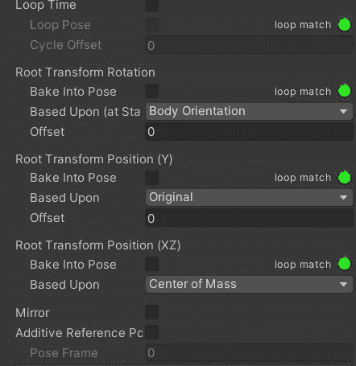

在动画选项卡中，您可以找到这些属性。这些是非常重要的，尤其是在你没有从 Mixamo 获得一个就地选项的情况下。我说的是**烘焙成姿势**选项。通过选中其中的一个或多个，您将强制动画在适当的位置出现。你必须为你的动画找到正确的组合。您可以随时在检查器底部预览结果，那里有一个动画播放器。

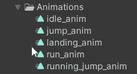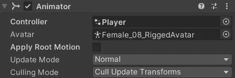

一旦所有这些都完成了，这里有一个诀窍:我们将窃取动画，永远不要使用这个虚拟模型。简单的**复制**动画对象，重命名并移动到你喜欢的任何地方！在这一点上，你可以为你的实际三维模型定义一个动画，并把所有的动画放在那里！

## 过渡

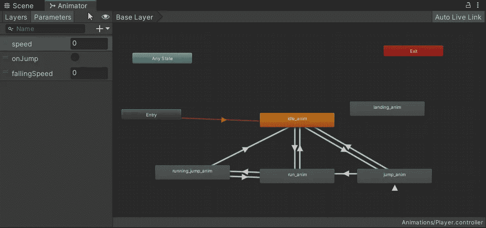

为了让动画工作，我们需要协调它们之间的**过渡**。目前，我们有 4 个动画:空闲，跳跃，跑步和跑步跳跃。空闲动画被设置为默认值，因此开始时的角色将处于空闲动画中。从那里我们可以过渡到跑步或跳跃。

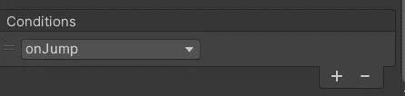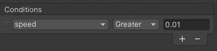

跳转由跳转方法中设置的实际**触发参数**触发。

运行由大于阈值(0.01)的**浮动参数**触发。移动时，该参数将设置为速度的绝对值。当跳跃时，它也将被设置为 0，以避免在半空中运行动画。

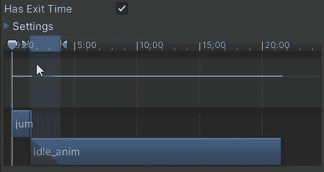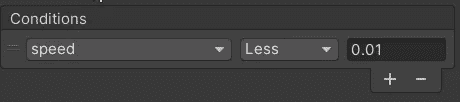

回到闲置状态的方式有所不同。跳转到空闲过渡将有一个**退出时间**，但有必要调整一点设置，以获得我想要的平滑过渡。

运行到空闲状态再次利用了浮点参数。

跑步跳跃动画将在玩家跑步跳跃时出现。所以过渡就是跑步到跑步跳跃，再回到跑步或者回到空闲。

跑步跳跃，使用跳跃触发器。相反的检查速度值(大于)。返回空闲又有一个退出时间。

这是在运动/跳跃逻辑中设置参数的时间。

## 字符方向

最后要修复的是**角色在奔跑时的方位**。由于模型(子对象)是动画，但只有玩家对象(父对象)根据输入移动，结果是角色正确地在一个方向上奔跑，而**在另一个方向上月球漫步**。当角色是一个胶囊时，我们从来不关心这个，每个方向都相等，但现在我们有了一个人类角色，我们需要他/她看着他/她跑的方向。

解决方案是`Quaterion.LookAt()`方法，我们已经在[银河射手](https://danioquero.itch.io/galaxy-shooter-2d)游戏中使用了鱼雷。该方法需要一个矢量作为**前进**方向，一个矢量作为**上升**方向。向上方向是实际的世界向上向量，而向前取决于运动，因此取决于速度。这是一个我们已经计算过的矢量，用来触发动画。

这一次我们还需要**将**存储在私有字段`_lastNonZeroSpeed`中。这个矢量在开始时将被指定为`Vector3.forward`，然后将保持水平速度矢量，如果非零，否则将保持其最后的值。

这意味着向量永远不会为零，而水平速度可以为零(无输入情况)。这个技巧将允许我们**保持**角色看着我们输入的最后一个方向，而不是翻回到默认方向(根据空闲动画)。

