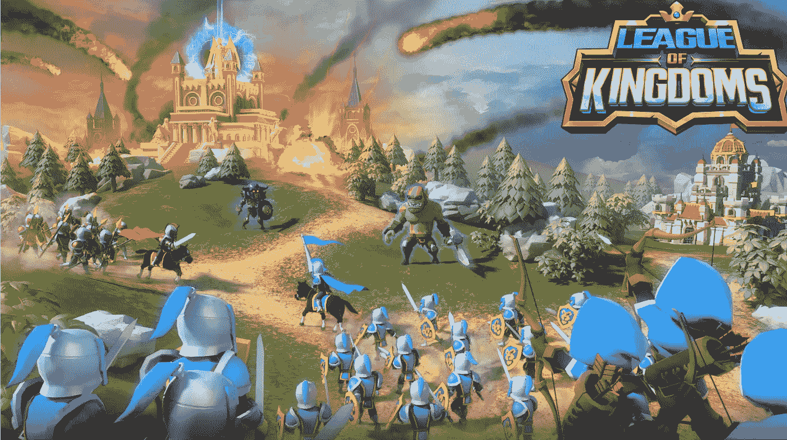
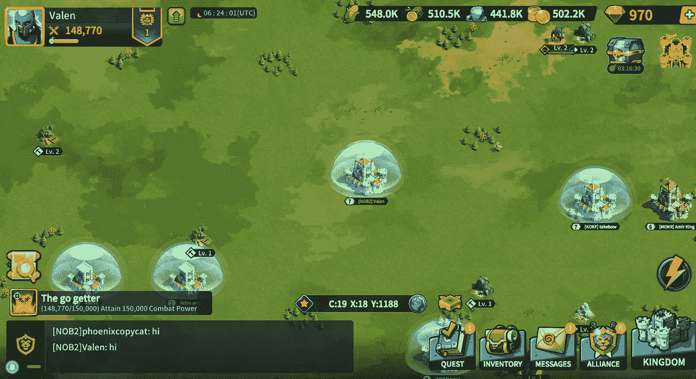
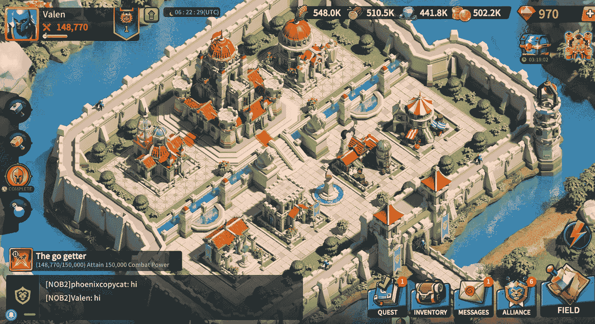
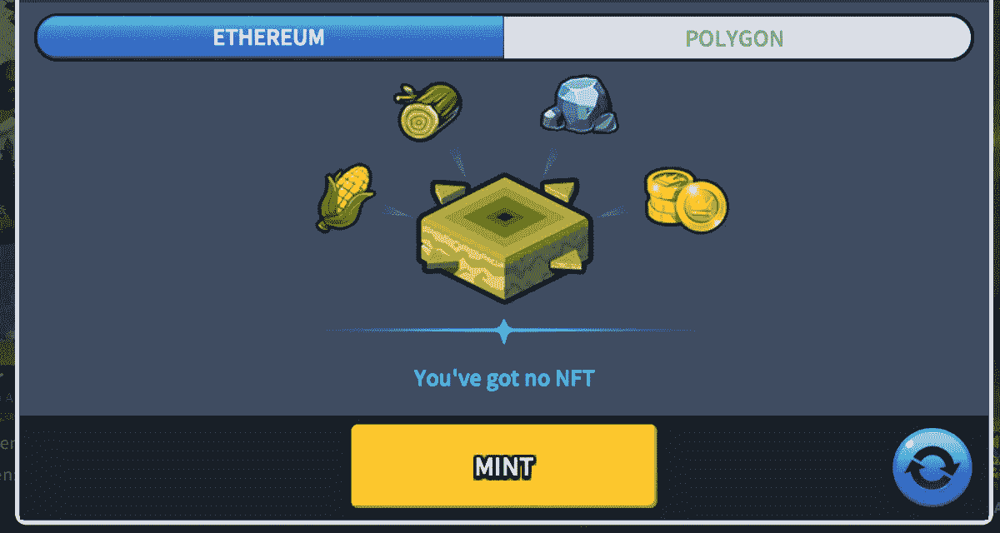

# 玩王国联盟你会忘记时间

> 原文：<https://medium.com/geekculture/playing-league-of-kingdoms-you-lose-the-track-of-time-6c8b84a21728?source=collection_archive---------13----------------------->

## 你可以免费玩，并铸造你的第一个 NFT

The image is a screenshot taken by the author from the [game](https://www.leagueofkingdoms.com/)

作为一名对加密货币、区块链游戏和 NFT 商业世界中出现的一切新事物的狂热爱好者，我想扩展我在这些领域的知识，因为我确信它们代表着未来。我寻找新的游戏，可以帮助我以一种简单的方式铸造我的第一个 NFT。我想我找到了一个好的，我想把它送给你。

# 自由发挥

我只是想更熟悉 NFT 游戏，看看你如何从游戏资源中创建一个 NFT。嗯，[王国联盟](https://www.leagueofkingdoms.com/)就是这样一款游戏，超级上瘾，让你免费玩，帮你打造你的第一个 NFT。

通常，NFT 的游戏质量也很好，但需要你进行初始投资。一个例子是[轴无限](https://axieinfinity.com/)。但是我在这里发现的游戏允许你免费玩，收集资源和奖励，然后用它们来制造 NFT。

《王国联盟》是一款战略游戏，你可以直接在浏览器中在线玩。它也允许你购买土地，类似于[分散土地](https://decentraland.org/)。

# 可爱的图形

当我第一次看到这个游戏的截图时，我有点怀疑，因为我在手机上玩了一些类似的游戏和外观，但我承认这不是一个区块链游戏。

一旦我进入了《王国联盟》，我选择用我的谷歌账户登录(你可以用脸书、苹果、电子邮件登录，或者只是作为一个客人)。我只是被卡通但清晰的画面和令人上瘾的游戏吸引住了。

The image is a screenshot taken by the author from the game

这款游戏也可以在手机上通过 Google Play 和 App Store 下载。我也在手机上玩过，在三星 S8 Plus 上玩，效果非常好。

# 令人上瘾的游戏

当我被我在 21.5 英寸屏幕上看到的众多细节惊呆后，我开始玩。我不是战略游戏的狂热爱好者，尤其是这种类型的战略，但当我开始建造、夷平建筑、创造士兵并获得奖励时，我的神经元似乎意外地感到愉快。

This is an image taken by the author from the game

我继续在游戏中前进，用各种各样的奖励填满我的库存，并思考转换那些在 NFTs 中可能的奖励的可能性。有一刻我看了看钟，我意识到我连续玩了 4 个小时这个游戏。它只让你在开始的时候玩这么久，因为一旦你升级，升级建筑和做某些事情需要很长时间，在此期间你可以离开电脑。

看着菜单选项，我终于找到了一个你可以创建一个 NFT。

# 铸造 NFT

一旦你收集到足够的奖励和资源，你就可以创造资源包，如木头、石头、黄金或玉米，并在 [OpenSea](https://opensea.io/) 市场上出售。你可以从两个不同的网络中选择:以太坊区块链和多边形网络。在这两种情况下，都会有一个通知警告您，您必须支持网络燃气费和资源费，这可能高达所有已用资源的 40%。

This image is a print screen from teh game, taken by the author

举个例子，如果你有 2000 万枚黄金，你可以制作一包 1000 万枚的 NFT，然后在 OpenSea 上出售。你定价格，但是你可以看看别人要了多少钱一包。我见过卖几百块的 NFT，想想看，这只是个开始！

我还没有铸造 NFT，但我计划很快这样做。我可能会带着另一篇评论回来。

# 结果

总之，《王国联盟》在游戏性、画面和创造 NFT 的可能性方面超出了我的预期，因为老实说，这是它最令人愉快的地方。我只是忘记了时间，我每天都回来玩，特别是因为有你不能错过的登录奖励。

能够玩这样一个令人愉快的策略游戏，并且希望有一天你能够从中赚到很多钱，这真是太棒了。我推荐这个游戏，尤其是如果你是一个策略迷。

*你喜欢我的评论吗？你可以通过* [*订阅介质*](https://marchisflorin82.medium.com/membership) *来帮我。它也将让您访问我的所有文章和所有其他文章的媒介。*