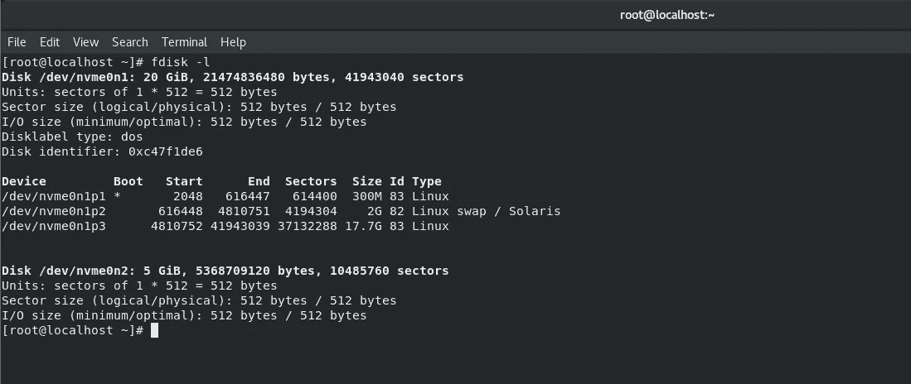
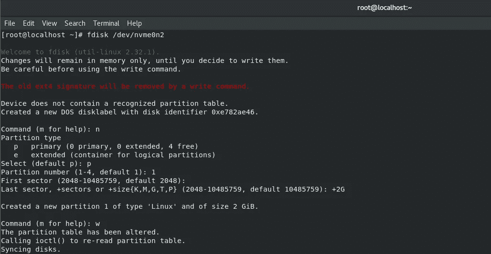
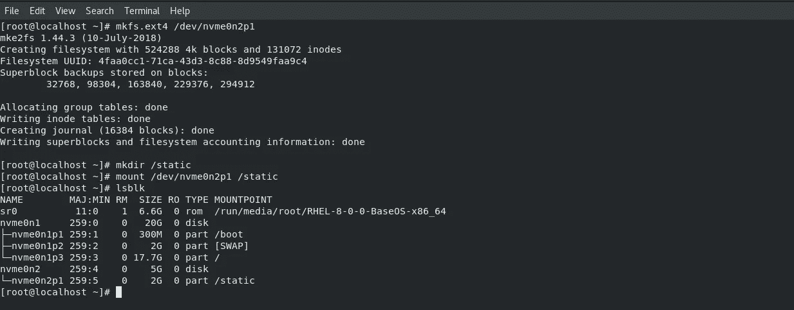
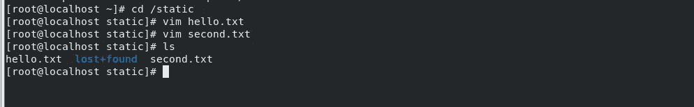
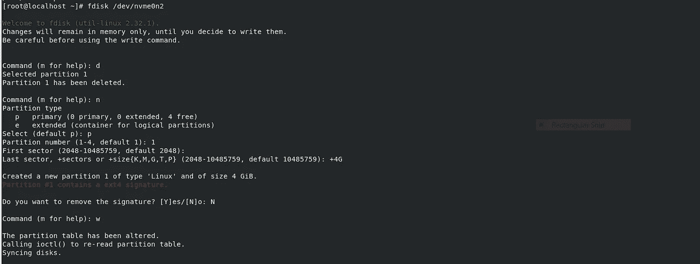
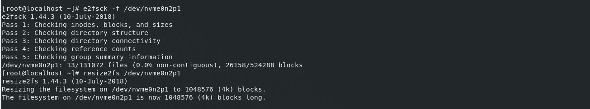
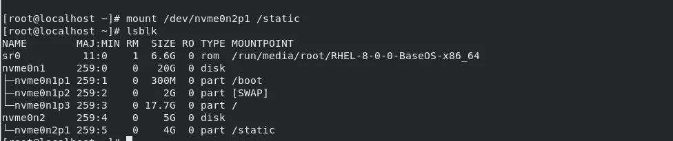
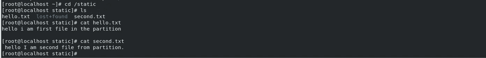

# 使用静态分区(Linux)

> 原文：<https://medium.com/geekculture/playing-with-static-partitions-linux-94b50088fff5?source=collection_archive---------1----------------------->

真的吗？我们可以增加或减少在 Linux 操作系统中创建的静态分区的大小吗？

# 操作系统中的什么分区

在操作系统中，内存管理是负责分配和管理计算机主内存的功能。内存管理功能跟踪每个内存位置的状态，无论是分配的还是空闲的，以确保有效和高效地使用主内存

静态(固定)分区:
这是最古老也是最简单的技术，用于将多个进程放入主存。在这种分区中，RAM 中的分区(非重叠)数量**是固定的，但是每个分区的大小**可能相同**也可能不同**。由于是**连续**分配，因此不允许跨越。这里，分区是在执行之前或系统配置期间进行。

让我们试试增加静态分区的大小，看看我们是否会成功。

**第一步**

向系统添加新硬盘。在 **#fdisk -l** 命令的帮助下，我们可以看到连接到我们系统的硬盘的所有细节。在我的系统中，我添加了一个 5GB 的硬盘。

initial details of hard disk

**第二步**

现在我们必须在硬盘上创建一个新的分区。对于这次运行 **#fdisk [hd_name ]** 在我的情况下/dev/nvme0n2。

creating a new partition

这里，n 用于新分区，p 用于主分区类型，1 个分区号，起始大小用作默认的 2048，大小为+2G，即 2 gb。最后用“w”来写修改。

**第三步**

格式化新创建的分区，并将其挂载到文件夹 **/static。**

我们可以用各种格式来格式化分区，但是在我们的例子中是用**# mkfs . ext 4[partition _ name]**来格式化分区，即 **nvme0n2p1** 。

并将分区挂载为**# mount/dev/nvme 0 N2 p 1/static**。

formatting and mounting of partition

#lsblk 是显示所有分区细节的命令。

**第 4 步**

转到分区目录并创建一些文件。

creating files in /static directory

**第五步**

这是我们增加分区大小的主要步骤。

在提交任何更改之前，首先使用**# umount[partition _ name]**卸载分区

changing partition size

这里的“d”用于删除旧分区，“N”用于再次创建新分区，“p”用于主要类型，“4G”用于 4 gb，最后给出“N ”,因为它要求删除以前的签名。

**如果我们给出“是”来删除签名，那么它将删除先前的信息节点表，并将创建一个新的信息节点表，并且先前存储的全部数据将被删除。**这就是签名的意义。

**第六步**

现在，我们将运行 **#e2fsck -f /dev/nvme0n2p1** ，这将检查分区中是否有任何错误，并删除它们。

这一次我们将使用 **#resize2fs /dev/nvme0n2p1** 而不是 mkfs.ext4，因为该命令只会格式化新添加的数据块，而不会格式化之前的数据块。

running error check and reformatting the newly added block of data

第七步

再次安装分区。

remounting the partition

万岁！！😁😁我们已经成功地增加了分区的大小，而没有改变任何数据。

final output

旧数据已经存在于分区中，并且大小也增加了。

同样，我们可以减小大小，但大小应该大于存储的旧数据的大小。

感谢阅读。😊😊