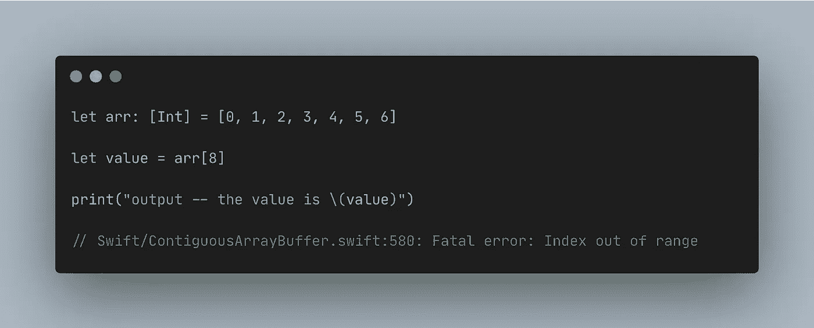
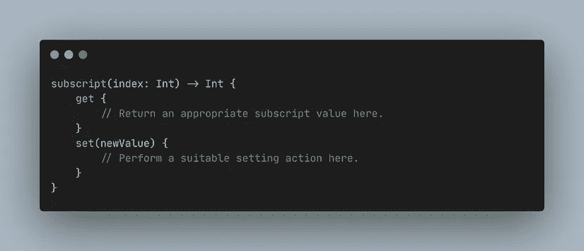
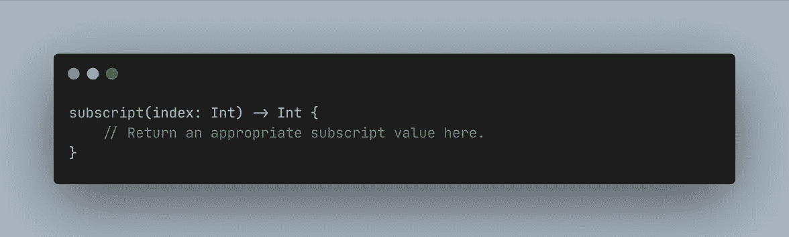
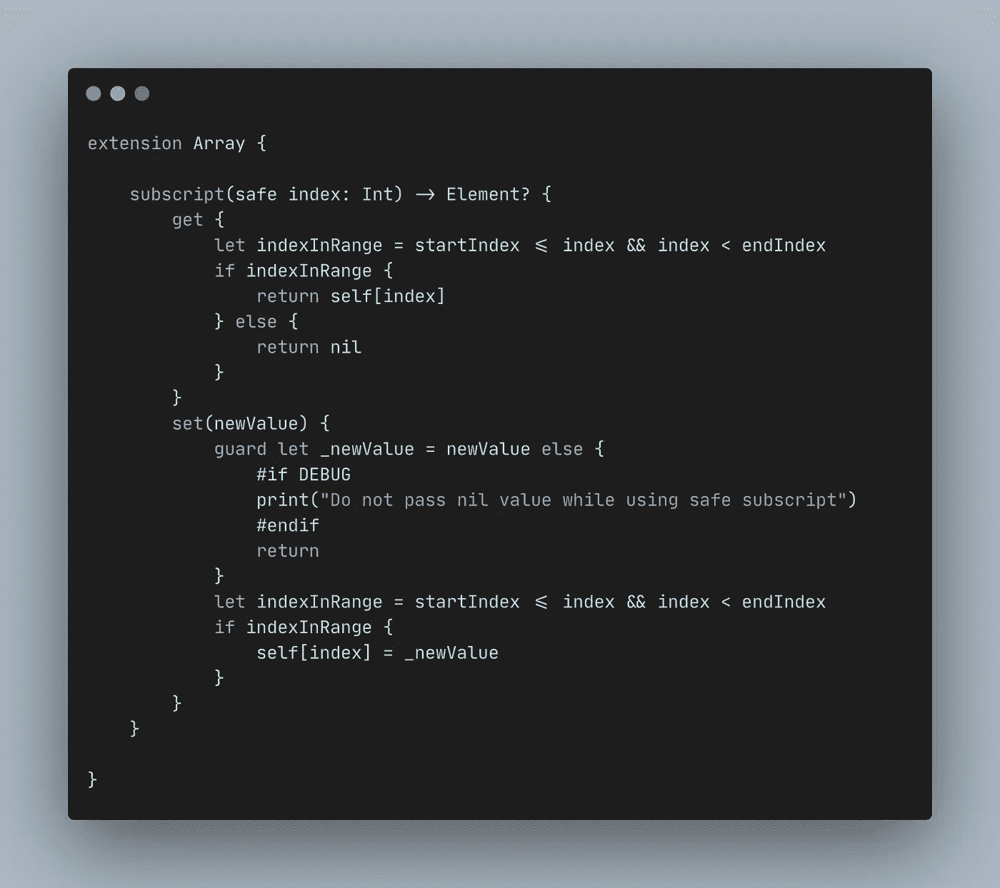
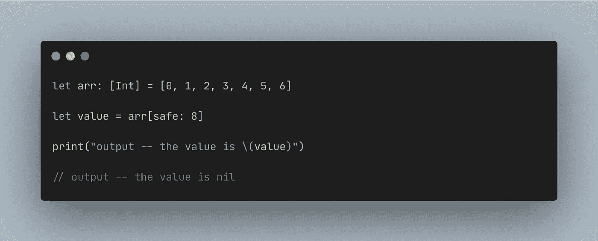

# 利用下标关键字安全访问数组

> 原文：<https://medium.com/geekculture/playing-with-subscript-keyword-to-access-array-safely-4e935d9b8ee0?source=collection_archive---------29----------------------->

# 🙂介绍

大家好，我希望你们都平安健康。嗨，iOS 开发者们，你们在访问一个数组的时候有没有害怕过？如果你有，那么你就在控制恐惧的正确场所。

# 😵‍💫问题

在试图获取特定索引的值时，您是否遇到过错误`Fatal Error: Index out of range`？这个错误很小但是很危险，因为它会导致你的应用程序崩溃。

Index out of range while accessing the index that has never been set

# 💡想法

我们可以避免在 Swift 中使用关键字`subscript`的错误，是的，🥳.让我们来接触一下`subscript`这个关键词。什么是`subscript`关键词？它是如何工作的？

## 什么是`subscript`关键词？

`subscript`是访问集合、列表或序列的成员元素的快捷方式。但是在另一个上下文中，你可以使用`subscript`，就像计算你的`struct`或`class`的`getter`和`setter`。你可以点击[这里](https://docs.swift.org/swift-book/LanguageGuide/Subscripts.html)了解更多`subscript`。

## 它是如何工作的？

`subscript`类似于计算的`getter`和`setter`。你可以为`getter`和`setter`编写你不可思议的代码。下面是使用`subscript`关键字的默认语法。

the subscript syntax is written in two ways

# 🎯行动

让我们回到问题上来。我们可以在了解 Swift 中的`subscript`关键词后加以利用。这是安全访问数组的代码。

the solution

how to use the solution

# ✨摘要

您可以利用`subscript`关键字来访问您的对象或集合。

## 赞成的意见

*   使用这种方式可以节省时间复杂度，而不是同时使用`contains()`和`contains(where:)`。
*   安全地访问特定索引处的值。

## 骗局

*   如果您只知道索引，而不知道集合中的值，那么这种方法是合适的。
*   在我们的编译器中有一个检查器会很好，因为你不能给`nil`作为新的值。

# 👋🏻关闭

谢谢大家！希望这对你有帮助。请让我知道你是否有任何麻烦或关于这的任何讨论。永远不要停止学习！🔥