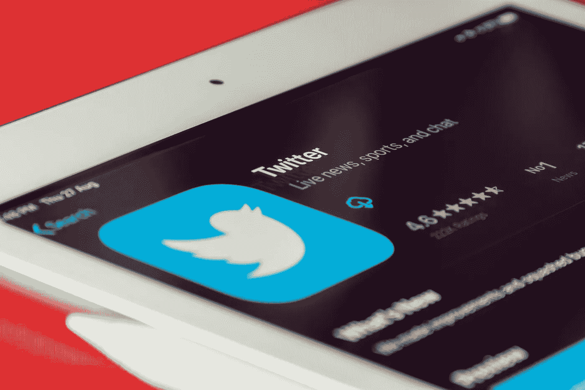
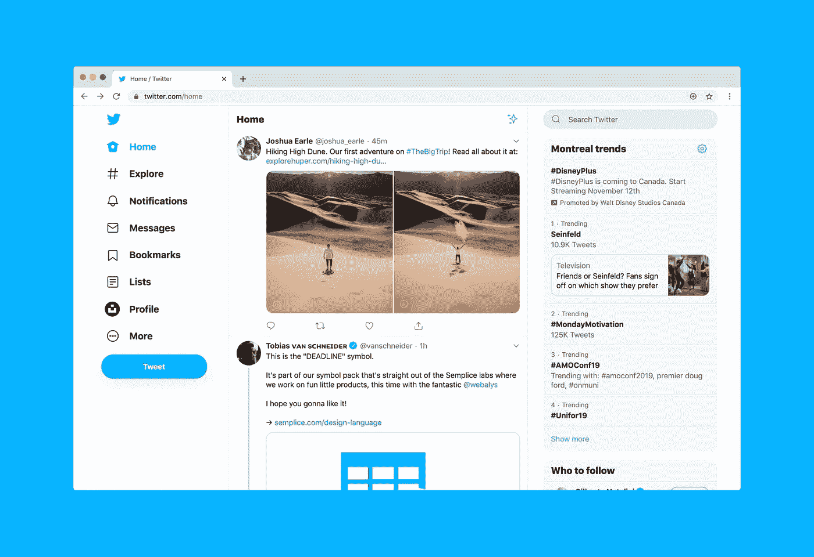

# 请不要“认证”Twitter 用户

> 原文：<https://medium.com/geekculture/please-dont-authenticate-twitter-users-54d43629daf2?source=collection_archive---------15----------------------->

Souvik Banerjee

现在你肯定知道这个消息了:埃隆·马斯克[收购了 Twitter](https://www.theverge.com/23026874/elon-musk-twitter-buyout-news-updates) 。这位亿万富翁花费数十亿美元收购了这家社交网络，并宣布他的第一步将是开源 Twitter 使用的算法，这是一件真正的好事，并“认证”真实用户，据称是为了消除该平台非常真实的机器人问题。第二部分是一个巨大的失误，今天我想讨论一下为什么会这样。

# 请出示证件

许多人为马斯克的意图欢呼，因为最近垃圾邮件和错误信息的增加已经给互联网上的匿名概念带来了负面影响。然而，匿名并不是一件坏事，正如 Twitter 自己[所主张的那样](https://knightcolumbia.org/content/twitter-reddit-file-in-support-of-lawsuit-challenging-us-governments-social-media-registration-requirement-for-visa-applicants)。让人们匿名分享信息和观点为告密者、间谍、记者和活动家传播信息打开了空间，否则这些信息很容易被压制。强迫人们说出他们的真实身份使得许多重要信息来源的工作变得不可能。没有来自暴虐国家、恶劣工作场所和政府组织的泄密，除非泄密者愿意分享他们的真实身份，但大多数人不愿意。我们真的会为了没有垃圾邮件的便利而交易秘密来源的可靠信息吗？安慰胜于真相似乎不是一个固定的等式。

现在，人们可能会采取乐观的路线，假设认证不会涉及明确地将您的真实身份与您的 Twitter 帐户绑定在一起以供所有人查看。也许这只是一个你上传身份证明文件到 Twitter 的过程，这在技术上更好。除此之外，我们都不得不担心这些文件泄露，或者 Twitter 会用它们做什么。与任何公司共享识别个人文件都不是一个好主意。尤其是当数据泄露会让你进监狱的时候。

此外，你可以通过适当的节制和简单的要求通过注册测试来解决机器人问题。错误信息和隐藏在假名后面传播仇恨的人，嗯，这是一个更困难的任务，但是，再一次，确保适当的适度，坚持每个人都有相同的标准，将比这种“认证”的想法更有效。这只是对一个需要更复杂方法的问题的一种反动方法。

# 然后呢？

Luke Chesser

就像我说的，更好的审核，更精细的过滤，更多的人真正阅读报告，将是一个好的开始。但最终目标应该不是对垃圾邮件做出反应，而是防止垃圾邮件，这意味着投入更多资金使注册过程只对人类开放。这不需要知道任何人的身份，它应该只是要求用户执行机器人无法可靠处理的操作。

如果埃隆·马斯克真的希望 Twitter 成为一个更好的平台，不管他是为了用户还是为了以后卖掉它，他都需要采取长期措施，并实施有意义的结构性变革。将世界上最大的社交媒体服务之一变成一场凭 ID 进入的隐私噩梦并不是最佳的方式。