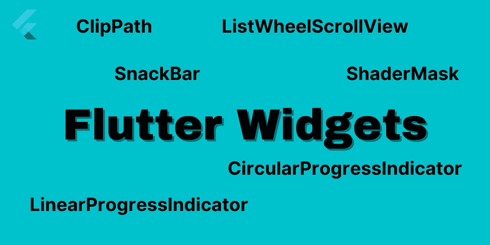

# 请确保你知道这 5 个颤振部件

> 原文：<https://medium.com/geekculture/please-make-sure-you-know-these-5-flutter-widgets-ace908571a9b?source=collection_archive---------9----------------------->

## 颤振知识分享#27

F lutter 是建立在 widgets 之上的。如果你想在 Flutter 中表现出色，显然你需要关于 widgets 的完整知识。整个应用程序可以解释为 Flutter 中的小部件树。作为程序员上面的软件工程师，每天都需要用这些东西更新。那么，希望这一系列扑朔迷离的故事能有所帮助…