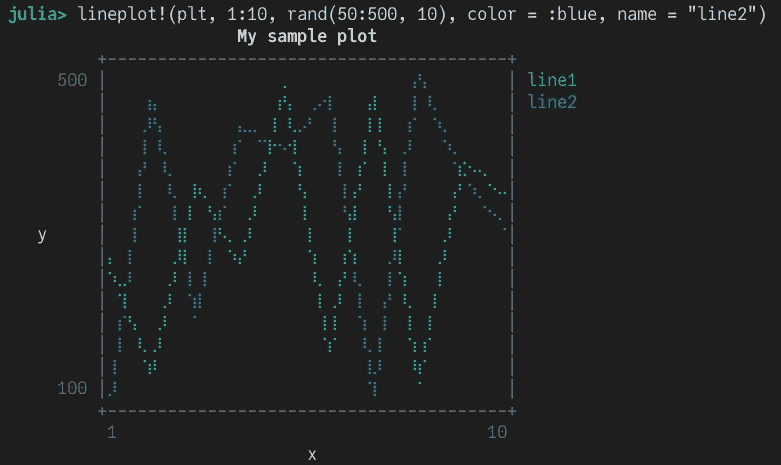
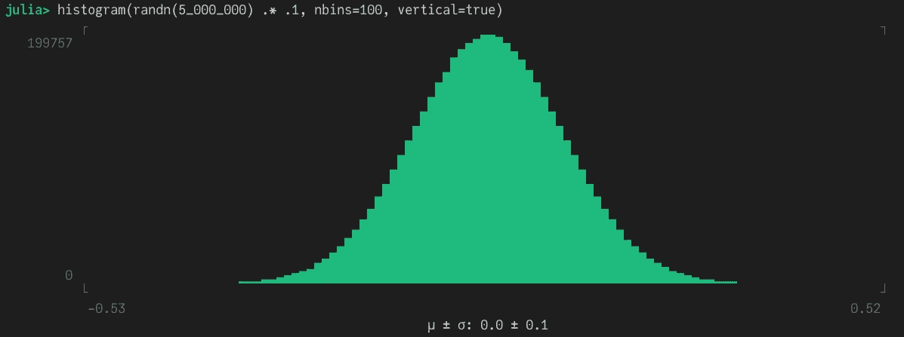
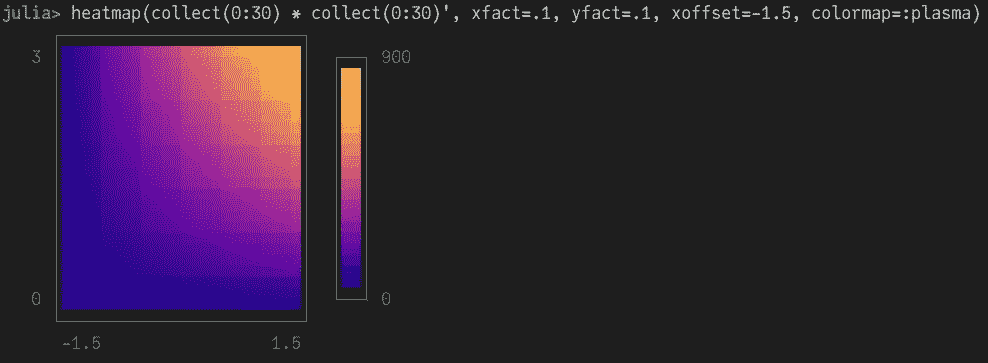
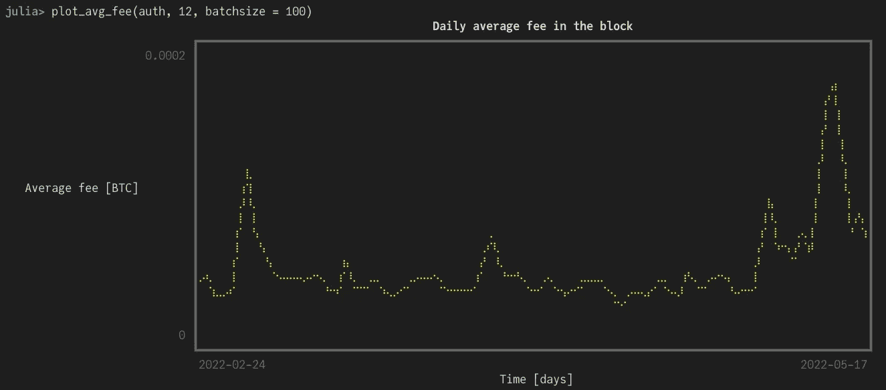
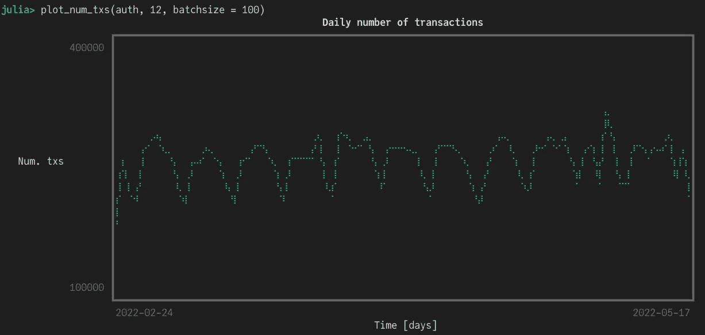
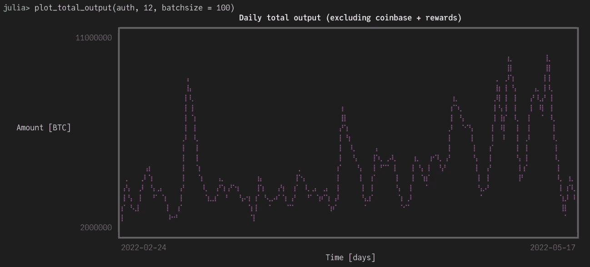
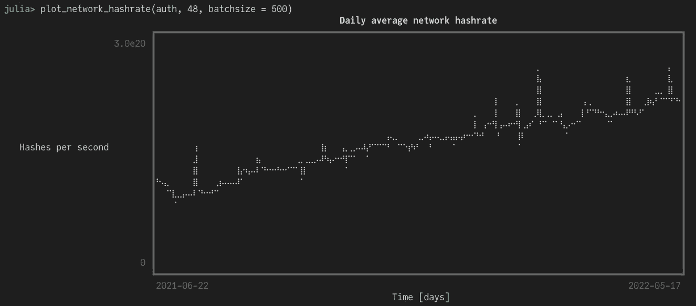
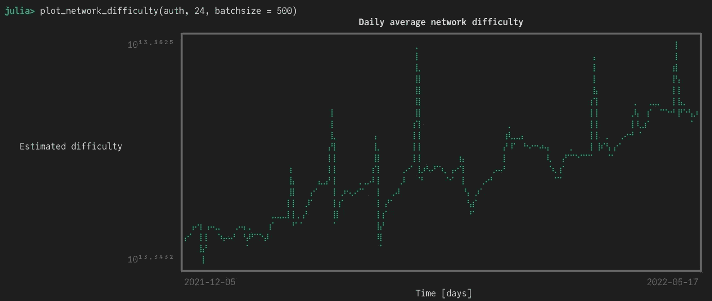
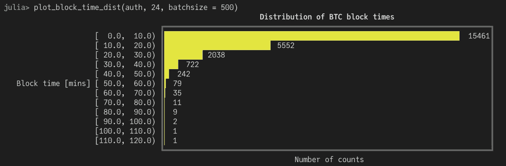

# 终端绘图——一种非常规的数据可视化方法

> 原文：<https://medium.com/geekculture/plotting-in-the-terminal-an-unconventional-approach-to-data-visualization-dd36ec6515d0?source=collection_archive---------9----------------------->

## 谁知道 Unicode 剧情会这么有趣？


Photo by [Emily Morter](https://unsplash.com/@emilymorter?utm_source=medium&utm_medium=referral) on [Unsplash](https://unsplash.com?utm_source=medium&utm_medium=referral)

如果您每天都要处理大量数据，那么您的工作流很可能会涉及到使用终端，无论是在 Mac、Linux 甚至 Windows 上。从命令行轻松执行复杂的任务有一种无法解释的快乐。然而，当涉及到数据可视化时，我们通常依赖于花哨的绘图库。情节本身通常出现在笔记本、网页或单独的窗口中。在航站楼内进行策划几乎是闻所未闻的。嗯，不再是了！请允许我向您介绍一下 [UnicodePlots.jl](https://github.com/JuliaPlots/UnicodePlots.jl#barplot) ，这是一个在 REPL 中支持 UnicodePlots 的 Julia 包。

我最近花了一些时间来测试这个包，老实说，我在开始时相当怀疑。当我开始生成和调整图形时，我意识到这个过程是多么的轻松和快速。最后，结果非常令人满意。我非常喜欢它，甚至给我最近开发的包 [BitcoinRPC.jl](https://github.com/vnegi10/BitcoinRPC.jl) 添加了一些绘图功能。如果你想了解更多，请点击下面的链接:

[](/geekculture/connect-to-the-bitcoin-network-using-julia-418c76fed393) [## 使用 Julia 连接到比特币网络

### 一种访问实时区块链数据的简洁方法

medium.com](/geekculture/connect-to-the-bitcoin-network-using-julia-418c76fed393) 

# 添加包

您可以将其添加到当前环境中，如下所示:

*   按“]”进入 Pkg 提示符
*   添加 UnicodePlots

# 基础

该包旨在显示 REPL 内的地块。支持各种类型，例如:

```
julia> using UnicodePlotsjulia> X = 1:10
1:10julia> Y = rand(50:500, 10)
10-element Vector{Int64}:
 270
 133
 365
 261
 480
 158
 470
 125
 391
 342julia> plt = lineplot(X, Y, title="My sample plot", xlabel="x", ylabel="y", border=:ascii)
         ⠀⠀⠀⠀⠀⠀⠀⠀⠀⠀⠀⠀⠀⠀My sample plot⠀⠀⠀⠀⠀⠀⠀⠀⠀⠀⠀⠀⠀⠀ 
         +-------------------------------------------------+ 
     500 |⠀⠀⠀⠀⠀⠀⠀⠀⠀⠀⠀⠀⠀⠀⠀⠀⠀⢀⠀⠀⠀⠀⠀⠀⠀⠀⠀⠀⠀⠀⠀⠀⠀⠀⠀⠀⠀⠀⠀⠀| 
         |⠀⠀⠀⠀⠀⠀⠀⠀⠀⠀⠀⠀⠀⠀⠀⠀⠀⡞⡄⠀⠀⠀⠀⠀⠀⠀⣼⠀⠀⠀⠀⠀⠀⠀⠀⠀⠀⠀⠀⠀| 
         |⠀⠀⠀⠀⠀⠀⠀⠀⠀⠀⠀⠀⠀⠀⠀⠀⢸⠀⢇⠀⠀⠀⠀⠀⠀⠀⡇⡇⠀⠀⠀⠀⠀⠀⠀⠀⠀⠀⠀⠀| 
         |⠀⠀⠀⠀⠀⠀⠀⠀⠀⠀⠀⠀⠀⠀⠀⠀⡇⠀⢸⠀⠀⠀⠀⠀⠀⢸⠀⢣⠀⠀⠀⠀⠀⠀⠀⠀⠀⠀⠀⠀| 
         |⠀⠀⠀⠀⠀⠀⠀⠀⠀⠀⠀⠀⠀⠀⠀⡸⠀⠀⠈⡆⠀⠀⠀⠀⠀⡎⠀⢸⠀⠀⠀⠀⠀⠀⠀⡎⠢⢄⠀⠀| 
         |⠀⠀⠀⠀⠀⠀⠀⠀⢸⢆⠀⠀⠀⠀⢀⠇⠀⠀⠀⢣⠀⠀⠀⠀⢠⠃⠀⠀⡇⠀⠀⠀⠀⠀⢠⠃⠀⠀⠑⠤| 
         |⠀⠀⠀⠀⠀⠀⠀⠀⡇⠀⢣⠀⠀⠀⡸⠀⠀⠀⠀⢸⠀⠀⠀⠀⢸⠀⠀⠀⢣⠀⠀⠀⠀⠀⡜⠀⠀⠀⠀⠀| 
   y     |⠀⠀⠀⠀⠀⠀⠀⢸⠀⠀⠀⠣⡀⢀⠇⠀⠀⠀⠀⠀⡇⠀⠀⠀⡇⠀⠀⠀⢸⠀⠀⠀⠀⢀⠇⠀⠀⠀⠀⠀| 
         |⡄⠀⠀⠀⠀⠀⢀⠇⠀⠀⠀⠀⠱⡜⠀⠀⠀⠀⠀⠀⢱⠀⠀⢰⠁⠀⠀⠀⠀⡇⠀⠀⠀⡸⠀⠀⠀⠀⠀⠀| 
         |⠱⡀⠀⠀⠀⠀⡸⠀⠀⠀⠀⠀⠀⠀⠀⠀⠀⠀⠀⠀⠸⡀⠀⡜⠀⠀⠀⠀⠀⢱⠀⠀⠀⡇⠀⠀⠀⠀⠀⠀| 
         |⠀⢱⠀⠀⠀⢀⠇⠀⠀⠀⠀⠀⠀⠀⠀⠀⠀⠀⠀⠀⠀⡇⢀⠇⠀⠀⠀⠀⠀⠸⡀⠀⢸⠀⠀⠀⠀⠀⠀⠀| 
         |⠀⠀⢣⠀⠀⡸⠀⠀⠀⠀⠀⠀⠀⠀⠀⠀⠀⠀⠀⠀⠀⢸⢸⠀⠀⠀⠀⠀⠀⠀⡇⠀⡇⠀⠀⠀⠀⠀⠀⠀| 
         |⠀⠀⠀⢇⢀⠇⠀⠀⠀⠀⠀⠀⠀⠀⠀⠀⠀⠀⠀⠀⠀⠈⡎⠀⠀⠀⠀⠀⠀⠀⢱⢰⠁⠀⠀⠀⠀⠀⠀⠀| 
         |⠀⠀⠀⠈⡾⠀⠀⠀⠀⠀⠀⠀⠀⠀⠀⠀⠀⠀⠀⠀⠀⠀⠀⠀⠀⠀⠀⠀⠀⠀⠸⡎⠀⠀⠀⠀⠀⠀⠀⠀| 
     100 |⠀⠀⠀⠀⠀⠀⠀⠀⠀⠀⠀⠀⠀⠀⠀⠀⠀⠀⠀⠀⠀⠀⠀⠀⠀⠀⠀⠀⠀⠀⠀⠁⠀⠀⠀⠀⠀⠀⠀⠀| 
         +-------------------------------------------------+ 
         ⠀1⠀⠀⠀⠀⠀⠀⠀⠀⠀⠀⠀⠀⠀⠀⠀⠀⠀⠀⠀⠀⠀⠀⠀⠀⠀⠀⠀⠀⠀⠀⠀⠀⠀⠀⠀⠀⠀10⠀ 
         ⠀⠀⠀⠀⠀⠀⠀⠀⠀⠀⠀⠀⠀⠀⠀⠀⠀⠀⠀⠀⠀x⠀⠀⠀⠀⠀⠀⠀⠀⠀⠀⠀⠀⠀⠀⠀⠀⠀⠀⠀⠀
```

看到这有多简单了吗？在 REPL 内绘图的优势之一是速度快。使用图形库时，第一个图(尤其是在 Julia 中)可能需要一段时间才能出现，因为需要编译请求的后端。这里不是这样的。Unicode 绘图速度很快，因为它们是直接在终端中生成的。散点图怎么样？

```
julia> plt = lineplot(X, Y, title="My sample plot", xlabel="x", ylabel="y", border=:ascii, name = "line1")
         ⠀⠀⠀⠀⠀⠀⠀⠀⠀⠀⠀⠀⠀⠀My sample plot⠀⠀⠀⠀⠀⠀⠀⠀⠀⠀⠀⠀⠀⠀      
         +-------------------------------------------------+      
     500 |⠀⠀⠀⠀⠀⠀⠀⠀⠀⠀⠀⠀⠀⠀⠀⠀⠀⢀⠀⠀⠀⠀⠀⠀⠀⠀⠀⠀⠀⠀⠀⠀⠀⠀⠀⠀⠀⠀⠀⠀| line1
         |⠀⠀⠀⠀⠀⠀⠀⠀⠀⠀⠀⠀⠀⠀⠀⠀⠀⡞⡄⠀⠀⠀⠀⠀⠀⠀⣼⠀⠀⠀⠀⠀⠀⠀⠀⠀⠀⠀⠀⠀|      
         |⠀⠀⠀⠀⠀⠀⠀⠀⠀⠀⠀⠀⠀⠀⠀⠀⢸⠀⢇⠀⠀⠀⠀⠀⠀⠀⡇⡇⠀⠀⠀⠀⠀⠀⠀⠀⠀⠀⠀⠀|      
         |⠀⠀⠀⠀⠀⠀⠀⠀⠀⠀⠀⠀⠀⠀⠀⠀⡇⠀⢸⠀⠀⠀⠀⠀⠀⢸⠀⢣⠀⠀⠀⠀⠀⠀⠀⠀⠀⠀⠀⠀|      
         |⠀⠀⠀⠀⠀⠀⠀⠀⠀⠀⠀⠀⠀⠀⠀⡸⠀⠀⠈⡆⠀⠀⠀⠀⠀⡎⠀⢸⠀⠀⠀⠀⠀⠀⠀⡎⠢⢄⠀⠀|      
         |⠀⠀⠀⠀⠀⠀⠀⠀⢸⢆⠀⠀⠀⠀⢀⠇⠀⠀⠀⢣⠀⠀⠀⠀⢠⠃⠀⠀⡇⠀⠀⠀⠀⠀⢠⠃⠀⠀⠑⠤|      
         |⠀⠀⠀⠀⠀⠀⠀⠀⡇⠀⢣⠀⠀⠀⡸⠀⠀⠀⠀⢸⠀⠀⠀⠀⢸⠀⠀⠀⢣⠀⠀⠀⠀⠀⡜⠀⠀⠀⠀⠀|      
   y     |⠀⠀⠀⠀⠀⠀⠀⢸⠀⠀⠀⠣⡀⢀⠇⠀⠀⠀⠀⠀⡇⠀⠀⠀⡇⠀⠀⠀⢸⠀⠀⠀⠀⢀⠇⠀⠀⠀⠀⠀|      
         |⡄⠀⠀⠀⠀⠀⢀⠇⠀⠀⠀⠀⠱⡜⠀⠀⠀⠀⠀⠀⢱⠀⠀⢰⠁⠀⠀⠀⠀⡇⠀⠀⠀⡸⠀⠀⠀⠀⠀⠀|      
         |⠱⡀⠀⠀⠀⠀⡸⠀⠀⠀⠀⠀⠀⠀⠀⠀⠀⠀⠀⠀⠸⡀⠀⡜⠀⠀⠀⠀⠀⢱⠀⠀⠀⡇⠀⠀⠀⠀⠀⠀|      
         |⠀⢱⠀⠀⠀⢀⠇⠀⠀⠀⠀⠀⠀⠀⠀⠀⠀⠀⠀⠀⠀⡇⢀⠇⠀⠀⠀⠀⠀⠸⡀⠀⢸⠀⠀⠀⠀⠀⠀⠀|      
         |⠀⠀⢣⠀⠀⡸⠀⠀⠀⠀⠀⠀⠀⠀⠀⠀⠀⠀⠀⠀⠀⢸⢸⠀⠀⠀⠀⠀⠀⠀⡇⠀⡇⠀⠀⠀⠀⠀⠀⠀|      
         |⠀⠀⠀⢇⢀⠇⠀⠀⠀⠀⠀⠀⠀⠀⠀⠀⠀⠀⠀⠀⠀⠈⡎⠀⠀⠀⠀⠀⠀⠀⢱⢰⠁⠀⠀⠀⠀⠀⠀⠀|      
         |⠀⠀⠀⠈⡾⠀⠀⠀⠀⠀⠀⠀⠀⠀⠀⠀⠀⠀⠀⠀⠀⠀⠀⠀⠀⠀⠀⠀⠀⠀⠸⡎⠀⠀⠀⠀⠀⠀⠀⠀|      
     100 |⠀⠀⠀⠀⠀⠀⠀⠀⠀⠀⠀⠀⠀⠀⠀⠀⠀⠀⠀⠀⠀⠀⠀⠀⠀⠀⠀⠀⠀⠀⠀⠁⠀⠀⠀⠀⠀⠀⠀⠀|      
         +-------------------------------------------------+      
         ⠀1⠀⠀⠀⠀⠀⠀⠀⠀⠀⠀⠀⠀⠀⠀⠀⠀⠀⠀⠀⠀⠀⠀⠀⠀⠀⠀⠀⠀⠀⠀⠀⠀⠀⠀⠀⠀⠀10⠀      
         ⠀⠀⠀⠀⠀⠀⠀⠀⠀⠀⠀⠀⠀⠀⠀⠀⠀⠀⠀⠀⠀x⠀⠀⠀⠀⠀⠀⠀⠀⠀⠀⠀⠀⠀⠀⠀⠀⠀⠀⠀⠀⠀
```

您可以通过使用某些方法的变异版本来轻松地组合图。例如，我们可以向之前的线图添加一个新的数据集，如下所示:



请注意，我在这里使用了一个屏幕截图来显示颜色，否则在复制到代码块时是看不到的。话虽如此，但我们也可以复制我们的情节，就像它们是文本一样，这难道不令人惊讶吗？

更多示例:



Histogram with binning



Heatmap with “plasma” colormap

这些地块有数量惊人的定制选项。请务必看看[包资源库](https://github.com/JuliaPlots/UnicodePlots.jl)中提供的优秀示例。⠀

# 可视化真实世界的数据

面对现实吧，到目前为止，我们只看了虚拟数据的例子。在处理现实数据集时，这些图也有用吗？为了找到答案，我在 [BitcoinRPC.jl](https://github.com/vnegi10/BitcoinRPC.jl) 中实现了对 Unicode 图形的支持，我们可以用它们来可视化区块链数据。让我们看一些例子。

# 平均费用

我想看看连续 12 周的历史每日平均费用。这可以通过以下函数方便地实现:

我们可以使用我们现有的数据框架作为`lineplot`的输入，以及几个可定制的关键字。注意，我们使用了为 Unicode 绘图提供最高分辨率的`BrailleCanvas`。还有其他的，如`BlockCanvas`、`AsciiCanvas`等。



令人印象深刻，不是吗？我们能从中学到什么？最近几周平均费用似乎更高了。这通常发生在市场对大幅价格波动做出反应的时候。越来越多的人开始在交易所或其他同行之间来回移动硬币，导致网络变得拥堵。为了优先处理你的交易，你最终要支付更高的费用。

# 交易数量

让我们来看看 12 周内每天的数字是怎样的。



# 总块输出

我们还可以查询一个块的输出中的比特币总量，按每天的时间间隔求和。参见过去 12 周的示例:



# 网络哈希表

任何基于工作证明的区块链的一个重要指标是网络哈希。它衡量当前用于开采新区块的集体采矿能力。hashrate 可以增加或减少，这取决于有多少矿工加入或离开这个网络。例如，当比特币价格上涨，采矿变得更有利可图时，hashrate 也往往会增加。当市场低迷时，可能会发生相反的情况。



Network hashrate for last 48 weeks (~12 months)

回顾过去 12 个月，由于采矿似乎仍然有利可图，网络散列率似乎稳步上升。

# 网络难度

比特币网络调整其难度，使连续区块之间的时间间隔保持在平均约 10 分钟。它与网络哈希表直接相关。由于 hashrate 在上升，难度也调整到一个更高的值。



Network difficulty for last 24 weeks (~6 months)

# 封锁时间

使用块时间戳，我们可以计算连续块之间经过的时间。比特币网络的目标是大约 10 分钟的块生成时间。可以更快地生成方块(< 10 mins) when the network hashrate increases significantly, whereas difficulty is still readjusting to a higher value. On the contrary, a decrease in the network hashrate will consequently increase block generation time (> 10 分钟)，直到难度重新调整到一个较低的值。检查轮挡时间的分布情况会很有趣。



Histogram for block times over last 24 weeks (~ 6 months)

正如预期的那样，大多数数据块都在 0–10 分钟窗口内。他们中的许多人还表现出更高的封锁时间(20-40 分钟)。这些很可能对应于网络中断，而难度仍然很高时候。

# 结论

我必须说，我对剧情的结局印象深刻。重要的是要记住，在终端中绘图有其自身的局限性，并且绝不是高级图形库的替代品。这只是一个更简单的选项，最好用于快速直观地了解您的数据，而不必处理大型绘图包的开销。 [UnicodePlots.jl](https://github.com/JuliaPlots/UnicodePlots.jl) 还提供了很多定制的选项，所以支持多种用例。我很高兴看到这个包在未来会如何发展。我希望你喜欢阅读这篇文章。感谢您的时间，并希望在下一个看到你！如果你想联系，这是我的 [LinkedIn](https://www.linkedin.com/in/negivikas/) 。

# 参考

1.  [https://github.com/JuliaPlots/UnicodePlots.jl](https://github.com/JuliaPlots/UnicodePlots.jl)
2.  [https://github.com/vnegi10/BitcoinRPC.jl](https://github.com/vnegi10/BitcoinRPC.jl)
3.  [https://developer.bitcoin.org/reference/rpc/index.html](https://developer.bitcoin.org/reference/rpc/index.html)

⠀⠀⠀⠀⠀⠀⠀⠀⠀⠀⠀