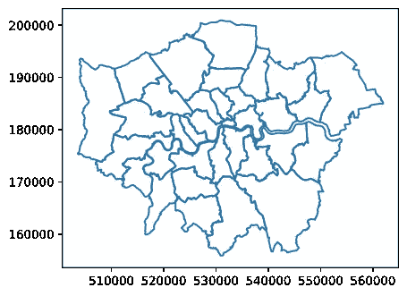
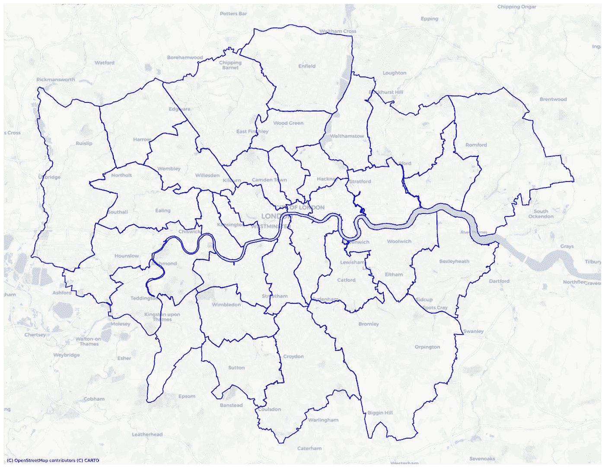
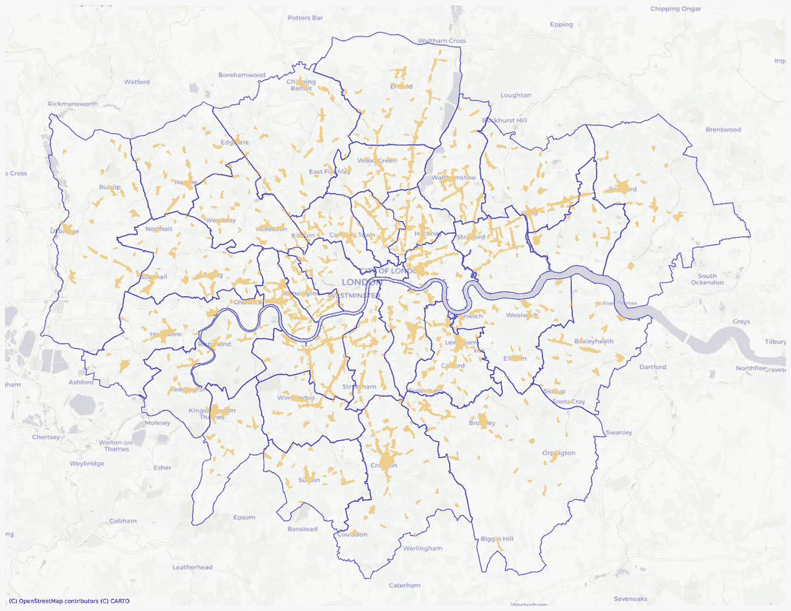
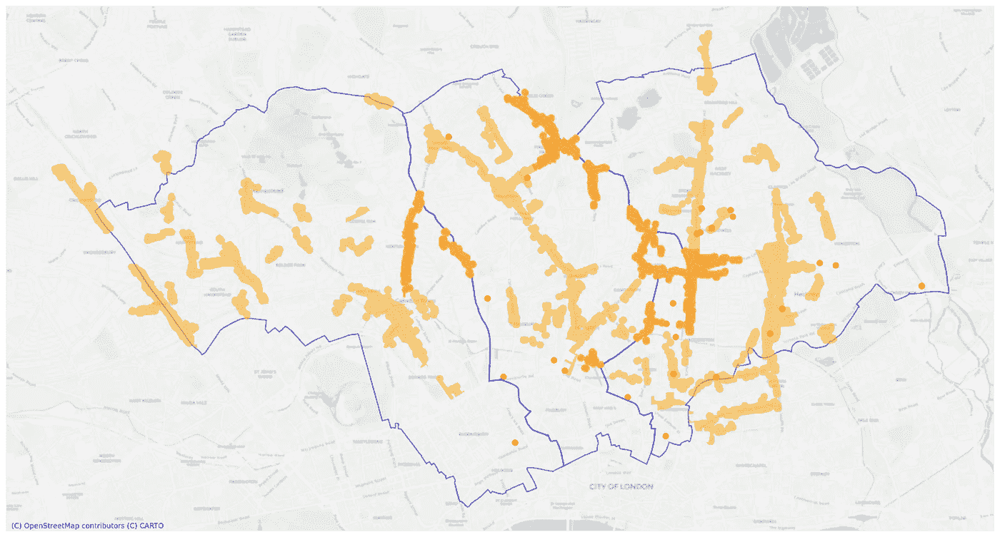

# 使用 Geopandas 和 Contextily 绘制地图

> 原文：<https://medium.com/geekculture/plotting-maps-with-geopandas-and-contextily-8d4b1f02603d?source=collection_archive---------4----------------------->

我们都不时需要一张地图。在 Python 中处理地理数据时，我有一些代码片段，可以放在几乎任何地方来检查 shapefile、在上下文中查看它，以及在彼此之上绘制多个数据层。

# 看，一个 shapefile！

使用 [Geopandas](https://geopandas.org/docs/user_guide/mapping.html) ，我们可以使用内置的 Matplotlib 功能，用几行代码绘制地理数据框架。在这里，我们将使用来自伦敦辉煌的[文化基础设施地图](https://www.london.gov.uk/what-we-do/arts-and-culture/cultural-infrastructure-toolbox/cultural-infrastructure-map)的样本数据。首先，我们将伦敦行政区的 shapefile 加载到地理数据框架中并对其进行检查。

这是结果:



Boundaries of London boroughs. Image by author (shapefile: GLA / [London Datastore](https://data.london.gov.uk/))

# 它在哪里？

如果我们想显示更多的地理背景，并在此基础上绘制一些数据，会怎么样？我们可以使用[上下文](https://contextily.readthedocs.io/en/latest/index.html)提供动态底图，查看我们的地理数据在世界上的位置:

使用与之前相同的 shapefile，结果看起来比我们的第一张地图更复杂，显示了环境中的行政区边界:



Image by author (shapefile from London Datastore)

# 给我做个三明治

但是如果我们想在基础地图上显示多层数据呢？对于多层地图，我们需要一个函数来汇集数据框，设置坐标参考系统(CRS ),以便它们在底图上匹配，并使它们看起来更漂亮。最重要的是，我们需要控制每一层的格式，指定颜色、透明度和其他功能:

以下是结果:底图之上的两个地理数据图层显示了伦敦行政区边界及其内的主要街道区域。地图上分散的城镇中心群是村庄和街区的当代遗迹，它们逐渐融入了我们今天所知道的伦敦。



London boroughs and high street areas. Image by author (all data from GLA London Datastore)

# 更多层？

为了给上面的`makeLayeredMap`函数添加第三层，我们所要做的就是添加一行来绘制和格式化第三层。红点代表创意工作区(截至 2019 年 4 月)，其中大部分位于哈克尼:

```
# Layer 3: Plot creative workspaces dataargs[2].plot(ax=ax, color='red', alpha=1, zorder=3)
```



Camden, Islington and Hackney high street areas and creative workspaces. Image by author (data from GLA London Datastore)

为了“放大”该地图的相关数据，我使用区边界通过空间连接函数`sjoin`过滤基础数据框。这是一个很棒的功能，它像 lassoo 一样有效地使用区边界来捕捉其他数据帧中的要素:

```
# Filter gdf (containing all London Boroughs) by list:LB_list = ['Camden', 'Islington', 'Hackney']LB_selected = gdf[gdf['NAME'].isin(LB_list)]# Select high street polygons located within the selected boroughs Store the result in separate geodataframe:high_streets_selected = gpd.sjoin(high_streets, LB_selected, how='inner', op='intersects')
```

关于`sjoin`的完整指南在 geopandas 文档的[合并数据部分。](https://geopandas.org/docs/user_guide/mergingdata.html)

这里我们已经到了三层，但是`makeLayeredMap`函数可以处理你需要的任意多的层。享受适应你自己的使用！