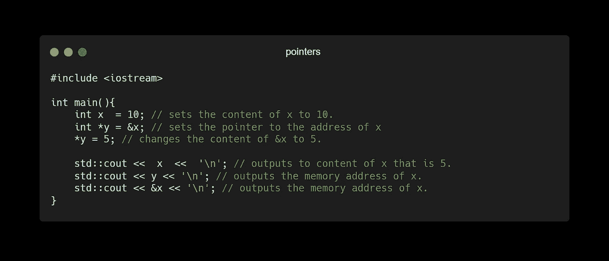
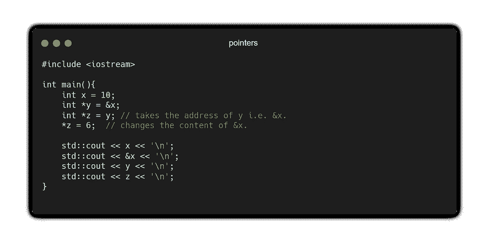
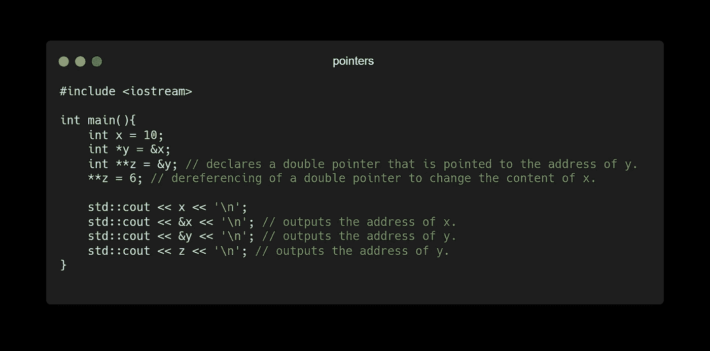
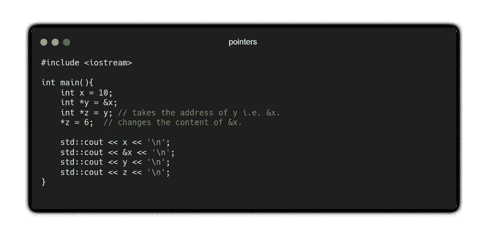
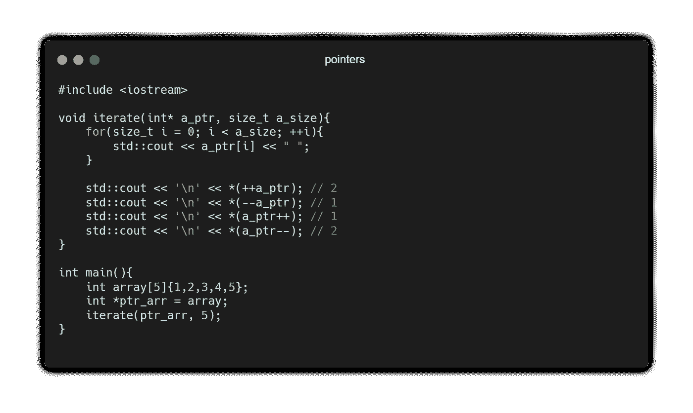
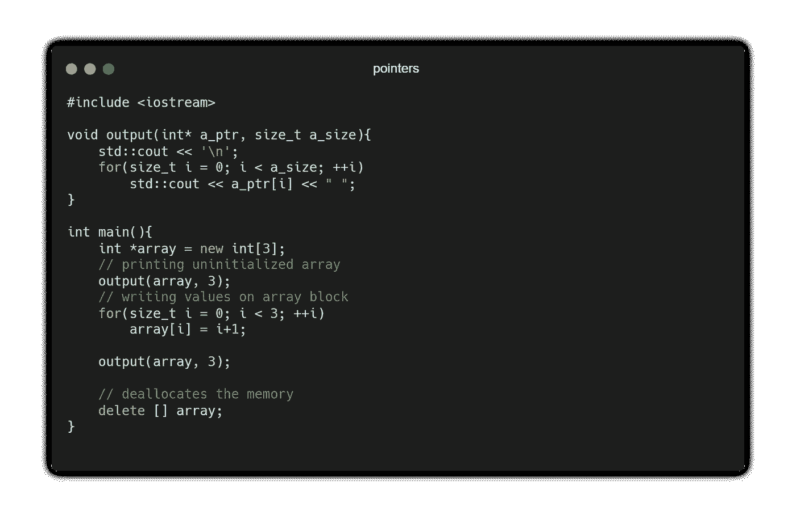
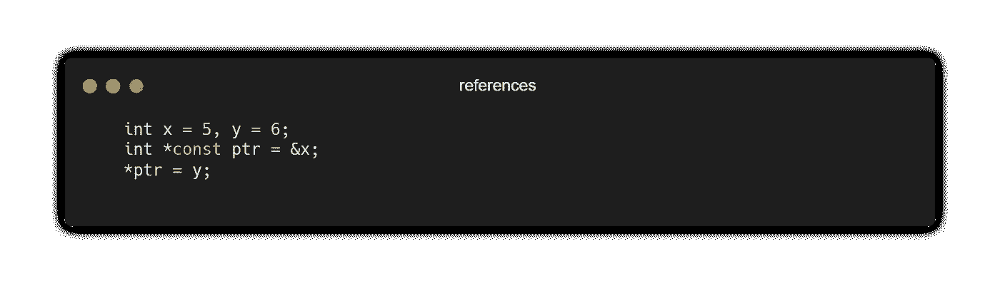
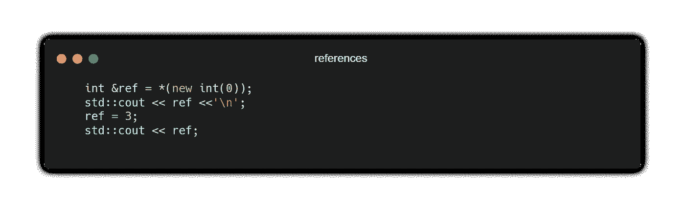
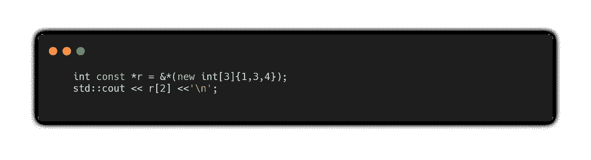
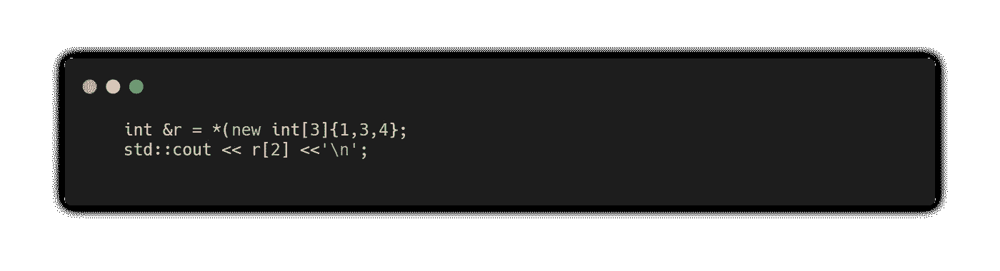

# 指针和参考:设计目标和用例

> 原文：<https://medium.com/geekculture/pointers-and-references-design-goals-and-use-cases-a536a984ba4d?source=collection_archive---------22----------------------->

## 其他语言是为了禁止指针而产生的，它们真的很可怕吗？

Photo by [Ben Robbins](https://unsplash.com/@ben_robbins?utm_source=medium&utm_medium=referral) on [Unsplash](https://unsplash.com?utm_source=medium&utm_medium=referral)

起初，C++似乎通过引入另一个抽象层使事情变得更加复杂。引用似乎封装了与指针相同的功能集。这两个构造都用于将*引用*到另一个实体，因为它们提供了操作 *referent* 实体的内容的访问点；它们都在堆上分配。

因此，我们面临以下问题:

1.  指针和引用是一回事吗？
2.  有没有指针只能做的技术，反之亦然？
3.  什么时候我们更喜欢指针而不是引用，反之亦然？

在这篇文章的结尾，我希望理清这两个概念，并试图给出一个理由，为什么引用应该有自己的权利来构建更健壮的高阶概念。

# 两颗北极指极星

指针是在 c 中引入的，指针存储了类型为`T`的实体的内存地址(其中`T`是一个可以解析为*任何*类型的模板参数)，正如前面提到的，它提供了一个访问点，用于改变它所指向的实体的值。考虑下面的片段:

指针非常适合利用间接方式来操作某个内存块中的内容。让我们修改上面的代码来演示如下的一系列间接操作:

我们可以通过将它们嵌套在一起来扩展它:

正如我们注意到的，指针的地址和它的引用地址是不同的。这个观察是因为指针有自己的身份。因此，指针可以更多地被重新分配给另一个变量，这样它们就可以容忍空值:`NULL`和`nullptr`(如果你使用指针的话，最好使用`nullptr`)。也就是`int *x = nullptr`有效，会编译。

更重要的是，指针可以通过前后递增操作符、前后递减操作符和下标操作符迭代数组。

正如我们注意到的，指针的地址和它的引用地址是不同的。这个观察是因为指针有自己的身份。因此，指针可以更多地被重新分配给另一个变量，以便它们可以容忍空值:`NULL`和`nullptr`(如果您使用指针的话，最好使用`nullptr`)。即`int *x = nullptr`有效，会编译。

更重要的是，指针可以通过前后递增操作符、前后递减操作符和下标操作符迭代数组。

如前所述，指针可用于在堆上分配值以及在该位置写入数据。让我们考虑为一个大小为`3`的数组块分配内存:

## 使用指针的提醒

*   指针可能很难管理，因为它们可以不受限制地嵌套和组合，这可能导致难以维护的复杂代码。
*   如果管理不当，指针可能会泄漏资源:当不再需要指针类型时，您必须确保进行清理，并且当它们不再与您的代码相关时，您应该记得释放堆上的资源。
*   当性能不如安全重要或不需要更精细的控制时，最好使用智能指针:`std::unique_ptr<T> u_ptr`、`std::shared_ptr<T> s_ptr`和`std::weak_ptr<T> w_ptr`而不是原始指针。智能指针允许你以最小的性能代价通过 [RAII](https://bityl.co/8BOl) 自动清理，在`u_ptr`的情况下，性能开销为零。
*   对于指针对象`ptr_obj`或自定义类型，可以通过箭头运算符访问成员，如`ptr_obj-> function()`。

# 参考

引用使事情更便于表达，它为表达*所有权语义*提供了必要的约束集——这个话题现在超出了我们的关注范围。C++遵循的设计原则是，符合标准的解决方案应该比备选方案更容易。

现在我们知道了指针，我们如何将它与引用进行对比呢？

引用可以被认为是一个[常量指针](https://bityl.co/8BUS) `T const* c_ptr = &obj`，不应该与`const T* ref = &obj`混淆:前者允许修改对象的内容，但限制地址指向`obj`，后者则相反，只限制修改`obj`。

要修改`x`的内容并将其设置为`y`，我们说:

使用引用可以达到相同的效果。因此，引用绑定到内存中实体的位置。它允许修改实体的内容，但是它*不能*被重新分配，必须在初始化时绑定。因此，实体的引用假定了原始变量的实体。

如前所述，引用也可以为堆上的单个实体分配内存。

## 使用参考的提醒

*   引用不能分配给`nullptr`。
*   引用不能迭代数组。
*   通过局部变量返回引用可能会导致未定义的行为(悬空引用)。
*   引用必须绑定到现有实体。
*   引用只允许一级间接寻址。
*   参考文献清楚简明地表达了意图。
*   自 C++11 标准以来，引用被更频繁地使用，因为 move 语义的元素[是从引用的概念](https://en.cppreference.com/w/cpp/language/move_constructor) ( `lvalue`和`rvalue`引用)构建的。

# 摘要

*   指针和引用是一回事吗？号码
*   有没有指针只能做的技术，反之亦然？指针比引用更灵活，如果管理不好，引用会使代码变得复杂。`T const* ref`实现了相同的引用行为，除了数组引用，它给了我们更多选择引用而不是指针的理由(如果合适的话),因为它的语义限制了在类似数组的结构上迭代:

而带有引用的数组索引将导致编译器错误:

*   什么时候我们更喜欢指针而不是引用，反之亦然？指针类型通常用于设置一个独立的间接字段，该字段能够修改同一类型的多个变量的内容。让同一个指针访问多个变量可能很难跟踪和推理。最好是保持清晰，而不是方便地键入一个指向所有相同类型变量的指针。由于这个原因，利用引用更安全。

指针并不可怕，事实上，它们是我们在 C/C++等语言中发现的最伟大的特性之一，然而，它们的强大是有代价的。

总之，引用不仅仅是语法上的糖衣炮弹`T const*`，它有自己的设计目标和目的，即包含声明实体的地址。这提高了我们意图的清晰度，在这些情况下，C++编译器是我们的朋友。

*最初发表于*[*https://dcode.hashnode.dev/*](https://dcode.hashnode.dev/)

*   什么时候我们更喜欢指针而不是引用，反之亦然？指针类型通常用于设置一个独立的间接字段，该字段能够修改同一类型的多个变量的内容。让同一个指针访问多个变量可能很难跟踪和推理。最好是保持清晰，而不是方便地键入一个指向所有相同类型变量的指针。由于这个原因，利用引用更安全。

指针并不可怕，事实上，它们是我们在 C/C++等语言中发现的最伟大的特性之一，然而，它们的强大是有代价的。

总之，引用不仅仅是要转换的语法糖，它有自己的设计目标和目的，即包含声明实体的地址。这提高了我们意图的清晰度，在这些情况下，C++编译器是我们的朋友。