# 神奇宝贝数据集-第二部分

> 原文：<https://medium.com/geekculture/pok%C3%A9mon-dataset-part-2-dcef8889e029?source=collection_archive---------31----------------------->

## 数据可视化

## 欢迎来到数据可视化系列的下一篇文章，这是有史以来最受欢迎和喜爱的卡通之一《神奇宝贝》的第二部分…
必须抓住它们…(数据集的可视化第二部分)😉

Photo by [Lia Panidara](https://unsplash.com/@panidara?utm_source=medium&utm_medium=referral) on [Unsplash](https://unsplash.com?utm_source=medium&utm_medium=referral)

[在第一部分中，我们看到了一些与神奇宝贝的产生有关的有趣图表，并试图找出其他领域与它的关系。接下来，我们将分析更多与其他领域相关的图表..](https://shashank-singhal.medium.com/9e6b033c9fe8?source=friends_link&sk=1583198017ba1c93e76c7029bfa0c383)

让我们先回顾一下数据集，看看我们要分析什么..

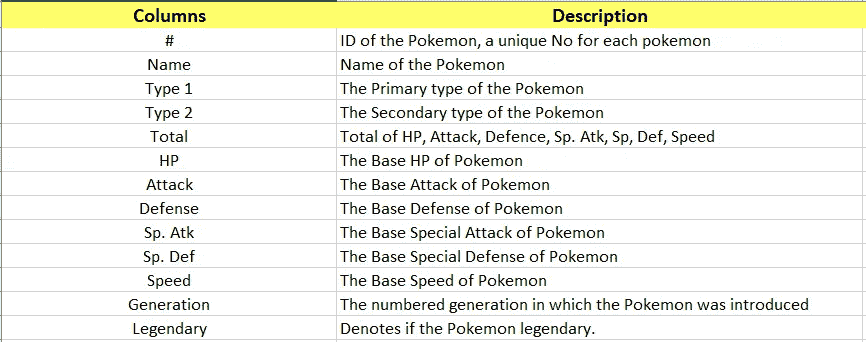

Fig 2:- Description of columns of Pokémon Dataset

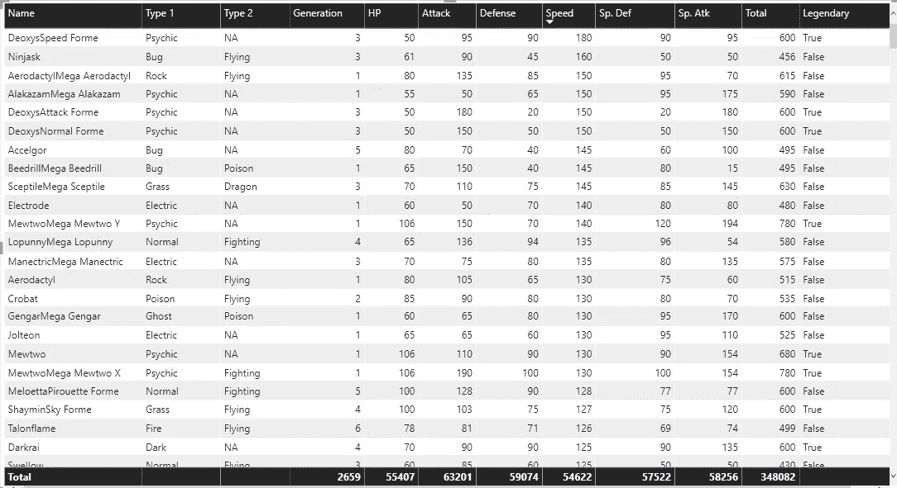

Fig 3:- Pokémon Data Overview

从一些与神奇宝贝类型相关的图表开始..

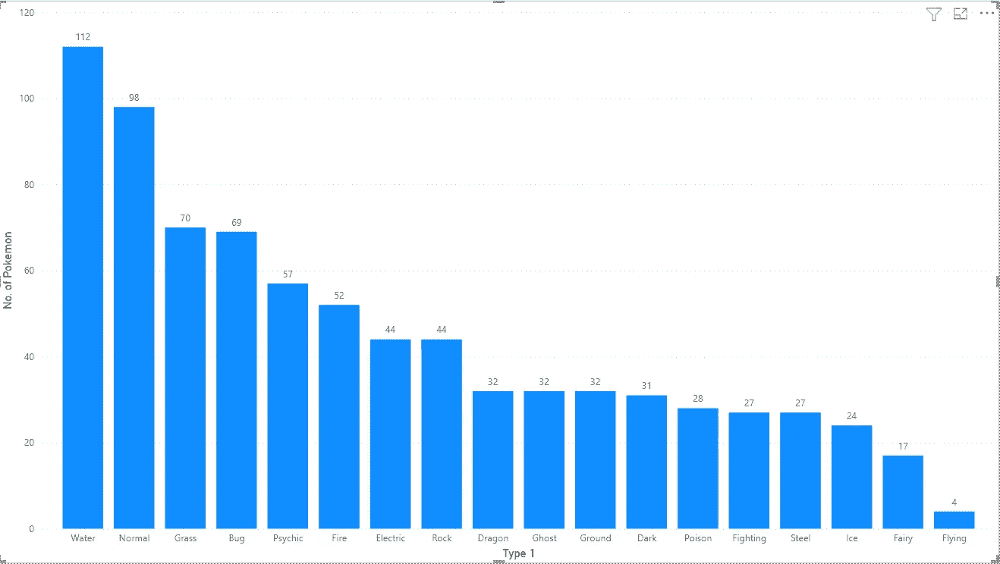

Fig 4:- Count of Pokémon based on Primary Type

我们已经在神奇宝贝数据集的第 1 部分中看到了一个类似的图表，当时我们正在分析主要类型的神奇宝贝的世代链接。

我们可以看到，水、普通、草、虫和灵力是神奇宝贝更常见的主要类型，而飞行似乎是 1 型神奇宝贝的罕见类型。

现在我们来分析一下这种神奇宝贝的能力分布…

**1.1 攻击 VS 初级型**

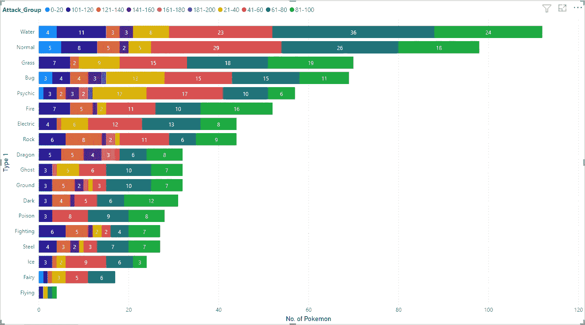

Fig 5:- Count of Pokémon based on attack group and Type

我们可以注意到，每种类型的主要部分由 41–60、61–80 和 81–100 组占据。此外，攻击组 21–40 在第 1 部分中被视为我们分析的主要部分，对每种类型的贡献都很小。

这里要注意的一点是……攻击群 181-200 只存在于虫类和心灵类型。此外，攻击群 161-180 只出现在少数类型中，而且数量也很少。最后，飞行式在 101-120，21-40，61-80 和 81-100 攻击群各有一个…

**1.2 防御 VS 初级**

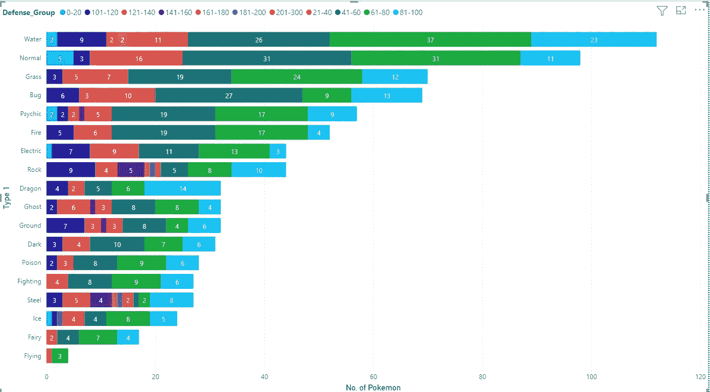

Fig 6:- Count of Pokémon based on defense group and Type

与攻击组类似，我们可以看到防御组 41–60、61–80 和 81–100 在所有类型中都占有很大份额……此外，21–40 在所有类型中只占很小一部分。我们还可以注意到，161-200 范围内的顶级群体没有太多神奇宝贝。

除了这个最高防御是 201-300，这是目前唯一的错误和钢铁类型。如果我们回到攻击组，Bug 型攻击组也是最高的。如果我们看到飞行型，它有 1 个不同攻击组的神奇宝贝，但这里 4 个神奇宝贝中有 3 个有 61-80 的防御组，1 个有 21-40。

所以我们可以说，每个类别中的大多数神奇宝贝的平均攻击和防御为 41-100。

**1.3 马力 VS 初级型**

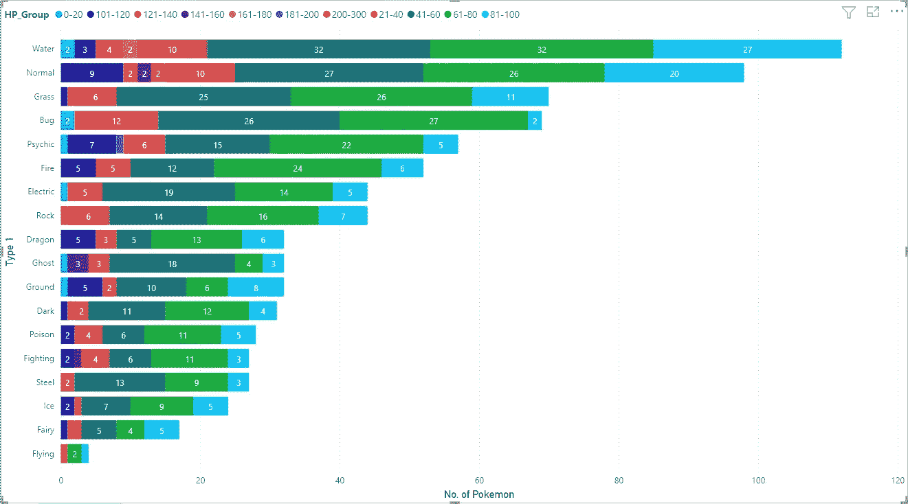

Fig 7:- Count of Pokémon based on HP group and Type

与前两个图表相反，这里只有 41-60 和 61-80 组拥有所有类型神奇宝贝的主要部分..81-100 组只有前 3 种类型的主要部分。此外，我们注意到最高的 200-300 组只有 2 个普通类型的神奇宝贝。

第二和第三高的群体，即 181-200 和 161-180，也分别只有 1 个和 2 个精神和水类型的神奇宝贝。飞行型在 21-40 和 81-100 组各有 1 个，在 61-80 组有 2 个，这表明飞行型似乎很罕见，但他们没有非常罕见的能力。

**1.4 速 VS 初级型**

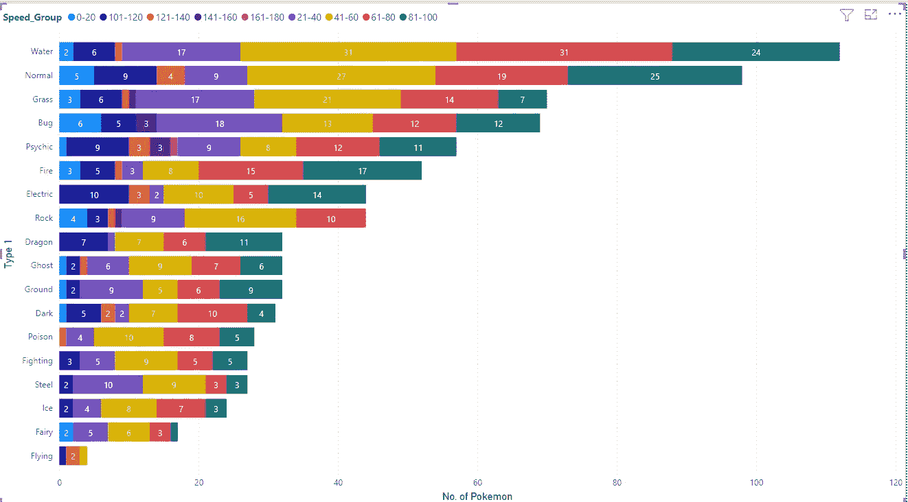

Fig 7:- Count of Pokémon based on Speed group and Type

在这里，我们还可以看到 41-60、61-80 和 81-100 组涵盖了所有类型的主要部分，但 81-100 组在岩石和飞行类型中缺失。

这里要注意的另一件事是通灵和草有很好的高速神奇宝贝数量(范围在 101-180 之间),通灵只有最高速度的神奇宝贝。

> 转到类型 2…

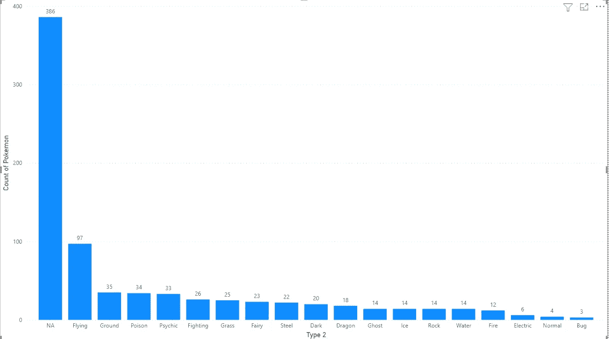

Fig 8:- Count of Pokémon based on Secondary Type

在分析次要类型神奇宝贝的生成链接时，我们也在神奇宝贝数据集的第 1 部分看到了类似的图表。

不要担心“NA”在这里是额外的…我特意删除了第 1 部分中的 NA 栏，因为当时不需要它。NA 实际上是为我们没有辅助类型的领域添加的…我们可以注意到这里大约有 390 个神奇宝贝没有辅助类型，而飞行对于主要类型来说是罕见的，在这里是常见的类型。此外，正常& Bug 是一种常见的主要类型，是一种罕见的次要类型。
通灵仍然在前五名…有意思…

**2.1 攻击 VS 辅助型**

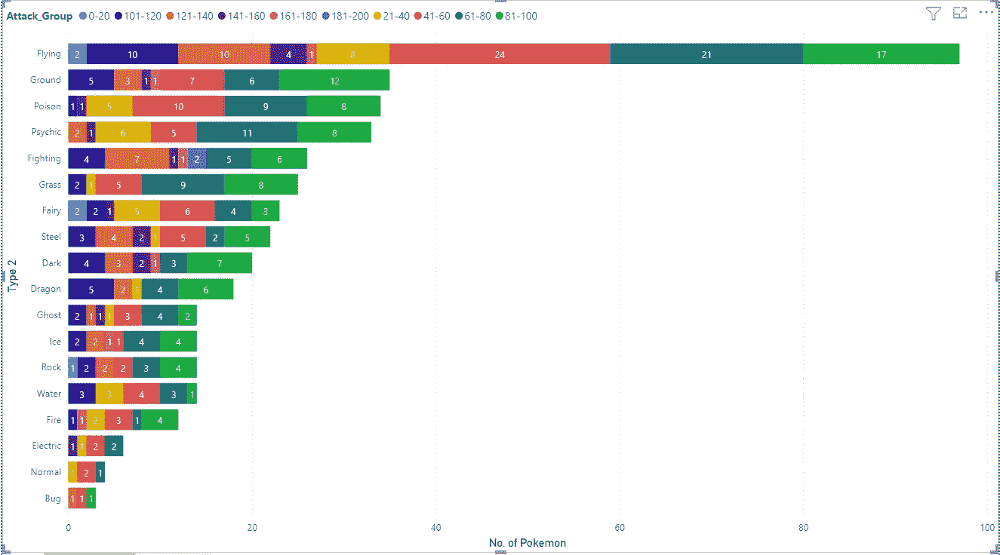

Fig 9:- Count of Pokémon based on Attack group and Secondary Type

走向..我已经删除了 NA 组，以使图形清晰可分析。

回到这个图表…我们可以注意到一些有趣的地方…
*在主型车后座的飞人突然引领了副型车的拉力赛。
*只有 2 组，即 61–80&81–100，在所有类型中占有最大份额。
*只有 2 个战斗型神奇宝贝的攻击群最高(181–200)。
* Bug(3) &正常(4)型没有多少神奇宝贝。
*第二高组 161–180 很少有神奇宝贝分散在各处。

**2.2 防御 VS 辅助型**

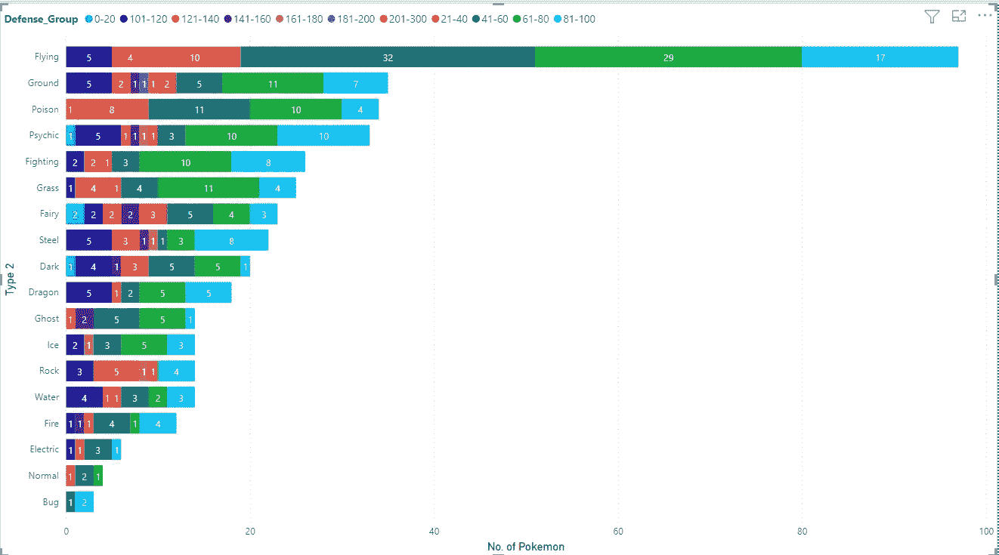

Fig 10:- Count of Pokémon based on Defense group and Secondary Type

在这里，我们可以看到 41-60 和 61-80 组在所有类型的神奇宝贝中占主要部分，81-100 组在所有类型中也有一些次要的发言权..
此外，最高组别 201–300 在地面和岩石类型中各只有 1 个神奇宝贝。这确实让地面&岩石有了一些高防御。

如果仔细看，防御高的神奇宝贝不算太多，top 4 组只有 16 个。此外，我们也没有太多 0-20 岁组的神奇宝贝。

**2.3 马力 VS 二级类型**

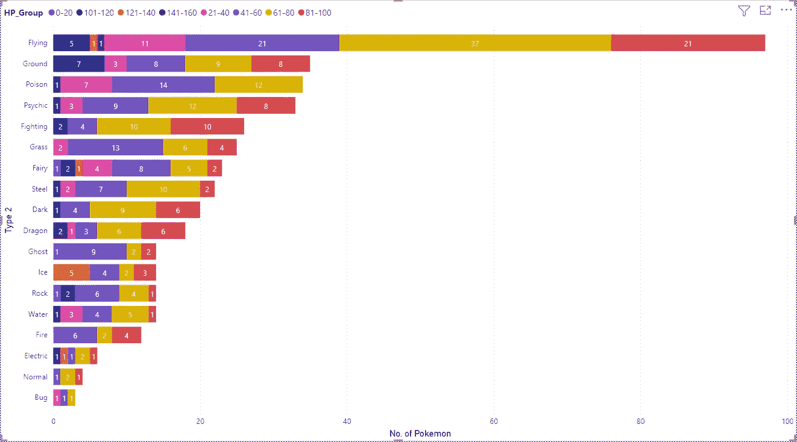

Fig 11:- Count of Pokémon based on HP group and Secondary Type

在这里，我们可以看到 41–60 和 61–80 组涵盖了每种类型的主要部分。
Bug 类型 21–40，41–60&61–80 组各 1 个。

此外，最高群体只有 141-160 岁，其中 1 人是飞行型，2 人是龙型..但是，这些龙型神奇宝贝应该把飞行作为它们的主要类型..因此，我们可以说龙和飞行类型的神奇宝贝有很高的几率获得高 HP。

**2.4 速 VS 二次型**

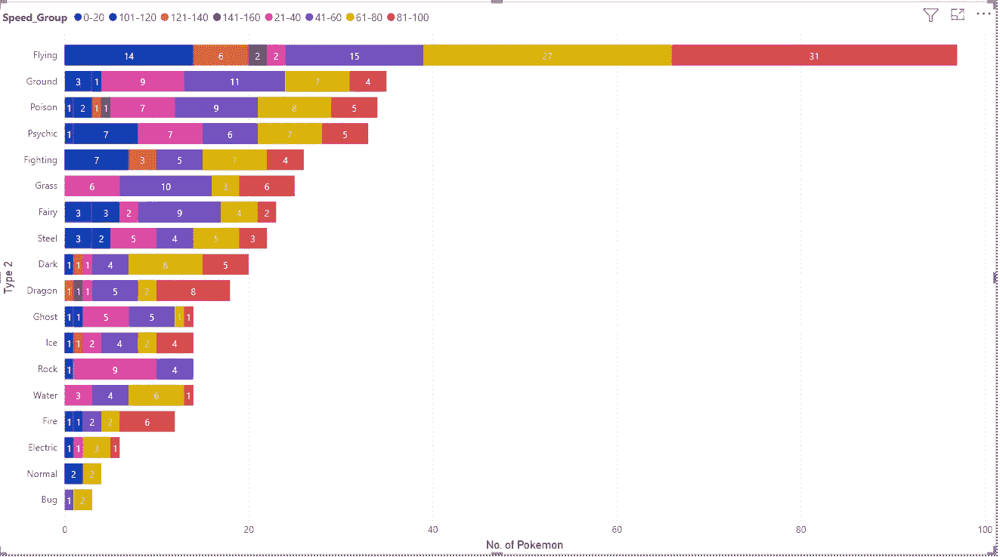

Fig 12:- Count of Pokémon based on Speed group and Secondary Type

我们可以注意到，对于飞行型来说，所有速度组的神奇宝贝数量都相当多，但对于最小的 0-20 组来说就不是这样了，对于 21-40 组来说也只有 2 个。

除此之外，我们可以注意到每种类型的主要部分的速度组在 61-100 之间。但是对于岩石类型，所有的神奇宝贝只有很少的速度组 0-60。

最高的 141-160 组只有 4 个神奇宝贝，其中 2 个是飞行型的，1 个是龙和毒。

这些都来自这个神奇宝贝数据集。请务必阅读第一部分，了解神奇宝贝一代的一些有趣分析。

现在我们知道我们需要选择哪种类型的神奇宝贝，如果有一天我们真的在一场神奇宝贝的战斗中倒下了…以及要捕捉哪种类型的…所以不要浪费时间把它们都抓住…噼卡噼卡…

直到时间[你可以在这里得到你的数据集](https://www.kaggle.com/shashanksinghals/pokemon)并尝试创造视觉效果或想出一些你认为我应该在这里添加的分析…

非常感谢各位…稍后见，有更多有趣的分析…

你可以了解我更多:- [关于我](https://shashank-singhal.medium.com/about-me-shashank-singhal-6654366c8a05)

快乐学习…！！！🙂