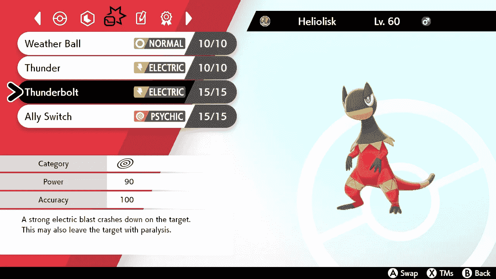
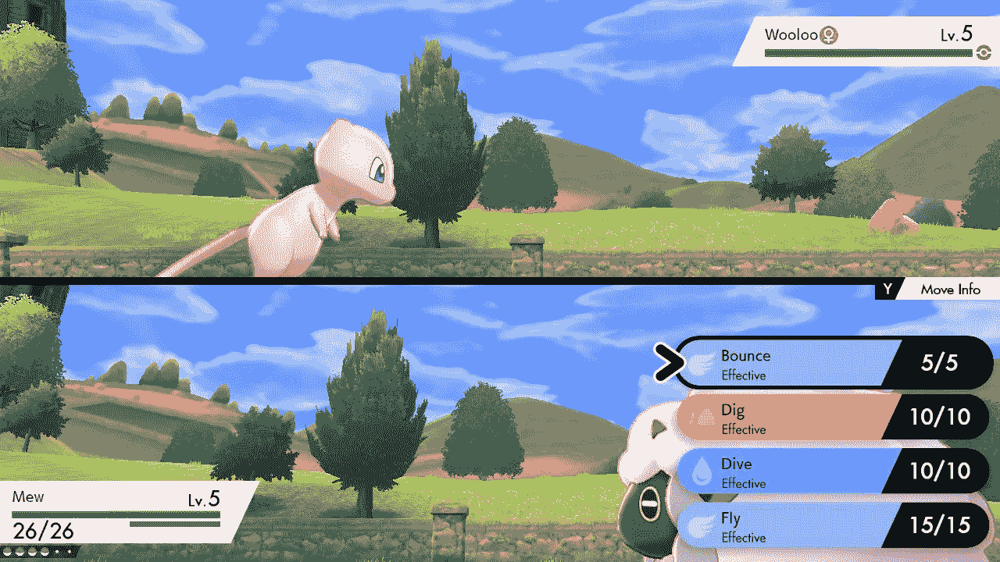
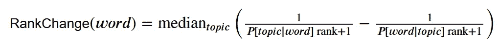
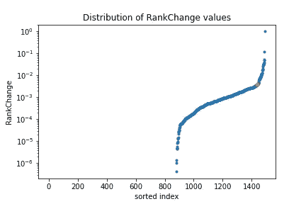

# PokeML:通过 Pokemon 数据理解主题建模

> 原文：<https://medium.com/geekculture/pokeml-part-3-topic-modeling-fb5ea8c57d0f?source=collection_archive---------31----------------------->

继续我们对口袋妖怪的分析，我们记得在第 1 部分中构造口袋妖怪矩阵时，我们将口袋妖怪的动作集编码为一个位向量。当时，我们认为这不是不正确的编码，因为它适应了移动的内在结构。当我们在第 2 部分中执行[主成分分析时，这种编码足以初步理解口袋妖怪之间的关系。现在是时候分析口袋妖怪的动作本身，并在其中寻找结构了。](/@patrickmartinaz/pokeml-part-2-principal-component-analysis-c3452ab03bb7)

我们将对如何创建移动做出以下假设。首先，存在着各种各样的动作“方面”,暗示着它们的一些特性；这些方面的意义，就像上一章中主要成分的意义一样，只有通过检查才能解释。我们的希望是，他们将与我们的直觉类移动，例如，双刃和木锤在某种程度上是相似的，而猛击和太阳光束不是。这些特征是特征上的概率分布，将较高的概率质量分配给更好地“属于”该特征的特征(例如，具有反冲伤害)。

第二，我们假设一个移动被表示为这些方面的组合，或者被解释为它们的加权和，或者被解释为这些方面的概率分布。

这种设置在自然语言处理中通常被视为一种特殊类型的[主题模型](https://en.wikipedia.org/wiki/Topic_model)；前面提到的*移动*的*方面*类似于*文档*中的*主题*。当分析主题模型，特别是[潜在狄利克雷分配(LDA)模型](https://towardsdatascience.com/latent-dirichlet-allocation-lda-9d1cd064ffa2)时，我们假设文档的含义可以从其词云(在此上下文中通常称为词包)中推断出来，标点符号和词序可以丢弃。在 LDA 模型中，假设文本文档中的单词是基于文档是关于什么主题而从概率分布的混合中提取的:对于每个单词，首先选择一个主题，然后从该主题中选择一个单词。



Pokemon Moves, like Thunderbolt, have various characteristics in common with each other and differ in others. Topic modeling helps us find groups of characteristics that are meaningful.

在我们的例子中，我们可以预期会有一个“优先移动”的主题，其中像水喷射、快速攻击和暗影潜行这样的移动的[条件概率](https://www.investopedia.com/terms/c/conditional_probability.asp) ℙ[move|topic】很大；或者一个挑出霹雳、冰梁之类招式的“特殊招式用 PP 10，威力至少 90，精度 100”的题目。

当然，作为一种无监督的方法，从我们的模型中识别的主题不会完美地匹配我们如何像人类一样将动作组合在一起——这没关系！我们的希望是，这些主题将与我们所期望的足够一致，而且它们将对下游任务有用，这将在下一篇文章中讨论！

一旦我们开发了主题模型，我们将讨论如何解释主题，但首先，为了发现这些相互联系，我们需要做一些比将动作编码为它们自己的位向量更好的事情——我们需要更多的信息。

每个动作都有几个决定性的特征，就像口袋妖怪一样！例如，关于移动 Thunderbolt 的所有描述性信息:

```
Name: Thunderbolt
Num: 85
Accuracy: 100
Base Power: 90
Category: Special
PP: 15
Priority: 0
Flags: Blocked by Protect, reflected by Mirror Coat
Secondary: 10% chance of paralysis
Target: One target
Type: Electric
Contest type: Cool
Description: Has a 10% chance to paralyze the target
Short description: 10% chance to paralyze the target
```

如果你以前喜欢位向量编码，你现在真的会爱上它。我们可以通过一步棋的所有相关领域的位向量来对一步棋进行编码:它的准确性、基础能力、类别、PP、优先级、标志、次要、目标、类型和描述。对于非描述字段，我们将每个可能的选项编码为一个位向量:一次移动可以有 504 种不同的机制，从水力泵的 5 PP 到千箭的忽略地面免疫的能力。

我们使用自然语言处理中非常常见的方法来类似地处理描述。我们将这些描述编码成一个单词的[包](https://en.wikipedia.org/wiki/Bag-of-words_model)，这是一个位向量的一般化，在这个位向量中，我们计算每个单词在描述中出现的次数。这个过程很大程度上取决于单词的定义，这个概念[在语言学上和实践中都很难定义](https://en.wikiversity.org/wiki/Psycholinguistics/What_is_a_Word%3F)——在我们的例子中，因为我们使用的是英语，而且文本的表现也不太差，所以单词应该是由空格分隔的字符序列，并且去掉了以下特殊字符: '，。；:)(.在实践中，为字符设置白名单可能更好，但是对于任何固定的数据集，决定白名单就相当于决定黑名单。这个数据集的隐含白名单是字母、数字和特殊字符%-/+*。根据这个定义，有 1090 个独特的单词，从出现 1942 次的“the”到只出现一次的 281 个单词，如“jungle”。

因此，移动的特征是其定义的效果和机制，作为位向量，以及出现在描述中的单词包，产生 666 乘 1490 的矩阵来训练主题模型。在本文的其余部分，我将说‘word’表示这个矩阵中的一列；从现在开始，我们不需要在描述中区分特性名称和单词，这将与主题模型的通常描述更加一致。

主题模型的一个缺点是，您必须事先指定主题的数量。这只能以一种临时的、探索性的方式来完成:现在让我们先讨论 20 个话题。如果我们不喜欢这个模型的输出，改变主题的数量将是我们摆弄的第一个旋钮。

主题模型的输出主要是两个矩阵:代表ℙ[topic|word]的主题-单词矩阵(20×1490)和代表ℙ[topic|document]的文档-主题(666×20)矩阵；前者帮助您确定主题的含义，后者告诉您每个文档中代表了什么主题。

主题模型引用按照ℙ[topic|word 递减顺序用词描述主题是非常常见的——这在哲学和实践上都是不正确的。如果我们想知道一个主题由什么组成，我们问自己的问题是“如果我在这个主题中读到了什么，我应该期待看到什么？”这是ℙ[word|topic].的声明

在实践中，我们有所谓的“停用词”的问题；语义不明确的词(如“the”、“of”、“or”)。这对于主题模型来说是有问题的:首先，这些词的生成结构不同于更有内容的词，因为它们在意义上更接近标点符号。第二，因为它们是如此普遍，ℙ[topic|stop 词]对大多数话题来说通常是可评价的。如果一个主题是这样的，有强烈暗示它的词，那么这不是一个问题，但ℙ[topic|word]完全有可能小于每个词的 1/20，并允许停用词占主导地位。

事实上，让我们从我们的模型中考虑一个话题，考虑最大化ℙ[topic|word]和ℙ[topic|move]:的 10 个单词和动作

```
Topic  2
Words: 
	 the :  0.08832
	 turn :  0.04595
	 move :  0.04128
	 on :  0.03569
	 and :  0.03432
	 this :  0.03338
	 is :  0.03051
	 if :  0.0286
	 user :  0.02693
	 a :  0.02279
Moves: 
	 fly :  0.9875
	 dive :  0.98603
	 dig :  0.98603
	 frenzyplant :  0.97121
	 rockwrecker :  0.97121
	 gigaimpact :  0.97121
	 blastburn :  0.97031
	 hydrocannon :  0.97031
	 hyperbeam :  0.97031
	 prismaticlaser :  0.97031
```

光看文字，根本不清楚这个主题试图描述什么！然而，看着这些移动，我们可以说这个主题是有意义的:它清楚地描述了需要充电回合(飞，挖)或充电回合(狂乱植物，超光束)的两回合移动。如果我们改为按ℙ[word|topic]对术语进行排序，我们会得到一个更好的描述:

```
Topic  2
Words:
	 charges: 0.940620
	 executes: 0.940620
	 herb: 0.940620
	 completes: 0.940620
	 flags: charge; 1: 0.940620
	 self: volatileStatus; mustrecharge: 0.913640
	 following: 0.913640
	 must: 0.913640
	 flags: recharge; 1: 0.913640
	 recharge: 0.837500
Moves: 
	 fly :  0.9875
	 dive :  0.98603
	 dig :  0.98603
	 frenzyplant :  0.97121
	 rockwrecker :  0.97121
	 gigaimpact :  0.97121
	 blastburn :  0.97031
	 hydrocannon :  0.97031
	 hyperbeam :  0.97031
	 prismaticlaser :  0.97031
```



These are similarity groupings, not suggestions to make actual movesets!

然而，这种方法总的来说也有缺点。文本文档中有与某个主题紧密相关的罕见或拼写错误的单词并不少见。有两种方法可以处理这个问题:可以排除所有不出现一定次数的单词(或者从这些单词列表中，或者从整个分析中)，或者可以通过包括置信区间来软化ℙ[word|topic]计算。

学生的 t 检验是产生置信区间的标准方法。它需要估计平均值(计算的ℙ[word|topic])、方差(因为ℙ[word|topic[是狄利克雷分布，方差大约是ℙ[word|topic](1-ℙ[word|topic]))和观测值(该特征在所有移动中出现的总次数)。有了这些计算结果，人们可以根据ℙ[word|topic].置信区间的下限对单词进行排序

在现实世界的数据集中，停用词通常通过停用词列表严格删除来处理。我发现这在哲学上非常不令人满意。首先，语言是一种不断进化的工具，因此停用词表总是不正确的——停用词表中很少出现“dis ”,而“this”几乎总是出现。第二，什么是停用词，什么不是停用词，很大程度上取决于数据集和问题；“你”通常被认为是一个停用词，但我发现它对分析维基百科上训练的主题模型非常有用，它可以识别关于歌曲的页面。第三，停用词本质上是特定于语言的，因此创建起来很昂贵；如果您的方法需要去除停用词，而您使用的语言(或方言)没有现成的停用词列表，那么您就不走运了。

事实证明，ℙ[word|topic]和ℙ[topic|word]排名之间的改进有时可以用来产生数据驱动的(但仍然是临时的！)停用词的描述。特别是停用词，它们在这两个系统中的排名变化很大，因此可以通过分析排名的变化来创建停用词列表。



One potential measurement of stop words, which tracks how much the ranking falls when we consider the better ranking system.



There’s a clear elbow in the plot of these RankChange values (orange), so we can decide to treat all subsequent words as stop words.

无论如何，我们模型的 20 个主题显得相当局促。光环球体、子弹拳、猛击等招式都归入题目 1，绝招、水手里剑等招式归入题目 9。可能发生的情况是，根本没有足够的主题来描述所有不同类别的移动。我们将通过将主题的数量增加到 60 个，删除由该模型识别的停用词，然后在一个新的模型中检查对清理后的数据运行的主题来完成本文。

以下是我们的新模型确定的每十个主题的描述([查看 Jupyter 笔记本](https://github.com/Patrisimo/PokeML)，探索完整的模型并亲自尝试！):

```
Topic  0
Words: 
	 raise :  0.73941
	 heal: 1 :  0.70799
	 heal: 2 :  0.65454
	 secondary: self; boosts; spe; 1 :  0.57579
	 secondary: self; boosts; spa; 1 :  0.44497
Moves: 
	 chargebeam :  0.61229
	 fierydance :  0.40577
	 flatter :  0.38524
	 meteormash :  0.29398
	 doubleteam :  0.27497

Topic  10
Words: 
	 basePower: 70 :  0.75706
	 secondary: volatileStatus; confusion :  0.74688
	 confuse :  0.47798
	 basePower: 75 :  0.35326
	 doubles :  0.15786
Moves: 
	 dizzypunch :  0.94825
	 boltbeak :  0.91806
	 fishiousrend :  0.73784
	 diamondstorm :  0.67699
	 boltstrike :  0.64442

Topic  20
Words: 
	 more :  0.5081
	 result :  0.44497
	 120 :  0.36646
	 weight :  0.28042
	 60 :  0.19581
Moves: 
	 quash :  0.6746
	 heatcrash :  0.66714
	 electroball :  0.66439
	 heavyslam :  0.64363
	 gyroball :  0.29317

Topic  30
Words: 
	 typeless :  0.70799
	 types :  0.32481
	 type :  0.26893
	 copied :  0.181
	 include :  0.14959
Moves: 
	 reflecttype :  0.98388
	 soak :  0.36077
	 magicpowder :  0.35143
	 conversion :  0.24423
	 electrify :  0.22328

Topic  40
Words: 
	 recoil :  0.8188
	 recoil: 100 :  0.65454
	 recoil: 33 :  0.65454
	 33% :  0.51437
	 less :  0.45537
Moves: 
	 doubleedge :  0.96927
	 woodhammer :  0.96927
	 headcharge :  0.86724
	 submission :  0.85934
	 bravebird :  0.85476

Topic  50
Words: 
	 boosts: def; 1 :  0.8188
	 boosts: spd; 1 :  0.77652
	 2 :  0.73822
	 stages :  0.72812
	 defense :  0.70986
Moves: 
	 cosmicpower :  0.94825
	 amnesia :  0.94216
	 cottonguard :  0.93854
	 defendorder :  0.8102
	 calmmind :  0.75486
```

你怎么想呢?在本系列的下一部分，我们将使用这些主题来测量口袋妖怪之间的距离并识别集群。