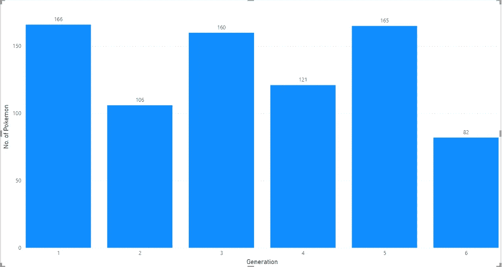
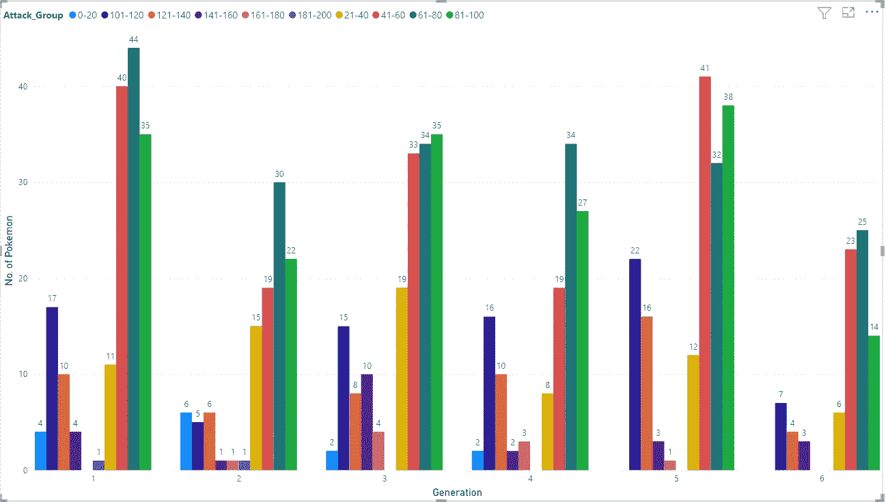
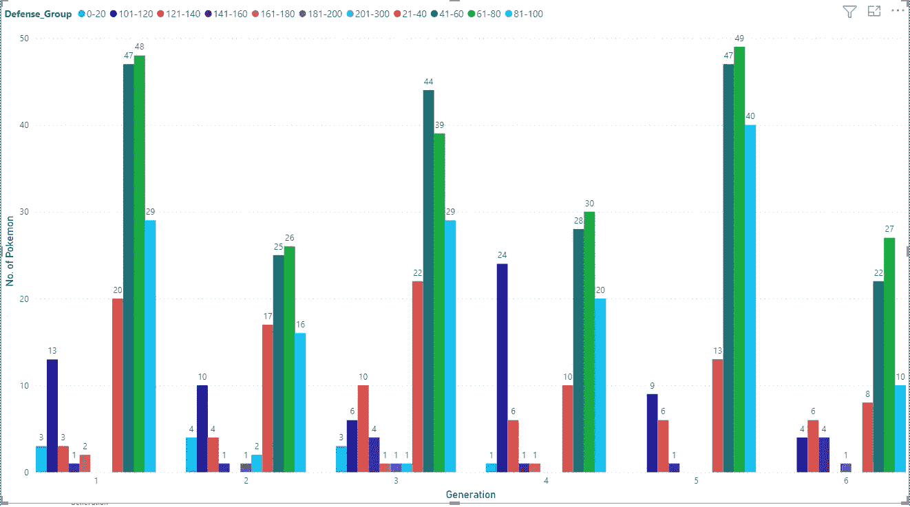
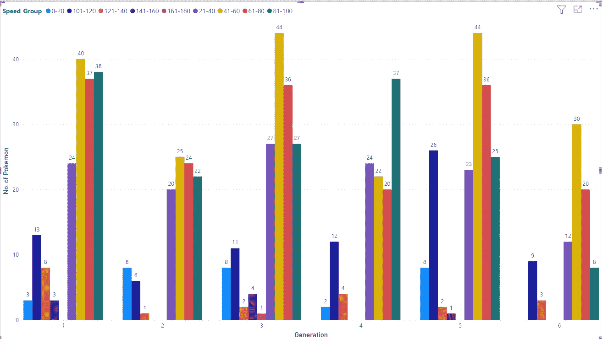
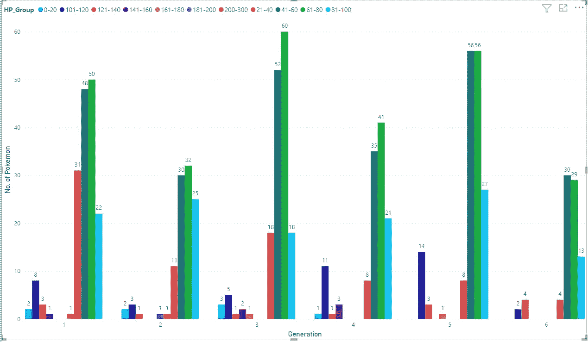
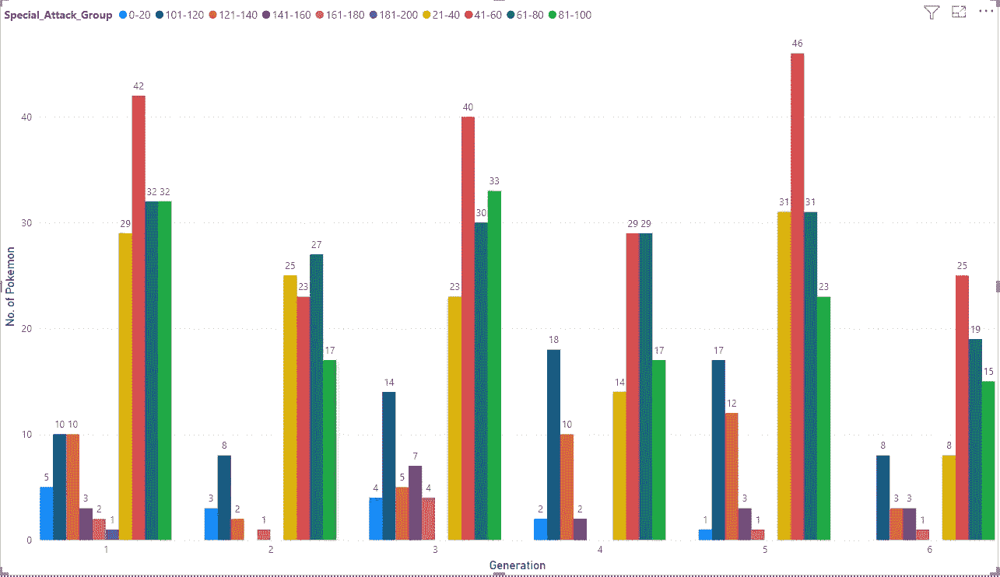
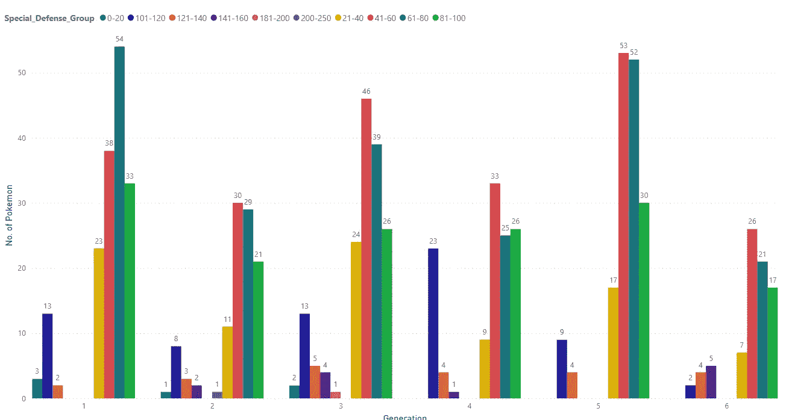
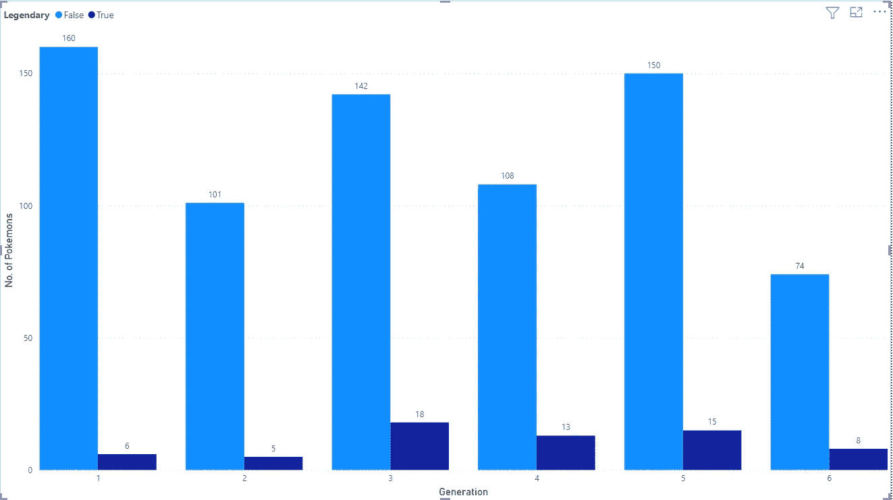
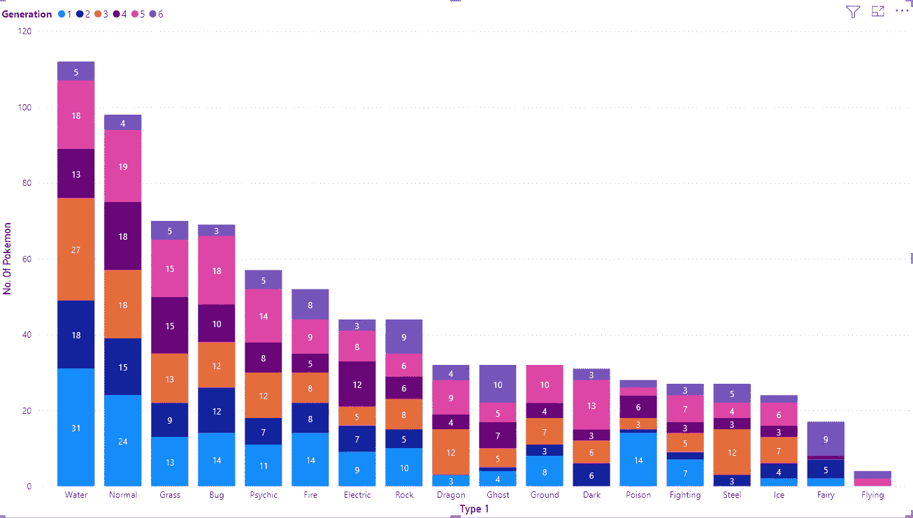
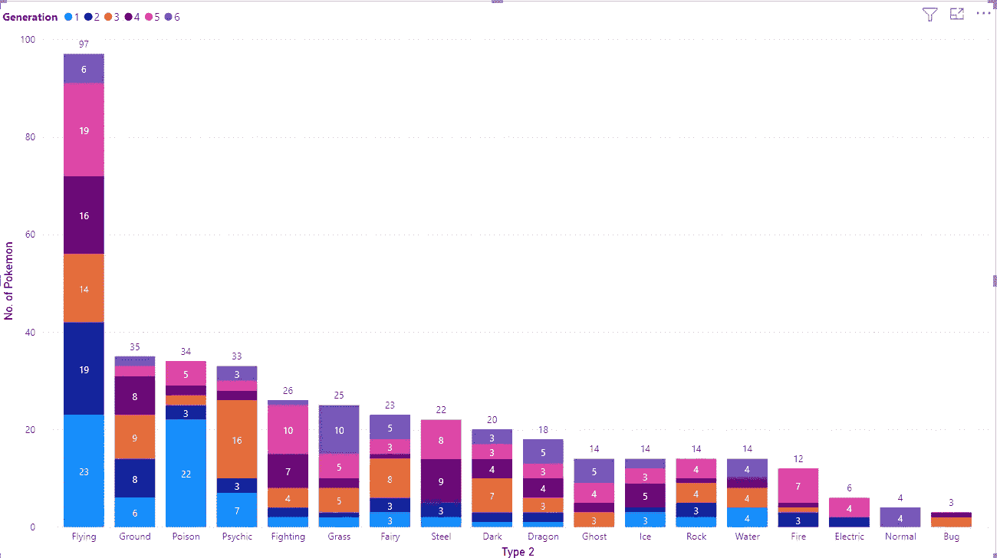

# 神奇宝贝数据集

> 原文：<https://medium.com/geekculture/pokemon-dataset-dv-9e6b033c9fe8?source=collection_archive---------15----------------------->

## 数据可视化

## 欢迎来到数据可视化系列的下一篇文章，这是有史以来最受欢迎和喜爱的卡通之一——神奇宝贝…
必须抓住它们…(数据集的可视化部分)😉

Photo by [Michael Rivera 🇵🇭](https://unsplash.com/@michaelrivera_ph?utm_source=medium&utm_medium=referral) on [Unsplash](https://unsplash.com?utm_source=medium&utm_medium=referral)

不要浪费太多时间，让我们跳进我们的数据集，从可视化开始。

Fig 2:- Description of columns of Pokémon Dataset

Fig 3:- Pokémon Data Overview

让我们从数据集的一些基本可视化开始。是时候让双手和头脑开始工作了…

Fig 4:- Count of Pokémon’s based on Generation

啊..一个很好的开始方式…我们可以看到总共有 6 代不同的神奇宝贝，但我们也可以注意到奇数代的神奇宝贝比偶数代的多。第 1 代、第 3 代和第 5 代的神奇宝贝数量几乎相等。

由于第 6 代的神奇宝贝数量最少，我们可以假设这与神奇宝贝的能力有某种联系。

因此，让我们首先验证我们的假设..
***是与能力挂钩的世代…！！！***

> **注意:-** 我把攻击/防御/速度/HP/sp 分组了。Atk/Sp。以 20 人为一组进行定义，以最大限度地减少条形并获得更清晰的图形。
> 例如，攻击值 15 分在 0-20 组，攻击值 49 分在 41-60 组，同样，防御值 35 分在 20-40 组，防御值 134 分在 120-140 组，其他也是如此。

**1.0 代链接攻击**

Fig 5:- Generation VS Attack

在这里，我们可以看到 0-20 的攻击组只出现在 1-4 代，而 21-40，41-60，61-80 和 81-100 组在每代都有相当数量的神奇宝贝。
此外，我们注意到最高组 181–200 只出现在第 1 代& 2 中。

因此，我们可以说，除了第 0-20 组以外，攻击与第几代没有太大关系，第 0-20 组只存在于下几代。

**2.0 代连上防御**

Fig 6:- Generation VS Defense

该图看起来类似于上一个图(图 5)，对于从第 1 代到第 4 代的攻击组 0–20，情况也是如此，防御组 0–20 仅出现在第 1–4 代中。此外，防御在 21-100 之间的神奇宝贝会按比例分配给每一代。我们在这里注意到的一个区别是最高防御(201-300)出现在第二代& 3 中。

因此，我们可以得出结论，除了第 0-20 组外，防御也与第几代没有太大关系，第 0-20 组只存在于下几代。

**3.0 代链接上速度**

Fig 7:- Generation VS Speed

该图与前两个图(图 5 和图 6)也没有太大的不同，这里速度组 0-20 也仅出现在较低代(1-4)中。此外，速度组 21–40、41–60、61–80 和 81-100 分布在所有组中。
需要注意的区别是，这里的最高速度不是太高，最大的群体是 161-180，只出现在第 3 代，也只有 1 个神奇宝贝。

因此，我们可以得出结论，速度只与第 0-20 组相关，而第 0-20 组只存在于下一代，我们只有 1 个高速神奇宝贝。

**惠普上的 4.0 代链接**

Fig 8:- Generation VS HP

这张图看起来也与之前的图相似..(图 5–7)。最小范围组 0-20 仅适用于较低的代(1-4)，范围 21-100 按比例分配给所有 6 代。
但是在这里，我们可以注意到最高分组是 200–300(在此范围内只有 2 个值，所以将它们分组为 1，而不是 20 的分组范围。)仅适用于第 1 代&第 2 代。

因此，我们可以得出结论，攻击，防御，生命值和速度与世代没有太大关系，但是:-
*如果一个神奇宝贝的值很低(< 20)，那么他们可能是第 1-4 代。
*大多数神奇宝贝的能力在 21-100 之间，而且它们跨越了所有的世代。

不错…我们能够从这些数据中获得一些见解..现在让我们继续，看看特殊能力&看看它们是否与世代有关…

**5.0 代林克特攻**

Fig 9:- Generation VS Special Attack

与之前的图表有一点不同..最低的 0-20 组出现在前 5 代。21-100 之间的范围同样以相等的比例分布在所有 6 个世代中。
在这里，我们可以看到最高组别范围 181-200 只有 1 个神奇宝贝，第一代只有 1 个，但第二高组别范围(161-180)第三代有 4 个神奇宝贝，第四代有 0 个，其他各有 1 个。

转到特殊防御…

**6.0 代特殊防御上的链接**

Fig 10:- Generation VS Special Defense

比前一系列相似的图表多了一些差异…好的，我们正朝着从我们的数据集中获得一些好的分析的方向前进。

此图中需要注意的要点:-
*最低范围(0–20)的神奇宝贝数量非常少，仅适用于第 1、2 和 3 代。
*特殊防御大于 140 的神奇宝贝在 1st&5 代中没有。
* 200–250 上的特殊防御范围第二代只有 1 个神奇宝贝
* 21–100 在各代之间分布相似。

**7.0 代与传奇神奇宝贝的链接**

Fig 11:- Generation VS Legendary

这是一个比之前的图表简单得多的图表……在这里，无论神奇宝贝是不是传奇，每一代人都只有 2 个柱状图..
我们可以注意到第三代、第四代&第五代有更多传奇的神奇宝贝，第六代也有相当高的数量。

因此，我们可以得出这样的结论:一代和传奇之间存在着某种联系。越是高世代越是传奇..但只有极少数人有资格成为最高 Gen 和传奇人物。

**8.0 代链接初级类型的神奇宝贝**

Fig 12:- Generation VS Type 1

离发现新东西又近了一步…
在这里，我根据世代对不同类型的神奇宝贝进行了分类。

我们可以注意到第 1、2 和 3 代遵循相似的模式&水型神奇宝贝的数量最多，其次是普通类型。除此之外，第一代有少量的虫，火和毒类型，第三代有虫，通灵，龙和钢，而第二代没有龙和飞行类型。

从第 4 代我们有一点不同，它有更多的正常，草，水和电动类型的神奇宝贝。对于第 5 代，我们可以看到水，正常，草，昆虫，精神和黑暗的数量略高。此外，非常第一次，我们可以看到一些飞行类型的窥视。

对于第六代，我们有更多的摇滚、幽灵和精灵类型的神奇宝贝，很少有飞行类型的。

**9.0 代链接与次要类型的神奇宝贝**

Fig 13:- Generation VS Type 2

有趣的是……对于大多数神奇宝贝来说，飞行更多的是第二种类型，我们也可以看到很少的神奇宝贝只有第二种类型(因为总数比实际数量少)。

第一代有飞行和毒药作为普通的辅助类型，第二代主要只有飞行，第三代有飞行和心灵作为普通类型。

对于第四代来说，战斗和钢铁以及飞行和地面是常见的，对于第五代来说，战斗，钢铁和火。最后，第六代在草的类型上有更多的计数。

## 总结所有的分析要点

现在是时候总结一代人的视觉化，并概括我们到目前为止的分析了… :-

1.  我们有更多奇数代的神奇宝贝，如 1、3 和 5 代
2.  平均能力在 21-100 之间。
3.  如果一只神奇宝贝的特殊防御大于 140，它就不可能是第一代和第五代。
4.  如果一只神奇宝贝的主要类型是水或者普通，并且能力很低，那么它很有可能是第 1、2、3 代的。
5.  主要类型为龙或飞行的神奇宝贝不能出现在第二代中。
6.  主要类型为飞行的神奇宝贝只能是第五代和第六代。
7.  一个传奇的神奇宝贝比其他任何一个氏族都有更多的机会来自第三、第四或第五代。

我们可以说它们在类型和能力上与世代有某种联系，但为此我们需要更多地研究这个数据集..

这还不是这个神奇宝贝数据集的全部。在第二部分，我将带来一些更有趣的视觉效果..
直到时间[你可以在这里](https://www.kaggle.com/shashanksinghals/pokemon)得到你的数据集，试着创造视觉效果或者想出一些你认为我应该在这里添加的分析…

非常感谢各位…稍后见，有更多有趣的分析…

你可以了解我更多:- [关于我](https://shashank-singhal.medium.com/about-me-shashank-singhal-6654366c8a05)

快乐学习…！！！🙂