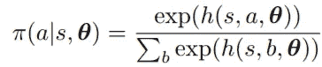
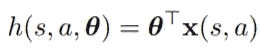
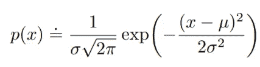
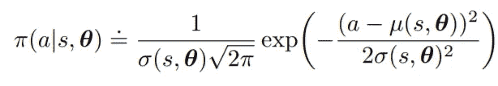
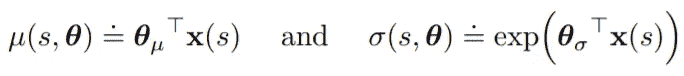
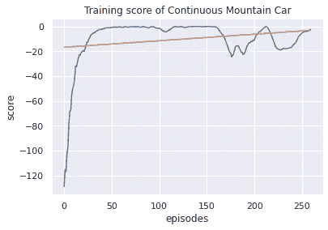
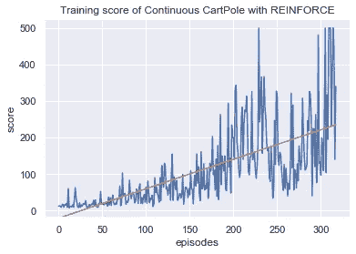
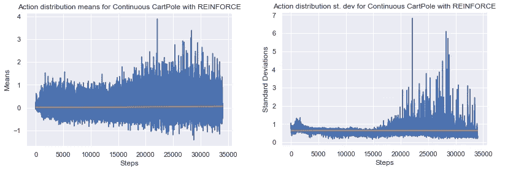
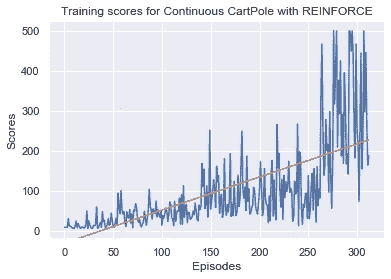
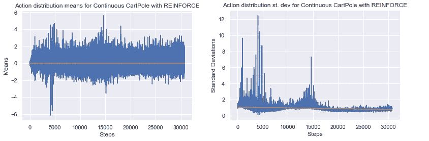

# 连续动作空间的策略参数化

> 原文：<https://medium.com/geekculture/policy-based-methods-for-a-continuous-action-space-7b5ecffac43a?source=collection_archive---------4----------------------->

在我实现的过去几个策略梯度和行动者批评算法中，我一直使用经典的控制环境 CartPole 作为我的实验基准。CartPole 环境有一个简单的离散动作空间:向左或向右推小车。在这篇文章中，我将探索另一种方法来参数化我们的策略函数，以处理具有连续动作空间的环境。

# 介绍

基于策略的方法的优点之一是能够处理大的甚至连续的动作空间。当我们使用 Q 学习方法时，代理学习一个状态中每个动作的 Q 值，并通过选择给出最高 Q 值的动作来建立一个最优策略。虽然这可能适用于某些环境，但这仅适用于离散的动作空间，因为在连续值的范围内有无限数量的动作。在基于策略的方法中，代理直接学习策略，并从动作空间的概率分布中选择动作。对于连续的动作空间，我们可以学习概率分布的参数，并从中选择一个值。首先，让我们回顾一下如何为离散操作参数化策略:

Taken from Sutton&Barto 2017

该函数接受一个离散动作，例如“向左推”或“向右推”，一个状态 *s* ，以及一组参数θ。等式的右侧是 *h(s，a，θ)* 函数，这是一个偏好函数，它为策略偏好的操作赋予更高的值。我们在这里使用指数 softmax 分布，因此偏好值被转换为[0，1]之间的概率值，并且一个状态中的所有动作的总和将为 1。

Taken from Sutton&Barto 2017

这里的偏好函数只是一组简单的权重θ乘以特征向量 *x(s，a)。*在实现过程中，这组权重可以通过神经网络来学习，因此偏好函数可以比简单的线性函数更复杂。

现在，让我们看看如何为连续操作参数化策略。策略函数基于高斯分布的概率密度函数:

Taken from Sutton&Barto 2017

我们可以看到，这个分布的参数是 *μ* ，均值， *σ* ，标准差。请注意， *p(x)* 并没有给出 *x* 的概率，而是给出了 *x 的概率密度。*与离散动作的 softmax 分布不同，高斯密度分布给出了一个真实值，而不是一个概率。要找到一系列 *x* 值的概率，您需要找到这些边界之间的定积分。使用这个概率密度函数，我们可以将我们的策略函数定义为:

Taken from Sutton&Barto 2017

这里，我们使用θ参数来近似μ和σ的值，以获得概率密度分布。μ和σ可以近似计算如下:

Taken from Sutton&Barto 2017

我们可以通过线性函数来近似均值，因此转置权重和特征向量的简单矩阵乘法。对于标准差，值应该是正的，所以我们对线性函数求幂。就像离散动作的参数化一样，我们只需要使用一个网络，因为μ和σ都由相同的线性函数近似。

原来如此！任何使用连续动作空间的算法的底层逻辑都没有太大变化，只是策略函数的参数化方式有所改变。

# 履行

为了实现，我将使用神经网络来参数化策略函数。然后，我将使用普通的策略梯度方法来测试我的实现。看着 OpenAI 健身房中的经典控制环境，我选择解决连续山地车问题。

Taken from Paperspace Blog

登山车环境的前提很简单。在每一步，代理人施加与[-1，1]之间的一个值成比例的力量，目标是把手推车开到旗子那里。当手推车到达旗子时，代理人会得到奖励，而消耗的能量会受到惩罚。然而，实现目标有点复杂。由于动力受到限制，这个想法是让手推车来回摇摆，以产生足够的动力爬坡。代理人还需要将用于获得更高分数的能量最小化。当得分达到 90+时，环境被视为已解决。

以下是我在实现中使用的超参数:

*   γ(折扣系数):0.99
*   α(学习率):0.001
*   剧集数量(要播放的剧集):1000
*   最大步数(每集最大步数):500

以下是政策网络:

这里有两个输出，μ和σ。下面是我用来选择动作的一段代码:

请注意，我仍然计算分布的对数概率，因为策略的更新方程仍然没有改变，我们只是改变了参数化策略函数的方式。

以下是该代理在 250 集强化训练中的训练历史:

当我第一次看到训练历史时，我对结果感到惊讶。代理人的分数迅速增加，进展在大约 50 集时持平。在再进行 10 次实验后，同样的历史模式出现了，尽管有时有一集的得分超过了 0。你可能得出的结论是，代理人使用了太多的能量来产生爬山所需的动力，导致奖励抵消了能量的使用。然而，看着代理人玩着学会的策略，手推车似乎只是在山脚下轻微地来回晃动。发生了什么事？

这里的问题在于环境的稀疏回报。MountainCar 环境根据每一步的能量使用情况对代理进行惩罚，并且只在到达旗帜后奖励代理。因此，在奖励随机到达旗帜之前，代理不会知道奖励。由于代理在每一步都受到惩罚，它的目标自然会是最小化能量消耗，从而产生一个手推车静止不动的策略。

这个问题的一个潜在解决方案可能是为环境定制奖励。然而，在尝试使用位置、速度、机械能等等之后，我仍然得到相同的结果。其原因是由于我们算法的性质。

我们基于策略的方法依赖于直接改进策略，并从我们学习的策略中采样动作。虽然非策略方法可以使用探索方法，如 epsilon-greedy，但我们的代理只有在采样行为偏离均值很远或标准偏差很大时才能进行探索。当代理试图在没有达到目标的情况下更新策略时，策略将次优地收敛。

看起来它回到了良好的老卡特波尔环境。我将使用[伊恩丹福斯](https://gist.github.com/iandanforth)的[连续翻筋斗](https://gist.github.com/iandanforth/e3ffb67cf3623153e968f2afdfb01dc8)实现，OpenAI 的解决条件是最近 100 集的平均 195 分。动作将被剪辑为[-1，1]。以下是强化培训的历史记录:

我们的经纪人在 50 次试玩中取得了 300.72 的平均分。该代理还能够在 5 次试验中平均 384.8 次地解决侧翻问题。与使用强化的不连续动作空间的弹球的 79.6 分相比，这个结果要好得多。代理能够解决 1000 集以下的环境。这一结果是意料之中的，因为与施加+1 或-1 的力相比，使用连续动作将提供对推车的精确控制。

需要注意的一点是不稳定性和频繁的灾难性遗忘。因为我们是在没有基线的情况下进行强化，所以预计会有很大的差异。然而，我们可以观察到，从第 150 集左右开始，代理“忘记”相当频繁。我推测这是因为我们的代理学习得太快，没有时间收敛到一个稳定的策略。除了我们的行动可能千差万别之外，几个异常的行动会导致策略崩溃。

下面是动作分布参数的训练历史:

该方法的训练历史是可以预期的。当代理试图平衡极点时，策略学习在消极和积极动作之间交替均值。我们还可以观察到，除了异常值之外，大多数负均值都在-1 以下，而正均值在 1 到 2 之间。因为我们将我们的动作限制在[-1，1]之间，所以积极的动作都是+1。负平均值出现的频率比正平均值高 20%,以补偿较大的正平均值。我假设平均值的大小随着时间的推移而增加，因为动作被剪切，所以平均值可以继续上升而不受惩罚。

标准差的历史有点出乎意料，可以解释训练分数的历史。从 20，000 步开始的高 st. dev 可以看出，我们的策略对其行动不太有信心。这大约与代理开始灾难性遗忘的时间相同，并且存在高得分差异。一旦代理解决了环境问题并收敛到最大值，st. dev 再次回落。

让我们来看看未剪辑动作的分数和动作分布参数的训练历史:

与修剪动作不同，平均值的大小不会随着时间的推移而增加，因为对于未修剪的动作，施加额外的力会受到惩罚。标准差历史也是有意义的，因为当学习的策略向解决方案收敛时，它对其动作更有信心。

# **最终想法**

总的来说，这是一个有趣而简短的实验，不需要太长时间。我只想尝试实现一种不同的策略参数化，所以我修改了增强算法的部分代码。在未来的帖子中，我将继续讨论更复杂的处理连续动作空间的算法，如 DDPG、PPO、SAC，希望这些算法能够解决更复杂的环境。

代码:[https://github . com/cheng i600/rl stuff/blob/master/Policy % 20 gradients/REINFORCE-continuous . ipynb](https://github.com/chengxi600/RLStuff/blob/master/Policy%20Gradients/REINFORCE-Continuous.ipynb)

参考资料:

*   [强化学习:导论(萨顿&巴尔托 2017)](http://incompleteideas.net/book/bookdraft2017nov5.pdf)