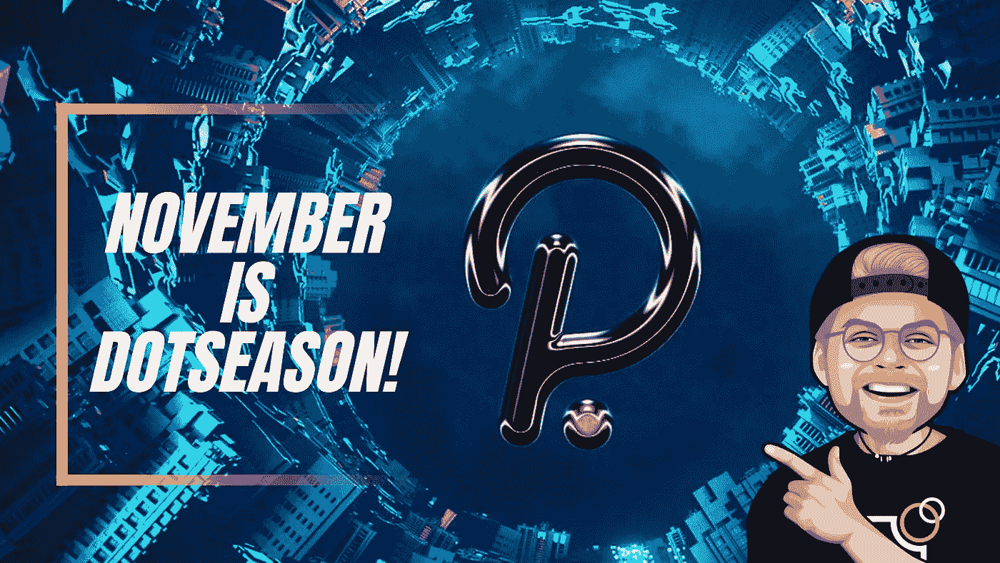

# 波尔卡多特在 50 美元以上爆炸——11 月是网络旺季！

> 原文：<https://medium.com/geekculture/polkadot-explodes-above-50-dollars-november-is-dotseason-f0f9b3216111?source=collection_archive---------11----------------------->

许多长期的行业观察家认为 Polkadot 是一种有前途的加密货币。特别是“副链”的概念使 Polkadot 有别于许多其他的加密项目。

Parachains 是集成到 Polkadot 网络中的完整区块链，用于验证交易。副链是各种专门的区块链…