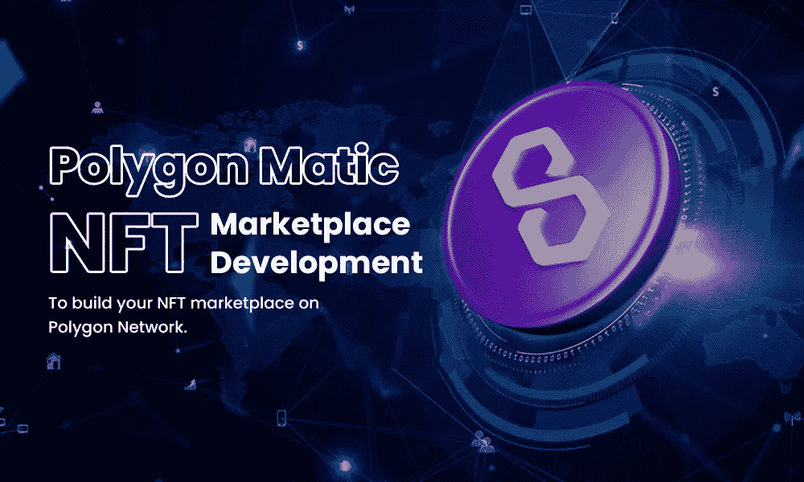

# Polygon Matic NFT 市场开发-在 Polygon 网络上建立您的 NFT 市场。

> 原文：<https://medium.com/geekculture/polygon-matic-nft-marketplace-development-to-build-your-nft-marketplace-on-polygon-network-5d792ac44f4b?source=collection_archive---------11----------------------->

Polygon Matic NFT marketplace development — To build your NFT marketplace on Polygon Network.

在加密领域，FTs 目前正获得难以想象的受欢迎程度和盈利能力。不信？2021 年，NFT 的销售额已经从上一年的 24.7 亿美元增加到了 2021 年的 24.7 亿美元，而上一年的销售额只有数百万美元。它记录了市场交易活动的成倍增长。Statista 报告称，2021 年 8 月出现大幅上升，个人买家和卖家的数量上升至 28 万。难道这些数字还不足以证明 NFT 空间为雄心勃勃的企业家所拥有的潜力吗？当然可以！

不仅仅是任何市场，而是一个基于多边形的 NFT 市场开发，它是提高吞吐量和效率的可行解决方案。多边形马蒂奇 NFT 市场以其在减少交通拥堵和交易成本方面的巨大优势而闻名，同时保留了以太坊区块链的最佳功能。

利用这个绝佳的机会可以获得有利可图的收益。

# 什么是多边形区块链？

以太坊区块链网络仍然是加密世界中最好的网络之一，这可能解释了为什么每个新令牌都渴望成为它的一部分。网络可靠性和传统的一个因素是它的可靠性和网络稳定性。然而，可伸缩性仍然是以太坊的主要关注点。因此，以太坊推出了多边形 NFT，这是一种第二层协议，与区块链类似但不相同。被专家称为侧链。

多边形最初被称为马蒂奇 NFT。Matic NFT 市场计划连接和开发兼容以太坊的区块链网络。Matic 的目的是建立一个生态系统，用户可以在其中利用以太坊平台提供的不同功能。马蒂奇·NFT 后来改名为多边形。那么，你如何在 Polygon 上建立一个 NFT 市场，具有可伸缩性和它的核心？

# 为什么 NFT 市场在多边形上？

Polygon network 的主要目的是提供许多工具来提高交易区块链网络速度，同时降低成本和减少麻烦，使其成为分散金融应用程序的可行链。另一个好处是，用户可以将他们的资产押在 Matic 网络上，以便获得更大的回报。在大用户打算大规模采用之前，必须解决延迟的容量稳定和昂贵的天然气费用问题。更重要的是，它需要一种特殊的用户体验，这种体验是由多边形网络提供的。

# 多边形 NFT 市场是如何运作的？

Polygon 作为一个桥接解决方案，致力于创建一个结合多种扩展解决方案的生态系统。这些包括 2 级可能性，如等离子体、乐观汇总和 ZK 汇总，以及具有不同共识机制的侧链。

Polygon 为新的项目构建者提供了快速高效地构建自己独特的缩放解决方案的能力。多边形以太坊虚拟机(EVM)兼容方法在规模、增强的灵活性和项目互操作性方面将其与其他区块链区分开来。

与早期的区块链协议(如以太网)相比，使用 Polygon 的成本更低，因为它可以灵活地收缩为 POS(堆栈验证)。多边形系统有许多成员，包括建筑商、开发商、客户和利益相关者。Polygon 利用 Sidechain 在以太坊兼容的区块链应用上运行和协作。

# 多边形 NFT 市场中的高级功能

**可伸缩性:**执行几个快速简单的交易的能力。

**以太坊兼容性:**允许兼容以太坊的区块链进行交互并减少限制，以便充分利用以太坊的生态系统。

**主权:**与以太坊网络集成，支持每秒可支持数千次交换的多链主权区块链。

**安全性:**为了促进安全交易，一群验证者利用算法。

**模块化:**利用可扩展、可配置和升级的平台。启用多个定制层以避免系统故障。

互操作性: Matic 允许多边形链与其他区块链网络接口。

如果它能提供一个有效的、分散的、高度安全的第二层解决方案用户界面，难道它不是一个很棒的 NFT 市场平台吗？

既然我们已经介绍了这些功能，让我们来看看 Matic NFT 市场开发的好处。

# 多边形马蒂奇 NFT 市场的好处

*   **用户界面:**作为 NFT 市场平台的所有者，您有能力提供最好的 UX。也就是说，一旦多边形 NFT 平台完成，你将有一个了不起的产品。
*   **第 2 层解决方案:**凭借巨大的可伸缩性，您可以显著加快日常事务处理。
*   **高安全性协议:**平台保证每一笔交易的高级加密。
*   **分散架构:**对 Matic NFT 市场用户完全透明。
*   效力: NFT 市场通过使用以太坊来支持区块链，从而增加了它的实用性。
*   **划算的天然气费:**与其他平台相比，NFT 交易的天然气费价格合理。

# 结论

NFT 是创新者和年轻企业家开创新事业的未来之路。加密技术已经在全球范围内以前所未有的速度迅猛发展，预计 NFT 在未来十年内将增长十倍。根据最近的一项民意调查，每周售出 15，000 至 50，000 个 NFT，NFT 的大多数项目都建立在多边形网络上。从 [**Polygon NFT 市场发展**](https://www.alwin.io/polygon-matic-nft-marketplace-development) 开始你的商业生涯，并在全世界建立繁荣的业务。