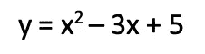
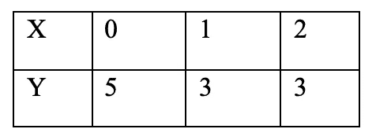
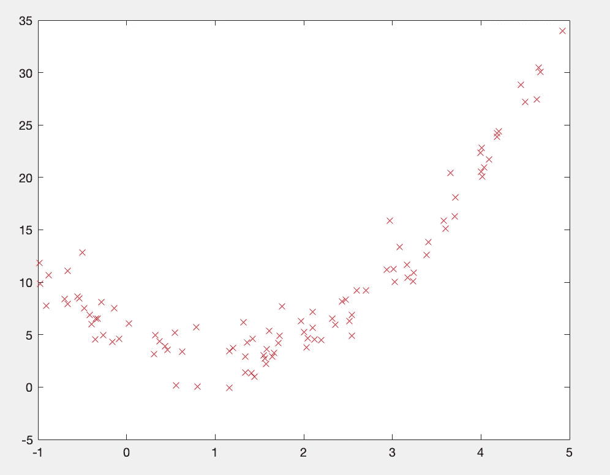
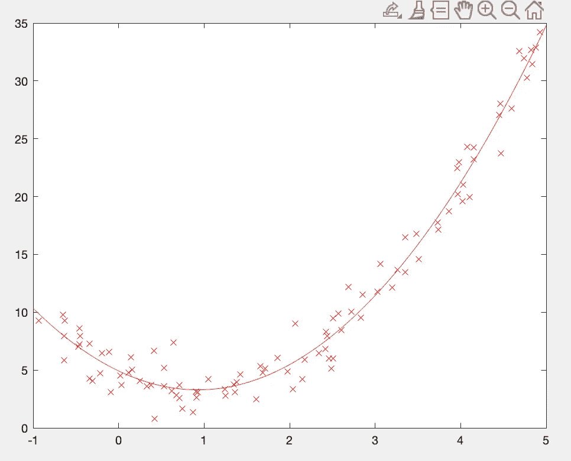
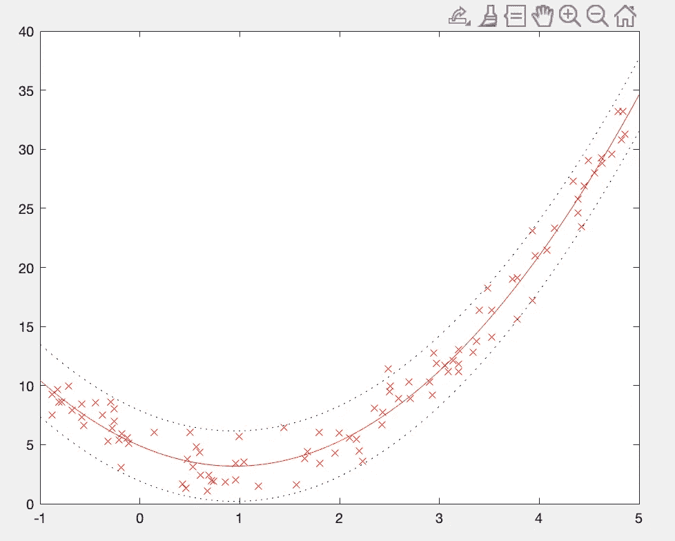

# Matlab 中的多项式(5/5)

> 原文：<https://medium.com/geekculture/polynomials-in-matlab-5-5-3e2b598a1eaf?source=collection_archive---------83----------------------->


好的，所以如果你一直在关注我的系列，那么你应该对多项式有很好的理解。如果不是，那么你可能想先从这里开始。

是我们开始编码的时候了，系好安全带，让我们试一试…
[源代码可在 github 上找到。](https://github.com/shaunenslin/polynomials.git)

如果你取下面的多项式



现在，如果我们将下面的 **x** 值代入上述等式，我们将得到下面的 **y** 结果。



你现在可以启动 Matlab，创建你的 x 和 y 向量如下。然后运行 polyfit 命令，在最后一个参数中输入 2，因为我们使用的是二次函数。

```
x=[0,1,2]
y=[5,3,3]
polyfit(x,y,2)
```

运行以上，你应该得到一个如下的系数。很好，从我们的数据中，polyfit 找到了正确的多项式系数。

```
ans =1.0000 -3.0000 5.0000
```

这是一个很好的基本例子，但是让我们来尝试一些更复杂的例子。

# 生成样本数据

在这个例子中，我们没有数据集，但没关系，我们可以让 Matlab 生成一些样本数据来拟合我们的二次方程。首先，让我们定义我们的二次函数如下，称它为 *f* 。

```
clc;
clear;
close all;% declare our quadratic polynomial
f = @(x) 2*x.² — 4*x + 5;
```

现在，让我们使用 unifrnd 函数生成一些样本 x 值。我们用 *+ 1.5*randn(size(x))给 y 值添加一些变化。*毕竟，我们不希望数据太完美；-)

```
% Create x by getting random uniform values between -1 and 5
x = unifrnd(-1, 5, [100,1]);% Calculate y by running the polynomial but add some variations
y = f(x) + 1.5 * randn(size(x));
```

绘制数据点，这样我们就可以可视化数据

```
% plot the data points
figure;
plot(x,y,’rx’);
```



After executing, you will see we have generated a nice dataset to compliment our quadratic

# 找到我们的最佳系数

现在我们有了数据，让我们对二次曲线进行拟合，找出最佳系数。我们选择二次曲线，因为我们可以看到在 x 轴上大约“1”处的数据中有一圈，因此形状符合二次曲线。

```
% find the best coeffeciant
[p,S] = polyfit(x,y,2);
```

我们现在有了 p 的最佳系数，可以用 polyval 为我们的系数画一条线了。

```
xx = linspace(-1, 5, 100);       % generate even spaced xx
[yy, delta] = polyval(p,xx,S);   % Now get the y for xx
hold on;
plot(xx,yy);
```



After executing, your coefficient should be plotted

# 画出我们的支持/抵抗线

一个很好的小特性是，我们可以使用从 polyval 返回的 delta 来绘制多项式的支撑线和阻力线。这些图给了我们 90%的信心，数据将落在这些范围内。

```
% Lets use our delta to plot our support and resistance lines
plot(xx, yy + 2*delta, ‘b:’);
plot(xx, yy — 2*delta, ‘b:’);
```

