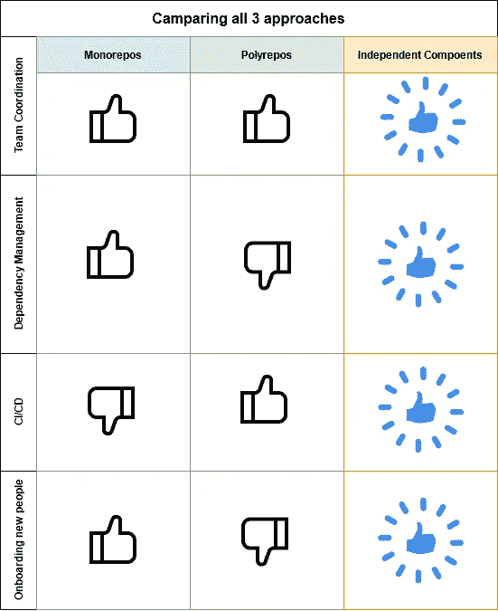
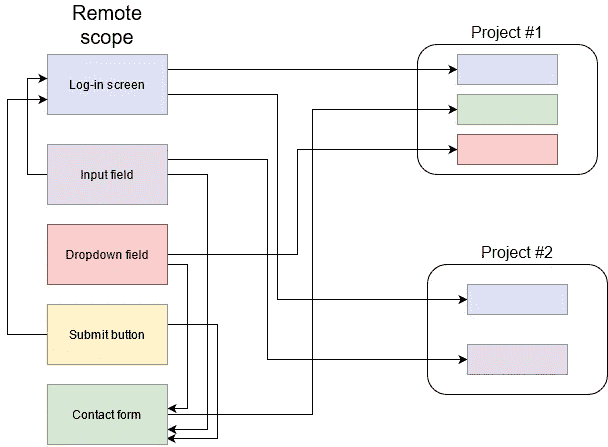
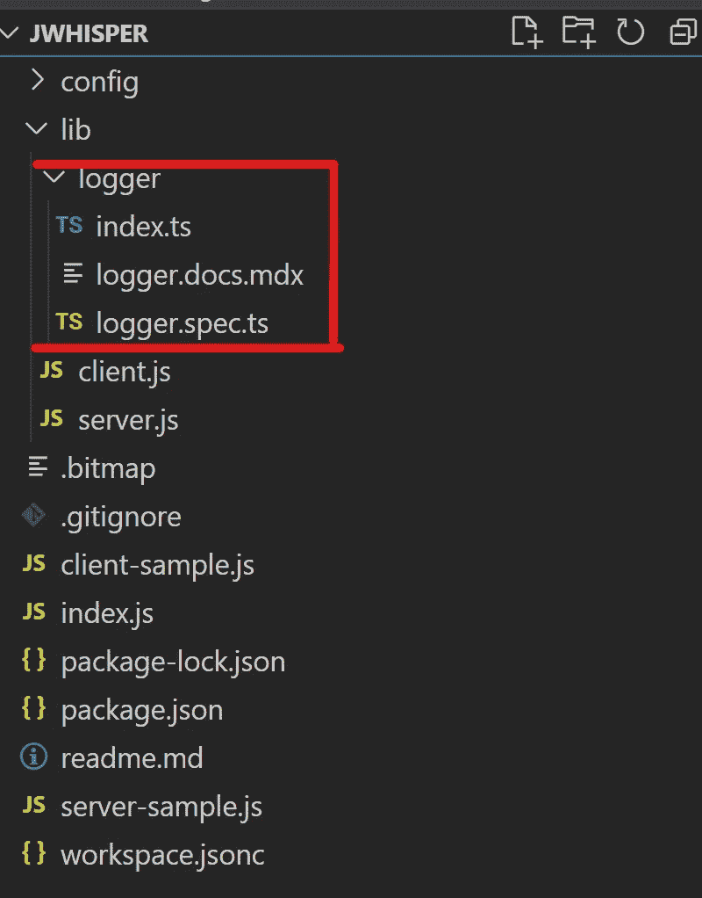
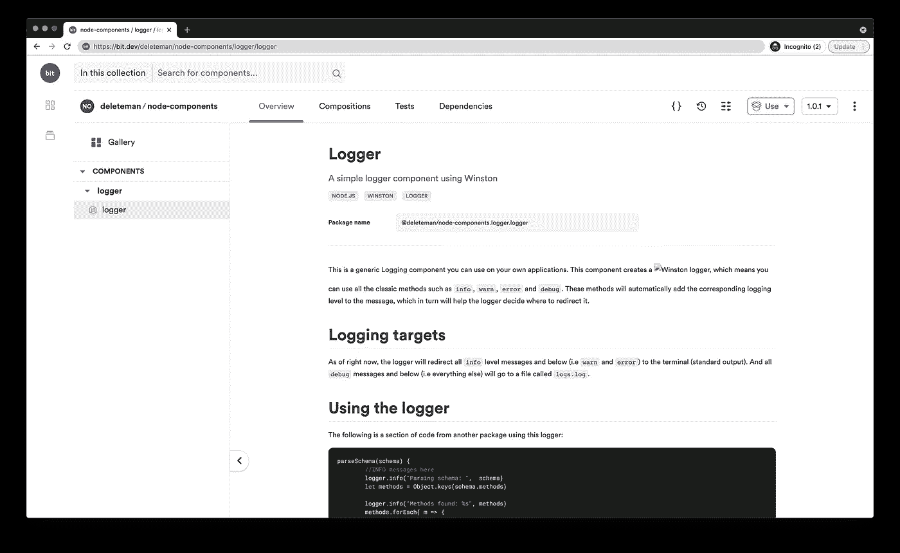
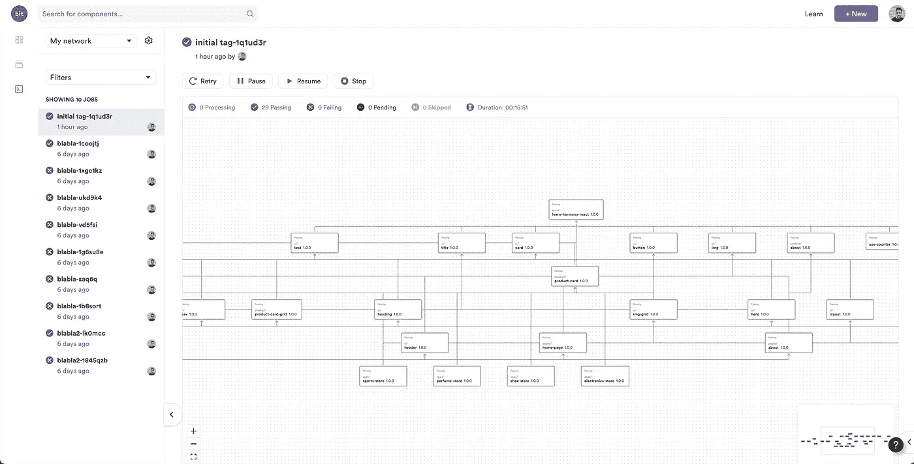

# 多回购与单回购与独立组件

> 原文：<https://medium.com/geekculture/polyrepos-vs-monorepos-vs-independent-components-fba5c3317958?source=collection_archive---------20----------------------->

## 引入独立组件:monorepo 和 polyrepo 开发策略的宠儿


Photo by [**The Humantra**](https://www.pexels.com/@thehumantra?utm_content=attributionCopyText&utm_medium=referral&utm_source=pexels) from [**Pexels**](https://www.pexels.com/photo/sea-man-person-beach-4986968/?utm_content=attributionCopyText&utm_medium=referral&utm_source=pexels)

我们一直在 monorepo 人和 polyrepo 狂热分子之间就如何构建我们的项目进行的长期斗争现在结束了。

将所有代码放在一个集中的地方，而不是将所有东西都放在多个单独的存储库中，这种利弊已经不再适用。结果出来了，结果出乎你的意料，事实上，我们都赢了。

通过讨论和创新，一种新的工作方式诞生了:[独立组件](https://blog.bitsrc.io/independent-components-the-webs-new-building-blocks-59c893ef0f65)。



Keep reading for more details…

让我们看看这对我们意味着什么。

# 什么是独立组件？

独立组件是由 [Bit](https://harmony-docs.bit.dev/) 提出的一种开发策略和软件架构。它允许您使用独立开发、版本化和协作的组件来构建和组合您的项目，这些组件托管在不同的“远程范围”中，即远程组件托管。



虽然每个组件都是作为一个单独的单元构建的，并且可以在一个单独的远程范围内托管，但是它仍然是依赖关系网络的一部分，该网络允许组件更新从一个修改的组件传播到它的所有依赖组件。

使用独立的组件允许您重用代码，并行工作(每个团队使用一组不同的组件，即一个“特性”)，并通过使用最少的应用程序构建块来大大减少构建时间。

## 但是等等，还有更多

即使独立的组件是独立的源代码控制的，它们仍然可以在一个单一的位工作空间中开发和维护。这使得处理由多个组件组成的特征变得更加容易。

通过使用单个工具(Bit CLI 工具)，您可以自动处理整个工作流(从开发、发布、通过、测试、构建和标记新的发布版本)。

如果您想了解有关 Bit 的更多信息，请参见以下内容:

[](https://github.com/teambit/bit) [## 团队位/位

### 面向组件驱动的应用程序的开放式基础设施，可加速和扩展开发。Bit 是一个开放源码软件基础设施，用于…

github.com](https://github.com/teambit/bit) [](https://harmony-docs.bit.dev/) [## 欢迎来到比特和谐|文档

### Bit 是一个由独立组件组成现代应用程序的工具。在 Bit 中，我们构建组件，而不是应用程序。在…

和谐-docs.bit.dev](https://harmony-docs.bit.dev/) [](https://blog.bitsrc.io/independent-components-the-webs-new-building-blocks-59c893ef0f65) [## 独立组件:网络的新构件

### 为什么你所知道的关于微服务、微前端、monorepos 甚至普通的旧组件库的一切…

blog.bitsrc.io](https://blog.bitsrc.io/independent-components-the-webs-new-building-blocks-59c893ef0f65) 

# 与 monorepos 和 polyrepos 有什么不同？

让我们快速总结一下 monorepo 和 polyrepo 的含义，这样我们就都明白了:

## 什么是单向回购？

简而言之:monorepo 是一个单独的文件夹，你可以在其中保存整个项目。这也意味着所有代码都有一个单一的代码版本库(通常是 Git)。在实践中，这意味着无论是大项目还是小项目，都在同一个存储库中进行版本控制。

monorepos 的主要目标是简化共享代码的任务。如果你有多个使用同一种编程语言的模块，比如有一组用 Node.js 编写的微服务和一个丰富的前端 React 应用，那就更是如此。如果它们都在同一个存储库中，那么与 polyrepo 方法相比，共享公共逻辑是微不足道的。

monorepos 的另一个主要优势和目标是提高团队成员之间代码和资产的可见性。因为每个人都可以访问整个存储库，所以每个人都可以看到其他人做了什么。这对于避免每次需要解决一个常见问题时都要重新发明轮子非常方便。如果其他人已经完成了，代码就会在那里。

给定正确的项目类型，比如一个小的 React 组件或者一个新奇的后端框架，这种方法会非常有益。然而，其他更复杂的场景，如我之前提到的微服务和 React 前端，如果团队不精通“Git 艺术”，会使事情变得更加困难。

当然，如果团队在正确的指令、工具和标准下工作，这是一个非常可行的方法。

## 那么什么是聚回购呢？

正如您可能已经猜到的，polyrepo 方法包括为项目的每个组件建立一个单一的存储库。对于前面的例子，这意味着每个单独的微服务有一个 repo，一个用于 web 应用程序，另一个用于移动应用程序。

这两种方法都没有明显的赢家，因为每种方法都有自己的缺点和优点。根据您的环境和您正在构建的项目类型，选择其中一个可能更有意义。但话说回来，我们在这里讨论的是独立组件，它是什么样的，与这两个组件有什么不同？

## 独立分量流

有了这个，你可以两全其美。您的每个组件都位于本地环境的同一个文件夹中，由 Bit 单独进行源代码控制。

但是您也可以获得 monorepo 方法的一些好处，因为您的项目在同一个根文件夹中有每一个依赖项。这允许你建立一个单一的工具来处理测试和依赖管理。

请看下面的图片:



这是我的一个项目的文件夹结构，在那里我将代码的一个公共部分提取到一个组件中，该组件位于基本代码中。这是一个日志组件，它被分发到这里，并且可以被导入到任何其他 Node.js 项目中。



[https://bit.dev/deleteman/node-components/logger/logger](https://bit.dev/deleteman/node-components/logger/logger)

注意文件夹中的文件，正如我之前提到的:它包含代码本身和更多内容(文档和测试)。

其工作方式是允许您跟踪项目中的文件夹，将它们视为独立的组件，并对它们进行版本控制和分发。全部通过使用 Bit 提供的 CLI 工具。例如:

```
$ bit add ./your-folder/ #starts tracking the folder as an individual component$ bit tag <component-id> 1.0 # Versions the component's current state $ bit export <component-id> # Distributes the component as a single entity by publishing it into the main marketplace
```

正如你所看到的，这个过程并不复杂，尽管如果你想要一个关于如何使用 Bit 的完整详细的解释，你应该查看[这篇文章](https://blog.bitsrc.io/how-bit-versions-independent-components-719aa9f0af68)。

现在让我们比较一下每种方法在一些特定场景下的表现:


上表显示了您可能期望的结果，独立组件方法每次都会成功。这是因为它可以被认为是 polyrepos 和 monorepos 的爱子。但是不要把我的话当真，我们深入一下为什么我会觉得是这样。

## 让人们加入项目

这种新方法如何影响新队友的入职流程？

**Monorepos。**除了简化工具之外——假设您只有一个存储库需要管理——了解如何设置和启动单个项目比了解如何单独设置不同的项目并让它们在您的本地环境中协调工作要容易得多，也快得多。

这是入职流程的另一个领域，其中 monorepo(或独立组件)方法可以带来很多价值。

**聚 repos。**当然，一个标准化得很好的 polyrepo 环境，其中考虑了 onboarding，也可以在所有项目中使用一套工具。然而，考虑到多个团队带着他们自己的目标工作，这几乎是不可能的。

**独立组件。通过使用单一工具(Bit ),你可以让新人的入职流程变得简单很多。相反，polyrepo 场景可能会为每个回购产生非常不同的工具，因为它取决于团队对工具、方法等的哲学**

您还可以获得 monorepo 的主要好处，即有一个单一的工作环境来设置和管理，而不是多个独立的工作环境。

## 团队协作

我所说的“团队协作”是指你协调几个团队的工作流的方式，这样所有的团队可以一起工作来发布一个新版本的应用程序，但是每个工作流都是独立的。

换句话说，无论你是在 mono 还是 poly repo 环境中工作，你都会有几个团队在不同的子项目上编码(例如后端或微服务、前端、移动应用等)。你会希望他们都朝着同一个目标努力，但是每个子团队都要对他们自己的子项目负责。期望是后端开发者做后端服务，而 React 开发者做前端，iOS 开发者做移动应用。在这样一个多变的环境中，让人们做任何事情都是不合理的。

**Polyrepos。**在这种情况下，polyrepo 环境通常更容易协调。这是因为需要多个团队作为同一个 monorepo 的一部分工作的分支模型可能会成为一场噩梦。想象一下，后端团队必须找到一种方法来提交更改，并增加回购中几个文件夹内的代码版本，而不会意外地从前端推送未完成的代码。[我经历过那种情况](https://blog.logrocket.com/the-git-workflow-you-need-how-to-deal-with-multiple-teams-in-a-single-repository-faf5bb17a6e4/)，我不推荐。

然而，如果您足够幸运地拥有多个存储库，这允许您将每个团队作为一个单独的工作流来处理。每一个都有自己的工作流程，如果需要，可能会有所不同，更简单、更快速、更容易协调。在项目的每一次迭代中，他们将各自朝着同一个坐标目标努力。

**Monorepos。**现在你也可以说 polyrepo 场景会给这种迭代的集成测试带来困难，因为每个团队都在独立地推进他们的代码。不得不开发一段依赖于他人进度的代码，这本身就可能成为一场噩梦。想象一下，如果你愿意，必须编码平台的前端部分，它依赖于 3 个后端微服务的当前版本。为了测试您的开发，您必须处理 4 个(至少)本地存储库，分别克隆并确保正确的代码被执行。Monorepos 让这变得容易多了。

**独立组件。**这就是独立组件的混合方法发挥作用并扭转局面的地方。通过这种方法，您仍然拥有 polyrepo 环境赋予您的同样的自由。但是由于所有东西都作为单独的组件安装在同一个 repo 中，所以您将代码作为一个大块来使用，就好像它是一个大的 monorepo 一样。通常单回购是由一个脚本编排的，比如运行`npm run dev` ,你仍然会受益于这种简单性和多回购情况的所有优点。这是双赢。

## 依赖性管理

无论是外部依赖管理(即你的代码需要的第三方包)还是本地依赖管理(换句话说，代码的不同部分是如何相互依赖的)，做好它从来都不容易，尤其是当项目足够大的时候。

现在每个问题都有自己的挑战:

**处理内部依赖**意味着理解代码的不同部分是如何相互依赖的。您可以在后端团队中使用一些公共代码(如自定义日志库)来拥有多个项目。如果您足够幸运，能够在后端和前端使用相同的代码，您甚至可以在不同的环境之间共享一些逻辑。

**Monorepos。**这在 **monorepo、**上很容易做到，因为这都是关于访问本地文件的。反正都在同一个伞包下。

**聚 repos。**然而，在 polyrepo 的情况下，共享代码迫使您将通用代码转换成一个包，并像安装外部依赖项一样安装它。这意味着每次依赖关系改变时，您都要创建包或更新它们。

**独立组件。**在这种情况下，独立组件方法再次为您提供了两全其美的方法。因为所有东西都在同一个伞型文件夹下，所以你可以直接修改和扩展代码。但是您也可以将其作为外部依赖项导入，因为 Bit 会将通用代码的副本安装到特殊本地路径下的`node_modules`文件夹中。这反过来允许您导入它并使用绝对 URL 引用它。这也是项目发布后你最终要做的事情。

这是一个很好的解决方案，因为它解耦了您的代码，但也让您能够将其视为代码库的一部分(而不是像处理第三方依赖那样对您来说是一个黑盒)。

现在，**处理第三方依赖关系**意味着理解你的项目需要哪些外部依赖关系。

**Monorepos。当应用程序的不同部分需要相同依赖项的冲突版本时，问题就出现了。你的包管理器可能不够聪明，你最终会得到一个糟糕的不稳定的代码库。**

**聚 repos。**对于 polyrepo 环境来说，这不是问题，因为它们都是彼此独立安装和处理的。

**独立组件。**这种情况下的独立成分方法也带来了与 polyrepo 相同的好处。每个组件都是单独处理和独立安装的。您不必担心第三方 dep 的版本冲突，所有这些都由 Bit 解决并从您那里抽象出来。

## 这对 CI/CD 意味着什么？

最后，无论您采用哪种方法，部署项目也是一个巨大的挑战。主要问题通常与处理部分部署有关，而不是重新部署整个平台。这可能需要很长时间才能实现，在最坏的情况下，这还可能意味着生产中的大量停机时间

这意味着，如果您只更改了后端拥有的多个微服务中的一个，您希望只测试和重新部署那个微服务。让所有其他 5 个微服务和前端应用程序经历相同的过程是没有意义的。

**Monorepos。**对于单一回购方法，这需要一些 CI/CD 魔法。本质上，部署触发器是由 repo 上的通用提交捕获的，而不是检查哪些文件已被修改。当然，有一些方法可以解决这个问题，但是它们需要高水平的协调，包括 CI/CD 端和团队工作流。

**波利普斯。**然而，由于每一个都是单独部署的，因此他们没有这些缺点。当然，这也意味着您需要为每个 repo 设置一个部署工作流，然后分别维护它们。如果有足够多的存储库，这也会变成一个小小的噩梦。

**独立成分。**独立分量方法如何解决这个问题？Bit 的人开发了 RippleCI，它将触发每个组件的构建和部署工作流(按照依赖关系的正确顺序)。这些构建将在承载远程作用域的服务器上运行。最终(构建的)发布版本也将存储在这些作用域中。

托管存储库将获得这些组件的最新版本。



A look a the RippleCI

在上面的截图中，您看到的是由 Bit 自动生成的依赖图，它向您展示了依赖于(因此需要更新)您的代码的不同组件。

该解决方案也超越了单一项目。请记住，通过独立组件方法，您可以在多个项目中重用这些组件。但是一旦这个数字变得足够大，让他们都使用最新版本的代码可能是一个挑战。通过这种方法，除了依赖平台提供的自动化之外，您什么也不用做。

最棒的是，这个过程还会触发每个组件的原生构建流程，包括编译、林挺、测试以及开发过程中配置或定制的任何其他内容。因此，在 CI/CD 端，您只需手动设置很少的内容，因为它是组件工作流的一部分。

为你的项目选择正确的方法具有挑战性和决定性。如果你选择了错误的一个，在项目持续期间，开发将会感觉像是走上坡路。如果你选择了正确的，无论这对你意味着什么，那么你就少了一个需要担心的问题。

然而，有一件事很难做到，那就是一旦你开始改变方法。改变你的工作流程，从单回购转向多回购，反之亦然，这可能是一个项目的结束。现在，由于独立组件方法，您不必这样做，因为通过它您可以获得两个世界的最佳效果。

如果您还没有尝试过，请给 Bit 一个机会，在您的下一个宠物项目中尝试他们的工作流程，并了解为什么它是我们行业的游戏规则改变者。