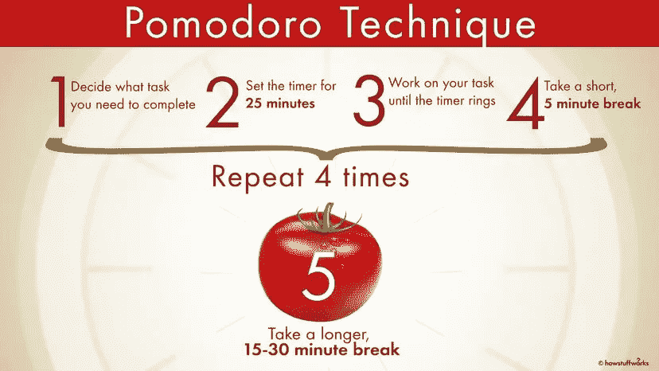

# 番茄显影剂

> 原文：<https://medium.com/geekculture/pomodoro-developer-4f968c04f4c5?source=collection_archive---------13----------------------->

利用番茄工作法进行软件开发

我们需要谈谈软件开发人员的心理健康。你可以在这里阅读更多关于 T2 的信息。如果你完美地管理你的时间，你总是可以同时实现你的心理健康和任务！以下是我个人遵循了一段时间的方法，它正在起作用。所以想和大家分享一下！🙂

> **简介:****番茄工作法**是弗朗西斯科·西里洛在 20 世纪 80 年代末发明的一种[时间管理](https://en.wikipedia.org/wiki/Time_management)方法。这项技术使用一个[计时器](https://en.wikipedia.org/wiki/Timer)将工作分解成间隔，传统上长度为 25 分钟，由短暂的休息分开。每个间隔被称为*番茄*，来自意大利语[的](https://en.wikipedia.org/wiki/Italian_language)单词，意为[番茄](https://en.wikipedia.org/wiki/Tomato)，源于西里洛在大学时使用的番茄形状的厨房定时器。

## 我们如何为软件开发人员使用 Pomodoro！

1.  为自己设定一天的目标，优先考虑你的目标，最后挑战自己
2.  每隔 25 分钟休息一下。你可以在每 25 分钟后休息 5 分钟，也可以在几次 25 分钟的训练后休息一会儿
3.  一旦你实现了每一个 25 分钟的目标或一个大目标(一个大目标会在几个 25 分钟的会议后出现)，就给自己打气或犒劳自己。
4.  从你的番茄周期中学习来优化你自己，并在下一个周期中应用。
5.  在一天结束的时候，回忆一下你今天得到了什么。你可能会在白天发现巨大的成就。

小贴士:这方面有很好的手机应用。对于 android，可以安装 [FOCUS-TODO](https://www.focustodo.cn/) 。

©How Stuff Works

快乐的编码伙计们！