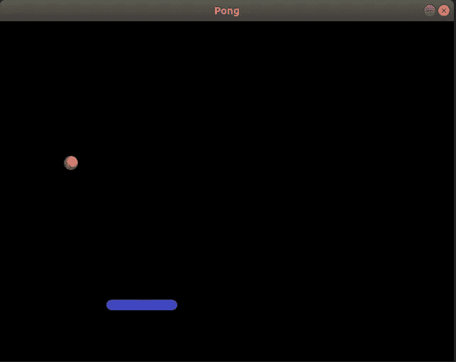

# 使用 Pygame 的乒乓游戏—步骤 1

> 原文：<https://medium.com/geekculture/pong-game-using-pygame-step-1-57bccb041abc?source=collection_archive---------11----------------------->

pygame 系列文章的第一篇

这是[系列](https://pythoninformer.com/python-projects/pygame-projects/pong/)的第一篇文章，我们将使用 Pygame 开发一个完整的 Pong 游戏。

在这一步，我们将简单地创建一个窗口，显示球棒和球，没有动画。

这篇文章的代码可以在 [github](https://github.com/martinmcbride/pygame-pong/tree/main/step-1) 上找到，资源在[这里](https://github.com/martinmcbride/pygame-pong/tree/main/resources)。

# 创建基本游戏…