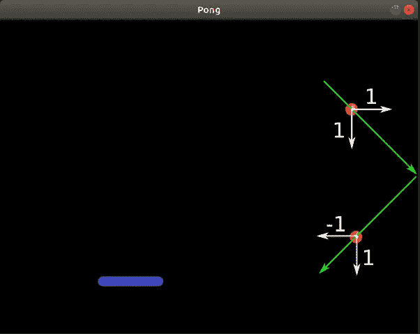

# 使用 Pygame 的乒乓游戏—步骤 2

> 原文：<https://medium.com/geekculture/pong-game-using-pygame-step-2-850138ca7d95?source=collection_archive---------11----------------------->

传奇的第二部分。

这是[系列](https://pythoninformer.com/python-projects/pygame-projects/pong/)的第二篇文章，我们将使用 Pygame 开发一个完整的 Pong 游戏。

在前面的[步骤](https://pythoninformer.com/python-projects/pygame-projects/pong/pong-game-step1/)中，我们创建了一个窗口，显示球棒和球，没有动画。

在这一步中，我们将制作球的动画，使它移动并从游戏窗口的边缘弹开。我们还将看到如何控制…