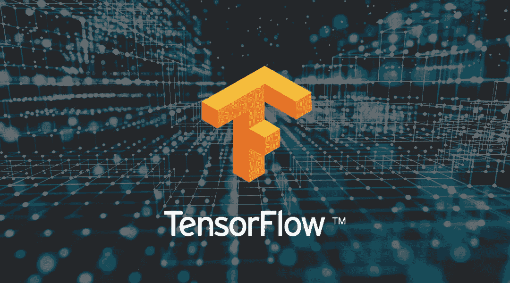
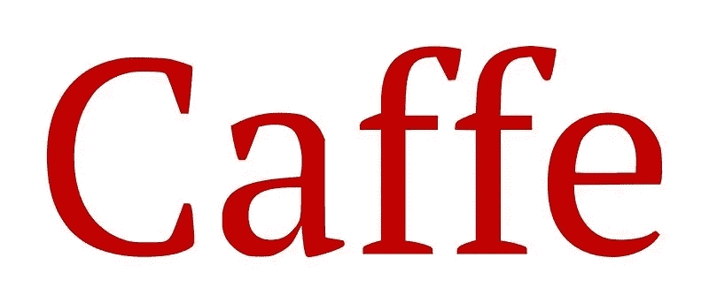
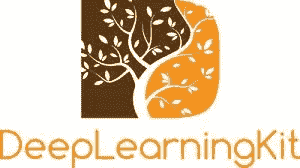
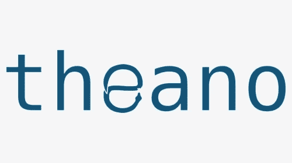

# 2022 年流行的 7 款深度学习工具

> 原文：<https://medium.com/geekculture/popular-7-deep-learning-tools-in-2022-651a874fe086?source=collection_archive---------8----------------------->

随着时间的推移，挖掘大量非结构化数据变得越来越麻烦。这种处理如此庞大数字的能力使深度学习变得极其强大，尤其是在处理非结构化数据时。大多数机器学习算法在处理拥有数百个特征或列的数据集时是兼容的。深度学习是机器学习和人工智能的子集。它包括统计学和预测建模。深度学习方法严重依赖复杂的程序来模仿人类的智能。

随着 AI 所需的 [**技能多样化，与行业相关的领域和工具也多样化。深度学习专注于重复的学习方法，这些方法涉及机器暴露于庞大的数据集。它的应用被应用于各种行业，如*自动驾驶*——研究正在进行中，利用深度学习来检测行人、标志和交通灯。这不仅有助于利用人工智能的力量，还能确保减少交通事故。反复接触数据集有助于机器理解差异、逻辑并得出可靠的数据结论。在处理复杂函数时，深度学习随着时间的推移变得更加可靠。由于这一特性，深度学习吸引了绝大多数年轻人工智能爱好者的大量关注。**](https://www.usaii.org/ai-insights/five-major-technical-skills-required-to-become-an-ai-engineer-in-2021)

考虑到深度学习在当今时代的巨大影响，这里有一些重要的深度学习工具可以在 2022 年寻找。

# **7 大深度学习工具:**

# **1。** **H2O.ai**

H2O.ai 是一个深度学习工具，它是用 Java 从头开始构建的，并与 Apache Hadoop 和 Spark 等其他开源产品无缝集成。作为一个开源工具，它支持大多数广泛使用的机器学习算法。它是快速、可扩展的 ML 应用程序接口，用于 DL、弹性网、逻辑回归和梯度增强。由于这个聪明的工具，所有的 [**人工智能顾问**](https://www.usaii.org/artificial-intelligence-certifications/certified-artificial-intelligence-consultant) 和人工智能专业人员都可以更容易地应用 ML 算法和预测分析来解决任何商业问题。

# **2。** **张量流**

TensorFlow 使初学者和专家更容易为移动、web、桌面和云创建 ML 模型。它提供了 Python、Java、Go 等语言的接口，由科技巨头谷歌开发。它被广泛用于创建具有多个层的大规模神经网络。如果你想解决一个 DL 或 ML 问题，如分类、感知、理解、发现、预测和创造，TensorFlow 是你合适的工具。

# **3。** **克拉斯**

Keras 是一个高级神经网络 API，可以在 TensorFlow 或 Theano 上运行。它是用 Python 编写的，支持更快的实验。它支持单独的递归网络和卷积网络以及两者的组合。它允许用户使用模块化、极简主义和易扩展性来更容易和更快地进行原型开发。

# **4。** **韩菲**

作为一个开源的深度学习工具，Caffe 拥有可表达的架构，允许应用和创新传播。它广泛应用于学术研究、创业原型以及语音、视觉和多媒体领域的大规模工业应用。

# **5。** **深度学习工具包**

DeepLearningKit 是一款开源的 DL 工具，适用于苹果的 iOS、OS X、tvOS 等系统。它支持所有配备 GPU 的苹果设备上的预训练模型。它也支持卷积神经网络，它的愿景是支持 DL 工具，如 Torch 和 TensorFlow。

# **6。** **火炬**

Torch 是一个高效的深度学习工具，使用 LuaJIT 脚本语言和 C/CUDA 实现。它展示了一些强大的功能，如索引，转置，切片的多个例程，通过 LuaJIT，神经网络与 C 惊人的接口，并提供快速有效的 GPU 支持和容易嵌入。

# **7。** **Theano**

Theano 是一个 Python 库，可以评估多维数组等数学运算，用于构建深度学习项目，因为它在 GPU 上比 CPU 上更快。对于涉及大量数据的问题，这种方法有助于获得与自制 C 实现相媲美的速度。

看深度学习及其多样化工具的大规模适用性，显然，来自 ***USAII*** 、 **MIT** 、**斯坦福**等知名机构的可信 [**AI 认证**](https://www.usaii.org/artificial-intelligence-certifications/) 是必备的。随着这个行业的飞速发展，这对于任何打算进入这个领域的人来说都是一个千载难逢的机会。

有了正确的人工智能认证，你一定会在天赋和资格的正确组合下，很快获得更高的职位。那么，为什么要等呢？从上面列出的人工智能认证中挑选，开始你的人工智能职业生涯。