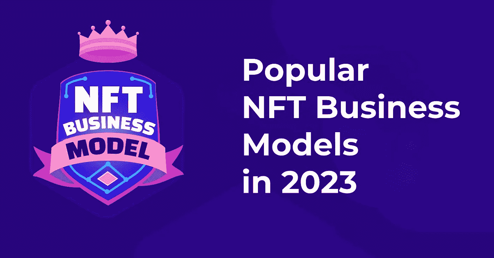

# 2023 年流行的 NFT 商业模式可能会变大！

> 原文：<https://medium.com/geekculture/popular-nft-business-models-in-2023-that-could-go-big-22db1b158f1f?source=collection_archive---------13----------------------->

Popular NFT Business Models in 2023 that could Go Big!

随着 NFT 空间在 2022 年因许多新颖的用例而熠熠生辉，人们对 2023 年的期望也很高。尽管加密市场呈螺旋式下降，但这一直是不可替代代币的突出之处。虽然 NFT 的受欢迎程度上升帮助推动了它们在这一年中的发展，但一些商业模式第一次成为关注的焦点，大多数都为更光明的 2023 年做好了准备。除此之外，企业家们还对那些带来前所未有的创新功能的模型产生了好感。我们将看到 2023 年 NFT 顶级商业模式对企业家有益。

# 1.NFT 市场

*   一个[**【NFT 市场】**](https://www.blockchainappfactory.com/nft-marketplace-development?utm_source=Medium+GC&utm_medium=26%2F11%2F22&utm_campaign=senpagapandian) ，这可能是最知名的 NFT 商业模式，允许用户在区块链上以不可替代的代币条目为支持，铸造和交换数字和实物商品。
*   这些网站能够轻松销售几乎任何领域的 NFT，包括像素化朋克、音乐唱片、视频剪辑、游戏内配件、体育纪念品、虚拟房地产，甚至稀有的实物物品。
*   由于虚拟世界的新手通常会通过市场来获得他们的第一个 NFT，NFT 市场的发展对于那些希望在 Web3 领域建立自己的名字的公司来说意义重大。

# 2.P2E 游戏

*   有充分的理由， [**P2E NFT 运动会**](https://www.blockchainappfactory.com/p2e-nft-game-development?utm_source=Medium+GC&utm_medium=26%2F11%2F22&utm_campaign=senpagapandian) 被认为是 NFT 最好的商业概念。由于其新颖的玩家激励系统和引人入胜的基于故事情节的游戏，P2E NFT 游戏对任何企业家来说都是一个很好的创业机会。
*   创建各种类型的游戏很简单，通过使用加密的原生令牌和游戏中的 NFT 物品，如头像、皮肤、武器、车辆、装备和虚拟土地，可以充分利用 NFT 的商业模式。
*   它有多种收入来源，包括游戏赚取(P2E)、移动赚取(M2E)和 NFT 租赁，可以顺利地包含在任何类型的游戏中。对于那些希望与一个紧密团结的社区保持联系的企业来说，这种模式可能是完美的。

# 3.NFT 聚合器

*   [**NFT 聚合器平台**](https://www.blockchainappfactory.com/nft-aggregator-marketplace-development?utm_source=Medium+GC&utm_medium=26%2F11%2F22&utm_campaign=senpagapandian) 开发是基于分散金融的聚合门户的最新进展。这种新一代的解决方案允许用户浏览市场上列出的 NFT 收藏品，查看它们的价格，并批量购买。
*   该平台提供了更多令人兴奋的多种前所未见的功能，使用户能够毫不费力地理解应用程序的功能和用途。
*   有抱负的 Web3 企业主可以利用该模型的新生特性来集成新功能，从而使他们的 NFT 聚合器应用程序在竞争中脱颖而出。
*   在某种程度上，它比 NFT 市场要好，因为没有处理个体创作者和其他品牌的压力。

# 4.NFT 房地产

*   NFT 有可能提高房地产的声誉，由于中介的盛行和新技术的延迟采用，房地产在物理世界中的声誉很糟糕。
*   [**NFT 房地产**](https://www.blockchainappfactory.com/nft-for-realestate?utm_source=Medium+GC&utm_medium=26%2F11%2F22&utm_campaign=senpagapandian) 为现实和虚拟世界已经发展成为一个顶级的风险投资选项，将在 2023 年作为 NFT 公司的模式运行。
*   通过将相关数据插入将在 NFT 交易期间执行的智能合约，以实现无中介交易，在这种情况下，为地块形成了非功能性交易。
*   由于元宇宙技术的发展，NFT 在虚拟房地产方面也可能呈现出稳固的金融机会。

# 5.NFT 发射台

*   一个 [**NFT 发射台**](https://www.blockchainappfactory.com/nft-launchpad-development-service?utm_source=Medium+GC&utm_medium=26%2F11%2F22&utm_campaign=senpagapandian) 是一个平台，让有抱负的企业家和小企业主能够通过 NFT 首次公开募股(INOs)为他们即将到来的项目筹集资金。
*   除了 NFT 产品之外，这些平台的运行与初始 DEX 产品(IDO)启动平台非常相似。
*   鉴于越来越多崭露头角、鲜为人知的公司和创作者努力取得成功，随着用户涌入的增加，这样的平台从长远来看对企业来说是有利可图的。
*   这些人可以通过被介绍给一个热切的投资者社区，从这种 NFT 商业模式中受益，这个社区寻找经过审查并建立在良好意愿基础上的倡议。

# 最后的想法

因此，我们已经看到了 2023 年可以为企业带来大笔收入的顶级 NFT 商业模式。当我们询问专家们的意见时，大多数人赞成 NFT 市场发展**和 NFT 聚合器平台发展**，因为它们或多或少是相互关联的。但是，如果你也在寻找一个模式来开始你在 Web3 领域的工作，这完全取决于你的偏好。不过，你永远也不需要担心专业人员的帮助，因为有许多 NFT 应用程序开发公司擅长为 Web3 业务创建这些解决方案。****