# 便携式浓缩咖啡:指南

> 原文：<https://medium.com/geekculture/portable-espresso-a-guide-5fb32185621?source=collection_archive---------1----------------------->

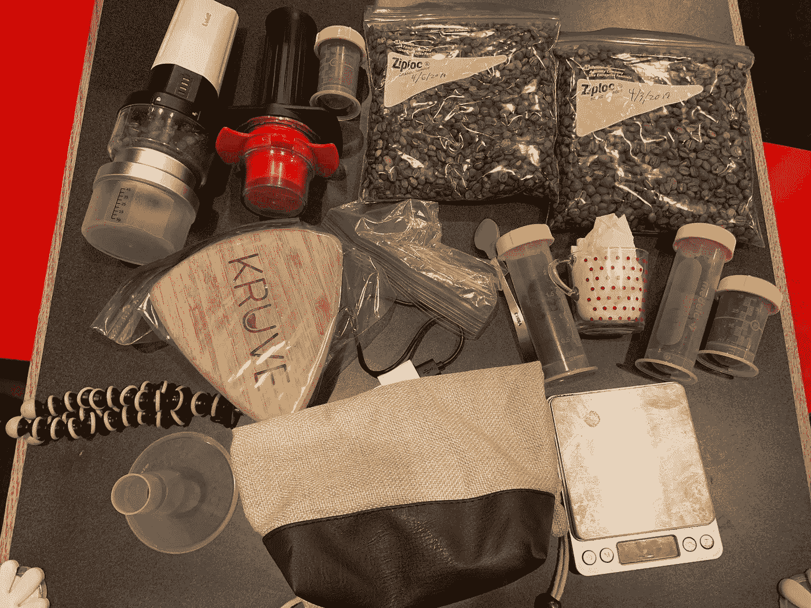

For my most recent trip of 2 weeks. It’s a little much, I know.

随着我的浓缩咖啡技术和烘焙水平的提高，我对劣质浓缩咖啡的容忍度下降了。结果是，不管在什么地方，我都努力按照我想要的方式喝咖啡。我介绍这个故事和由此产生的指南(如果你不关心历史或方法不够好，跳到最后)。

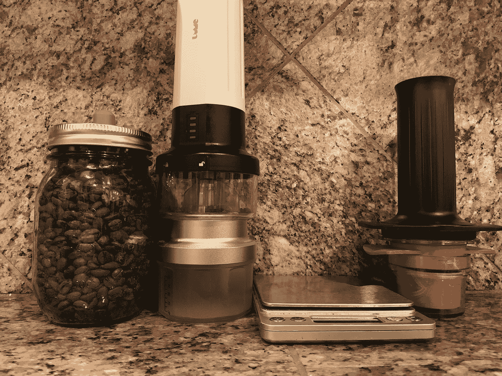

当我搬到加州时，我的浓缩咖啡质量正在上升。每次回到匹兹堡、迪斯尼乐园或意大利，我都能看到这种变化。在匹兹堡，我从[买豆子](https://laprima.com/pages/about)开始，但是我没有带研磨机。我会在我的姻亲家喝浓缩咖啡，但那不是很愉快。

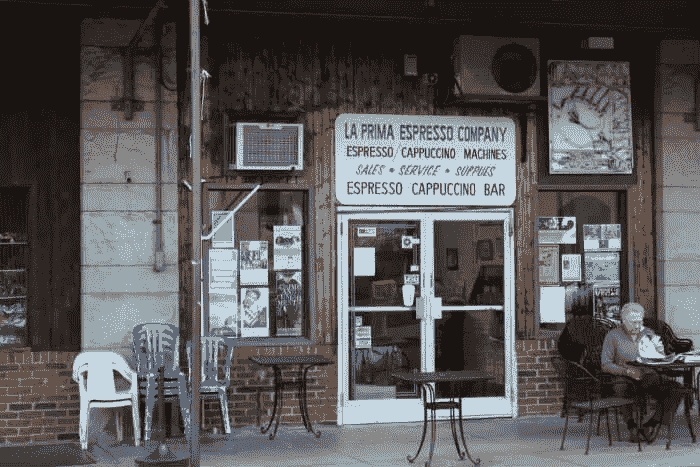

在我搬到加州之前，我买了一台 [Hario grinder](https://www.amazon.com/Hario-Ceramic-Coffee-Mill-Mini-Slim/dp/B001804CLY/ref=asc_df_B001804CLY/?tag=hyprod-20&linkCode=df0&hvadid=198088480690&hvpos=1o2&hvnetw=g&hvrand=10054867782102939245&hvpone=&hvptwo=&hvqmt=&hvdev=m&hvdvcmdl=&hvlocint=&hvlocphy=9032131&hvtargid=pla-352141159381&psc=1) ，我决定带着它。我从家里借了一辆[陆丹蓝](https://www.bialetti.com/coffee/stovetop/moka-express-c-1_7_22.html)，有一段时间我感觉不错。陆丹蓝的唯一问题是，我很难获得良好的一致性。直到我开始用秤称东西，我的陆丹蓝摄影才变得更好。我还买了单镜头陆丹蓝，这样我就不用每次都拍那么多了。我开始在每次去的时候自己供应咖啡，这样我就不用去寻找好的咖啡豆了。

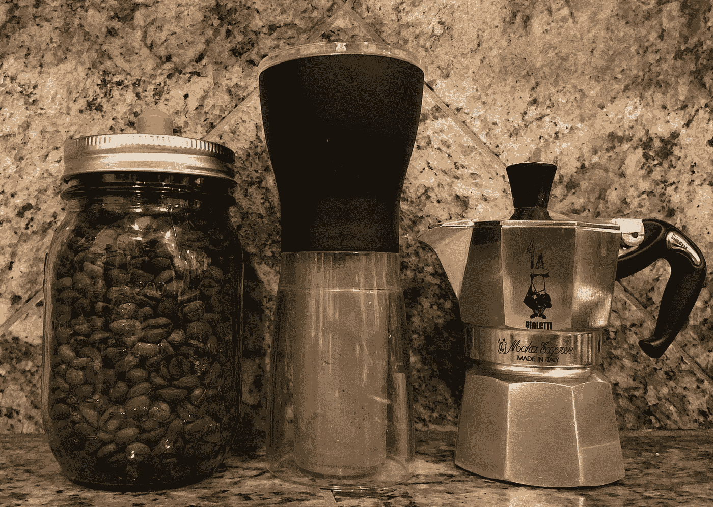

在意大利的时候，我什么都喝。我不知道那里的咖啡师做什么，但即使是苦的浓缩咖啡味道也很好。我只在意大利萨勒诺的一个火车站拍过一次可怕的照片。在咖啡馆和家庭陆丹蓝咖啡之间，我做得还不错。

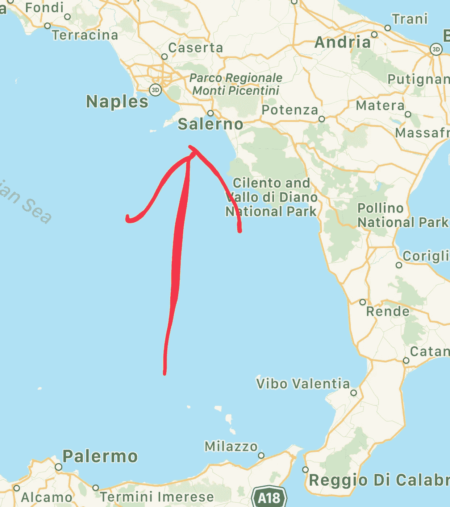

现在迪斯尼乐园是一个不同的问题。在他们换成星巴克之前，我可以得到一些可以倒在冰块上的可以接受的东西。然后星巴克接手了，我只能用大量的牛奶和糖来忍受。尝试不吃糖的时候不太好。我的解决办法是带一瓶[宇宙冷煮咖啡](http://cosmiccoffeeclub.com)(我发现的最好的)。

我不知道，我的旅行生活即将改变。2017 年圣诞节，姐夫送了我一台 [Wacaco 迷你浓缩咖啡](https://www.wacaco.com/?gclid=EAIaIQobChMI552xp8_k4AIV0yCtBh13mA7sEAAYASAAEgLIKvD_BwE)机。这不是我想自己买的东西，但我很感兴趣，并承诺给它一个很好的尝试。我不得不摆弄研磨和重量的咖啡渣。很难确定研磨和剂量。

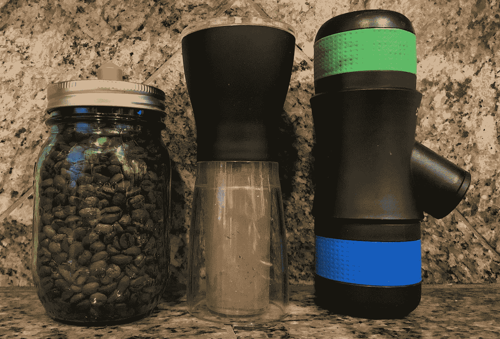

一天之内，我不得不打开它。我想我可以让它变得更好。Wacaco 使用的是[加压移动式过滤器](https://www.seattlecoffeegear.com/blog/2008/12/30/ask-the-experts-whats-the-difference-between-pressurized-and-non-pressurized-filter-baskets/)，我不喜欢这些过滤器，因为它限制了你可以使用多细的粉末。所以我去掉了弹簧和弹珠，这样的改变稍微改善了镜头，但还是有点弱。我不得不小心吹掉 O 型圈，这种情况我做过几次。它有一个最大压力极限。

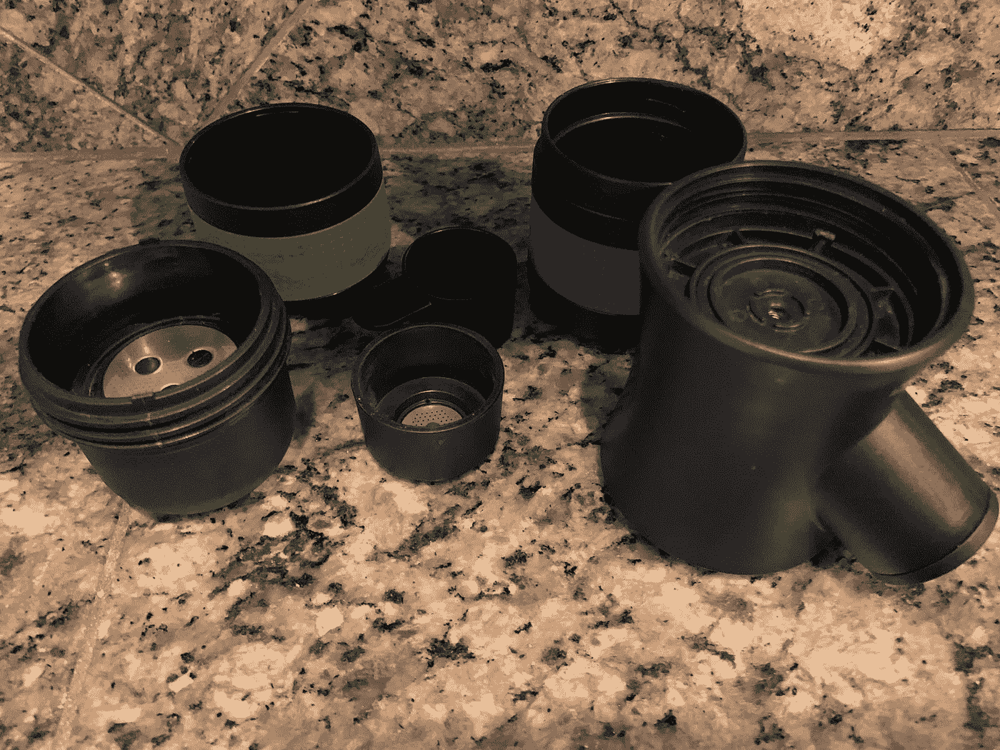

在家里，这个机器有时还不错，但我下定决心:我想要一个可以随身携带的浓缩咖啡包。所以我把它带上了飞机，马上就遇到了问题。我试了几次只是为了确定那不是我。它需要预热，这会延长冲泡的时间。[预热，我发现这是关键](https://link.medium.com/ihaf69M1JU)，水沸腾的前几秒很重要，所以做一个预热循环很有帮助，但永远不够，除非坐在水壶旁边。在飞机上，这是不可能的。清理也涉及太多的碎片。如果我不清洗就把它放好，它会漏的。清洁意味着要管理 4 个部分。

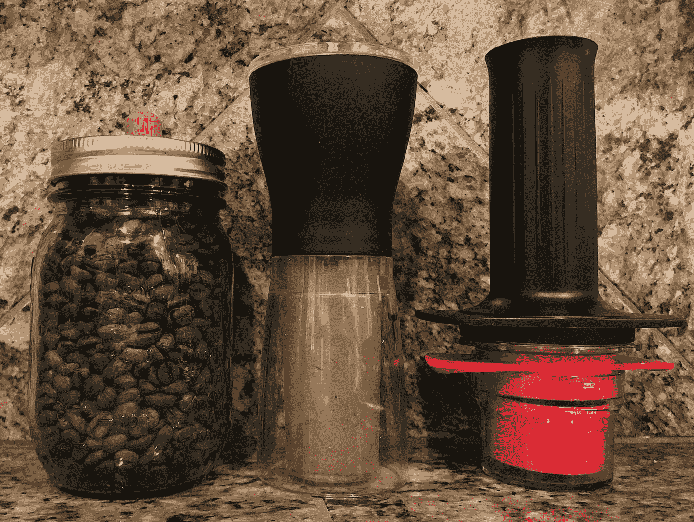

到了夏天，我觉得必须采取行动，买一台更好的机器。进入 Cafflano 的 [Kompresso。Cafflano 是一家韩国公司，每年都会推出一款新的便携式咖啡设备。这些设计很简单，也很有意义。瓦卡科似乎是通过试图将一台浓缩咖啡机小型化而设计的。Kompresso 似乎是按照浓缩咖啡机的原理设计的便携式机器。](http://www.cafflano.com/product_kompresso.php?TM=2)

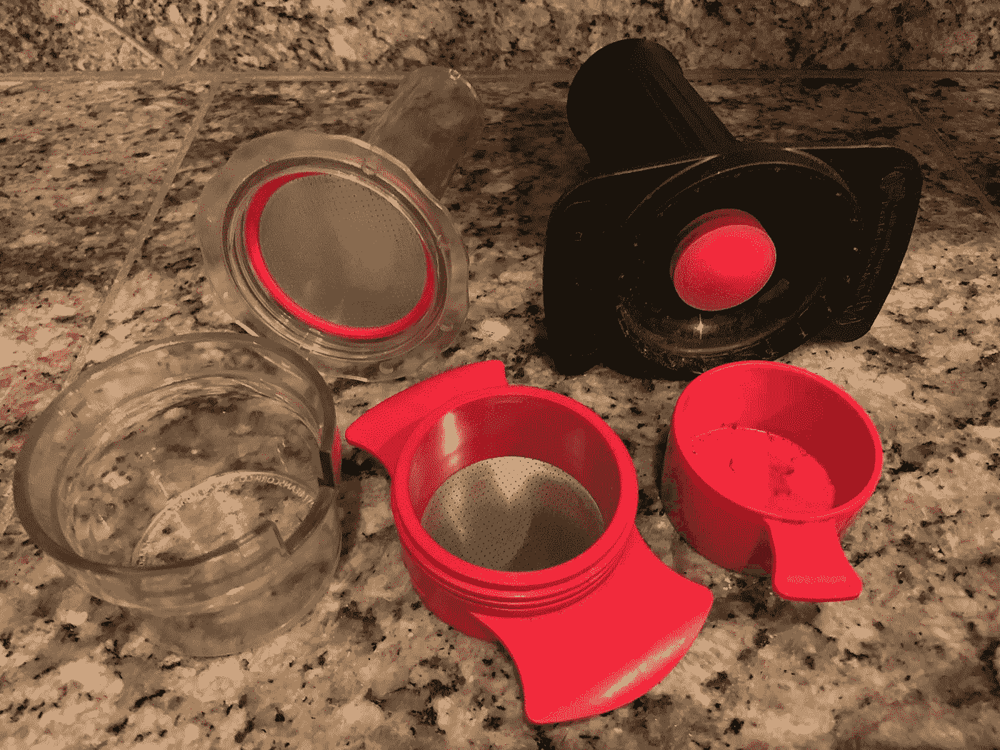

作为一个细圆柱体，它利用帕斯卡原理为好的浓缩咖啡提供足够的压力。重量也很轻，更容易清洗。Kompresso 也可以用来制作冷煮浓缩咖啡，这在紧要关头很有帮助。

这台新设备买后不久就派上了用场。我们去了迪斯尼乐园，在我们离开之前，我磨碎了一些豆子。它提供了一个简单的机器来喝我的浓缩咖啡，在公园里我想去哪就去哪。我所要做的就是要半杯开水；一个看似尴尬的请求。这让我在迪士尼的经历发生了很大的变化。

下一个重大考验是圣诞节时在匹兹堡的两周。我决定去了解我在那里的 la Pavoni，我认为这是一个尝试改进我的 Kompresso 拍摄的好时机。我发现这两台机器的主要缺陷并不是它们的错。研磨不够精细或一致。虽然我欣赏 Hario 研磨机的尺寸和重量，但它并没有达到预期效果。

在一次偶然寻找新的便携式研磨机时，我找到了 Lume。我希望有一天，自动研磨机会变得便携，所以我很惊讶 Lume 是便携的，自动的，并生产出与我的[韩国研磨机](https://www.rok.coffee)相似的研磨。我得到它作为一件礼物，但是直到我度假回来之后我才收到它。我摆弄了 Lume 几天，它变成了[我的家用研磨机](https://link.medium.com/rzGxlDtquT)。

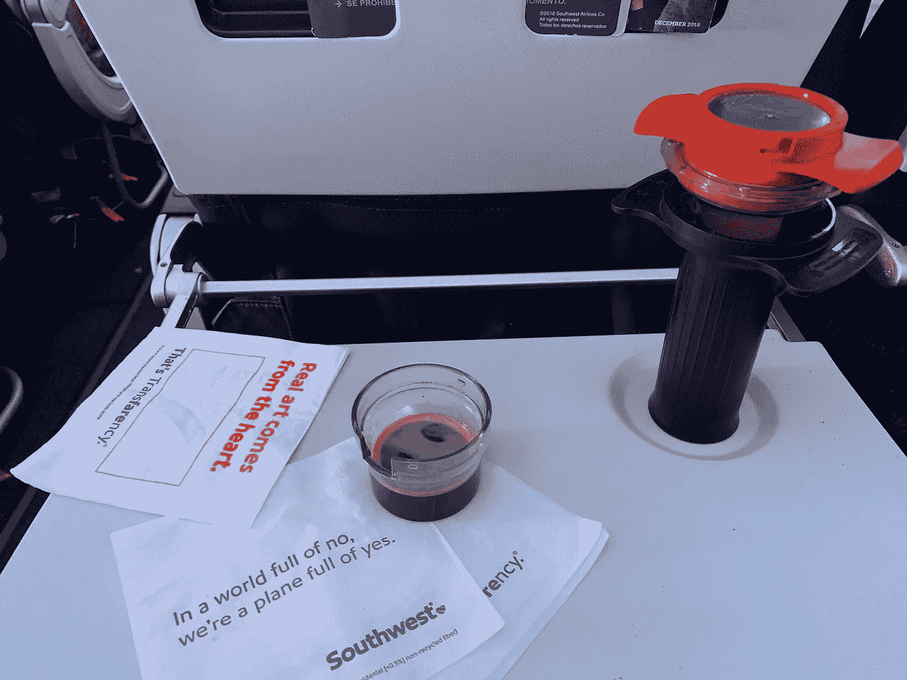

下一个旅行测试很快就出现了:另一次去迪斯尼乐园的旅行。Lume 带了一个漂亮的袋子，可以放入研磨机和 Kompresso。果不其然，这种设置非常适合在路上、酒店房间或迪士尼乐园享用浓缩咖啡。

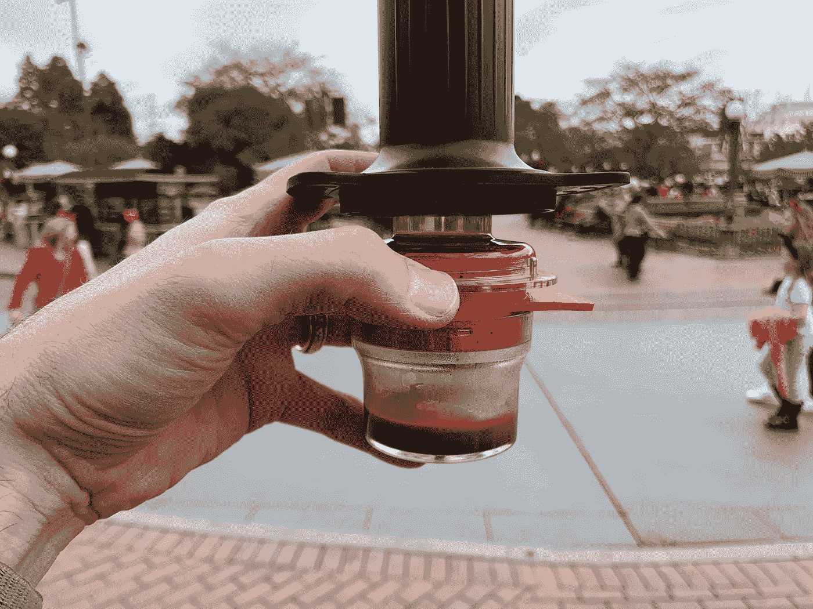

最后一件事:我带了一根[牙签，因为它是最好的分发工具](https://youtu.be/Lqba-JE9ftw)，而且非常便携。用牙签分发会有很大的不同。

**我的旅行浓缩咖啡工具汇总图:**

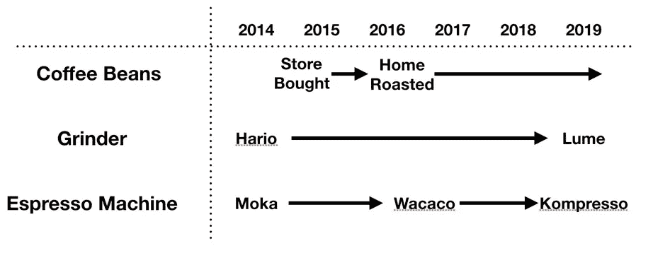

# 推荐设置:

*   Cafflano Kompresso 浓缩咖啡机
*   Lume 研磨机
*   便携式秤
*   分发用牙签

如果你愿意，可以在推特[和 YouTube](https://mobile.twitter.com/espressofun)上关注我，我会在那里发布不同机器上的浓缩咖啡照片和浓缩咖啡相关的视频。你也可以在 LinkedIn 上找到我

**我的进一步阅读:**

[我的咖啡设置](https://link.medium.com/NMfeoLVpuT)

工匠咖啡价格过高

[被盗咖啡机的故事](https://link.medium.com/pxCY5yrquT)

[买得起的咖啡研磨机:比较](https://link.medium.com/rzGxlDtquT)

[浓缩咖啡:群头温度分析](https://link.medium.com/FMxfCmcOCT)

[浓缩咖啡过滤器分析](https://link.medium.com/2T2tjpUsgU)