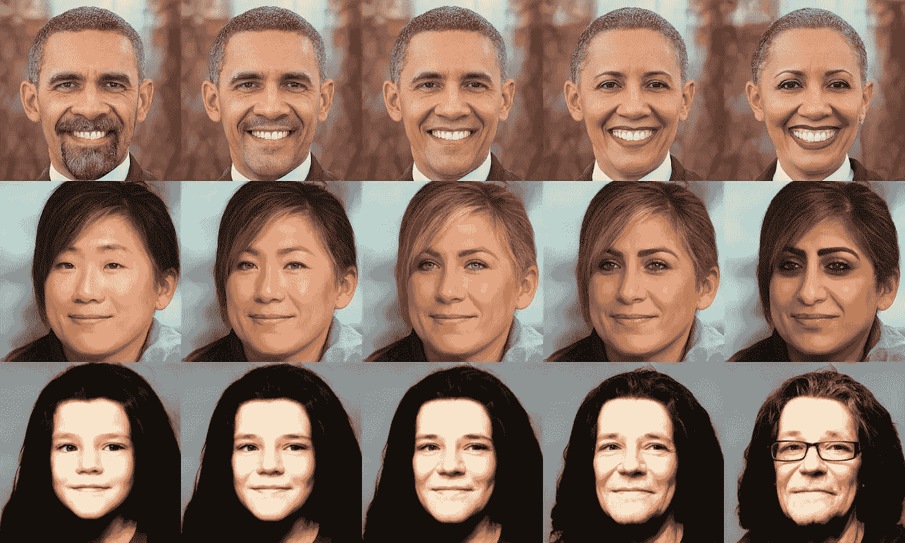

# 多元宇宙的肖像

> 原文：<https://medium.com/geekculture/portraits-from-the-multiverse-9cd5a25cbda0?source=collection_archive---------6----------------------->

## 使用机器学习来改变人们面部的性别、种族和年龄

**Portraits from The Multiverse,** Image by Author, Source Images: Pete Souza ([Barack Obama](https://commons.wikimedia.org/wiki/File:President_Barack_Obama.jpg)), Angela George ([Jennifer Aniston](https://commons.wikimedia.org/wiki/File:JenniferAnistonFeb09.jpg)), and Grossman Glotzer ([Janis Joplin](https://commons.wikimedia.org/wiki/File:Janis_Joplin_1970.JPG))

你见过让你挑战自己核心信念的图片吗？这是我第一次看到这样的“南向”世界地图。