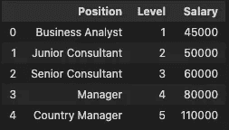
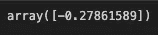
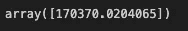
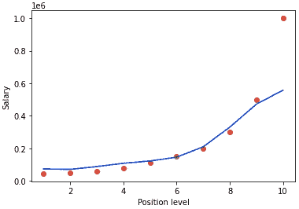

# 职位工资-支持向量回归(SVR)

> 原文：<https://medium.com/geekculture/position-salary-support-vector-regression-svr-db9f1deba4b0?source=collection_archive---------8----------------------->

## 使用支持向量回归(SVR)模型，我们将制作一个模型，该模型将预测特定职位人员的工资(带源代码)

和上一篇文章一样，我已经给你介绍了**支持向量回归**现在我将告诉你如何用几行**代码在本文中制作一个基本的**支持向量回归模型**。**

如果你想知道关于点击这个链接-

 [## 什么是支持向量回归机？

### 机器学习算法导论

iaviral.medium.com](https://iaviral.medium.com/what-is-support-vector-regression-svr-d88de1e72855) 

**那么让我们开始**

**第一步**是我们需要**下载**数据集**然后将数据集应用于模型。您可以从 [**网址**](https://github.com/aviralb13/codes/blob/main/datas/Position_Salaries.csv) 中**下载**或**复制**数据-**

 [## codes/Position _ salary . CSV at main aviral B13/codes

### 此文件包含双向 Unicode 文本，其解释或编译可能与下面显示的不同…

github.com](https://github.com/aviralb13/codes/blob/main/datas/Position_Salaries.csv) 

# 导入库

现在我们将导入如下所示的 **pandas、** **NumPy 和 matplotlib** 如果您的系统没有安装这些库，您可以通过 **pip 命令**下载它们。

# 数据准备

现在我们将通过**熊猫**从**读取**数据，并将其存储在一个名为**数据**的**变量**中，这样我们就不需要反复调用它了，通过 **head** 命令我们可以看到**数据**的前 5 个元素****如果您希望看到更多，可以在括号内输入数字。

现在我们将使**2**变量 x 和 **y** 在 **x** 列中我们将存储**级别**并且在变量 **y** 中我们将通过使用 **iloc** 来存储**薪水**(这里在 iloc 中我们已经完成了简单的切片，即我们在列表和字符串中完成)然后整形

# **特征缩放**

**现在我们将**特征** **缩放**我们的数据，因为**级别**的值**太** **低**即 1，2，3……相比于**薪水**即 45k，50k……因此为了**标准化**范围，我们需要在模型中引入**特征** **缩放**。现在如果你不了解**特性** **缩放**不要担心！很快我也会写一篇关于**特性**和**缩放的文章。****

# **制作模型**

**现在，我将从 **sklearn.svm** 导入 **SVR** 来制作模型。导入模型后，我将创建一个名为**回归变量**的变量，并赋予**内核**，一个内核用于查找线性和非线性关系。这里，我将使用 **RBF** 内核并在回归中调用模型，然后，我将拟合 **SVR** 模型中的值**

# **预测**

**现在我们将通过**模型**预测**职位**的**工资**6.5 的**预测**在这种情况下从模型预测的值是不同的**

****

**正如你所看到的，我得到了一个**特征** **缩放后的** **值**，所以为了**反转**这个值，我使用逆变换来得到**原始** **值****

****

# **测绘**

**现在我们将了解当**在 **SVR** 中绘制**时，这些**模型**是什么样子**

****

# **源代码**

**你可以去查看完整代码的链接**

** [## 代码/工资(svr)。ipynb at main aviralb13/codes

### 在 GitHub 上创建一个帐户，为 aviralb13/codes 的开发做出贡献。

github.com](https://github.com/aviralb13/codes/blob/main/machine%20learning%20models/salary%28svr%29.ipynb) 

# 结论

在文章中，我已经给了你关于如何用**源代码**制作一个简单的**支持向量** **回归模型**的信息和代码，我会为你制作更多令人兴奋的项目，所以保持联系**