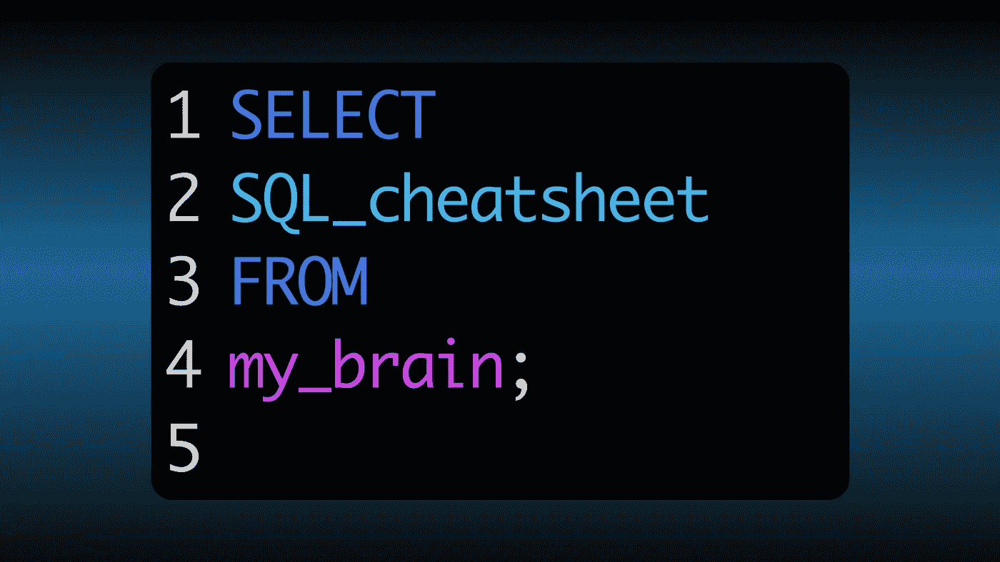

# 常见 SQL 查询的 Postgres 备忘单

> 原文：<https://medium.com/geekculture/postgres-cheatsheet-of-common-sql-queries-6cd4e43ced9c?source=collection_archive---------4----------------------->

## 终端命令和码头奖金

Postgres 是我选择的 SQL 风格，但我厌倦了谷歌搜索语法，所以这里是我经常使用的所有命令。我不打算解释什么，所以这将是简短和甜蜜的，但我已经正确地命名了一切，所以查找东西应该很容易。 ***用 docker 设置在最后。***