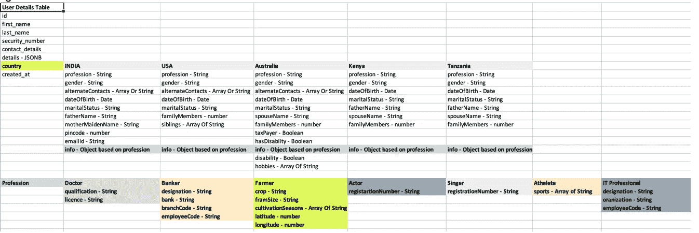
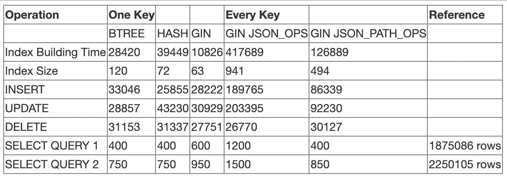

# Postgres JSONB 使用和性能分析

> 原文：<https://medium.com/geekculture/postgres-jsonb-usage-and-performance-analysis-cdbd1242a018?source=collection_archive---------0----------------------->

这个故事主要讲述 JSONB 提供的各种特性，用一个示例进行了阐述，并用可以存储和查询非结构化数据的场景进行了解释。还讨论了来自应用层的数据验证。


# JSONB 是什么？

PostgreSQL 文档定义的数据类型 JSON 和 JSONB 几乎相同；关键区别在于，JSON 数据存储为 JSON 输入文本的精确副本，而 JSONB 以分解的二进制形式存储数据；也就是说，不是作为 ASCII/UTF-8 字符串，而是作为二进制代码。

***而且这有一些立竿见影的好处:***

*   效率更高。
*   处理速度明显加快。
*   支持索引(这是一个显著的优势，我们将在后面看到)。更简单的模式设计(用 JSONB 列替换实体-属性-值(EAV)表，JSONB 列可以被查询、索引和连接，允许性能提高 1000 倍！)

***几无缺点:***

*   输入稍慢(由于转换开销增加)。
*   由于表的占用空间更大，它可能比普通的 JSON 占用更多的磁盘空间，尽管并不总是这样。

> **根据 Postgres 官方文档，Postgres JsonB 可支持的最大大小为每个文档 255 MB。请看源代码** [**这里**](https://github.com/postgres/postgres/blob/REL_12_STABLE/src/backend/utils/adt/jsonb.c) **。**

# 选择查询的数据保存和分析

请在 java 前端找到完整的源代码，它也有一个审计框架[在这里](https://github.com/ereshzealous/spring-data-jpa-audit)。

我创建了一个示例应用程序，它在普通 RDBMS 列中存储用户的基本数据，如姓名、联系号码、安全号码和国家。还收集了一些适用于一个国家和他们所属职业的额外细节。以下是不同国家和职业的数据保存方式。为了检查可行性，我包含了普通字符串、布尔值、数字、字符串数组和一个复杂对象。因此，这将危及所有用例，选择查询可以针对它们运行，以查看它是如何工作的。



我已经将分布在不同国家和不同职业的大约 400 万份数据加载到表格中。

***使用 JsonB 数据进行搜索的类型*** :

可以对 JSONB 数据进行多种类型的查询，如属性、包含、存在，以及提取路径或提取值的特定 JSONB 函数…

让我们看看如何在 JSONB 上查询不同数据类型的数据。

***查询 1 : (On String)数据精确匹配让我们跨 UserDetails 数据集查询 profession = Farmer。***

***查询 2:(字符串上)数据通配符匹配***

像“%Farm%”这样的职业

***查询 3:【上号】的家庭成员有哪些***

***查询 4:(按号码)查找范围*** 内的家庭成员

***查询 5 : (on Boolean)查找是否有用户有残疾***

***查询 6:(对字符串/对象数组)查找精确匹配:***

字符串数组形式的备用联系号码，与精确数据匹配。

对于上面的查询，没有结果。但是我们有数据表。原因是我们不能像那样查询数组类型的精确匹配。

其他方式:

1.  使用 JSONB 函数包含，但它会返回 true 或 false 而不是结果集。可以对其进行调整以返回结果集。
2.  调整上面的查询，使用 like 操作符而不是“=”，即使它是完全匹配的。

返回结果所需的时间更长，因为它不是三元模型索引，而是精确匹配。三元模型索引在这里没有用。

3.使用属性方式作为搜索标准。

***查询 7:(字符串数组)→通配符匹配***

这里我们不能用属性的方式进行包含。我们既可以使用 JSONB contains 函数，也可以使用常规方法使用三元组索引搜索通配符。还没有使用索引。

您可以看到 like 操作符在与通配符搜索进行精确匹配时的性能表现。

***查询 8:日期/时间戳查询→精确匹配***

因为我们有一个出生日期的属性，我们将搜索这个。

***查询 9:按日期/时间戳查询→按范围***

***查询 10:在对象上→让我们查询“info”对象，它是内部的子节点，让我们找出谁将 crop 作为“玉米”。***

**查询 11:对象上→作物为“玉米”,农场规模在 2-3 之间。**

请注意执行时间，是 44.733 毫秒，这是相当少的。但是如果我们使用属性的方式，我们可以进一步减少时间。

# JSONB 性能:

在本节上面的所有查询中，没有使用任何索引，在 ***4M*** 数据上性能相对较好。如果我们想提高大型数据集的性能呢？

1.  为了改进大型数据集上的查询，我们必须在每次搜索中定义适当的搜索标准参数，我们必须在查询中包括许多所需的属性。(这同样适用于 JSONB 或普通查询集)。
2.  通过使用索引，我们可以提高性能。
3.  有隔板的。

让我们在这里讨论索引，因为我们经常使用分页来获取结果，我们最终在偏移量和总计数(本质上是顺序的)内获取实际数据。在大型数据集上，这可能是一个瓶颈)。

# JSONB 和索引

当我们使用 JSONB 的-> >操作符时，PostgreSQL 可以使用 B 树或散列索引来处理操作。-> >运算符以文本格式返回指定属性的值。PostgreSQL 可以将文本结果的索引用作比较操作数。GIN 索引可以由 GIN JSONB 操作符类使用。

***GIN JSONB 运算符类***
默认运算符类 jsonb_ops 支持存在运算符(？, ?&，？|)和包容运算符(@ >)。而 jsonb_path_ops 只支持包含运算符。因此，GIN 索引只可能搜索具有特定键或键值的。[PostgreSQL Doc : [jsonb 运算符](https://www.postgresql.org/docs/9.4/static/functions-json.html#FUNCTIONS-JSONB-OP-TABLE)

我用几种方法对 4M 数据进行了测试，得出了一个结论。

**BTREE:**

```
CREATE INDEX idx_btree_profession ON user_details USING BTREE ((details->>'profession'));CREATE INDEX idx_btree_profession_hash ON user_details USING HASH((details->>'profession'));--------------------------------------------------------------------SELECT count(*) FROM user_details WHERE details->>'profession' = 'Farmer';
SELECT count(*) FROM user_details WHERE details->>'profession' = 'Farmer' 
OR details->>'profession' = 'Doctor';
```

**杜松子酒:**

```
CREATE INDEX idx_gin_profession ON user_details USING GIN ((details->‘profession’));--------------------------------------------------------------------SELECT count(*) FROM user_details WHERE details->>'profession' = 'Farmer';
SELECT count(*) FROM user_details WHERE details->>'profession' = 'Farmer' 
OR details->>'profession' = 'Doctor';
```

**用 JSONB_OPS 开始**

```
CREATE INDEX idx_btree_profession ON user_details USING GIN (details jsonb_ops);CREATE INDEX idx_btree_profession ON user_details USING GIN (details jsonb_path_ops);--------------------------------------------------------------------SELECT count(*) FROM user_details WHERE details @> '{"profession" : "Farmer"}';
SELECT count(*) FROM user_details WHERE details @> '{"profession" : "Farmer"}'  
OR details @> '{"profession" : "Doctor"}';
```



根据上面的结果，BTREE 在搜索单个属性时表现最好，Gin index 在构建时间和索引大小方面表现突出。Jsonb_path_ops 在搜索每个属性时都比 jsonb_ops 表现得更好。虽然 jsonb_path_ops 是所有属性的索引，但与单键索引相比，它的性能很好，而且 jsonb_path_ops 的索引大小和构建时间不够好，因为它有 40 多个属性。

# 结论

BTREE 索引在针对单个属性的索引搜索中表现最佳。散列索引也执行得很好，但是不提供 WAL(预写日志)对于异常终止是至关重要的。GIN 索引在用单个索引索引所有属性方面有优势，但是它在索引单个键方面的性能比 BTREE 和 HASH 索引差。

因此，在为 JSONB 类型选择索引时，如果索引搜索几个预先确定的属性，BTREE 是最佳选择，然而，如果索引搜索任意属性，则首选 GIN 索引。在使用 GIN 索引的情况下，使用 jsonb_path_ops 作为一个类检查它是否简单地有一个键值，但是为了检查不仅有一个键值还存在键，最好使用 jsonb_ops。

# 非结构化数据的应用程序端验证

当我们处理非结构化数据时，我们必须从应用程序端或数据库端处理它，以便将适当的数据插入到表中，从而使数据保持一致。

**验证 JSON 结构:**

众所周知，有一种方法可以使用 JSON Schema 来验证 JSON 文本。[https://json-schema.org/](https://json-schema.org/)。在模式的帮助下，我们可以验证数据。

1.  **数据库端**:不建议在数据库端进行模式验证，因为如果对现有结构进行添加的话，这不是问题，但是如果删除的话，就会迫使我们进行迁移，然后添加数据。添加越来越多的验证会变得很麻烦。即使没有 SQL 数据库，我们也没有数据库端的模式验证。
2.  **应用端:**是一种应用在插入 DB 时照顾的应用逻辑。我们必须确保当从后端直接写入数据库时，我们必须小心处理。

**如何在 Java/Spring 中验证 JSON 模式:**

很少有可用的图书馆能为我们做这些。它们可以与 spring 集成，或者我们也可以在数据实际存在时执行按需验证。

请参见下面我为 Professions 属性实现的模式。可以编写越来越复杂的模式来验证 JSON 字符串。

> 除此之外，我们还可以在应用程序逻辑中注入一个逻辑框架(更具体到数据)