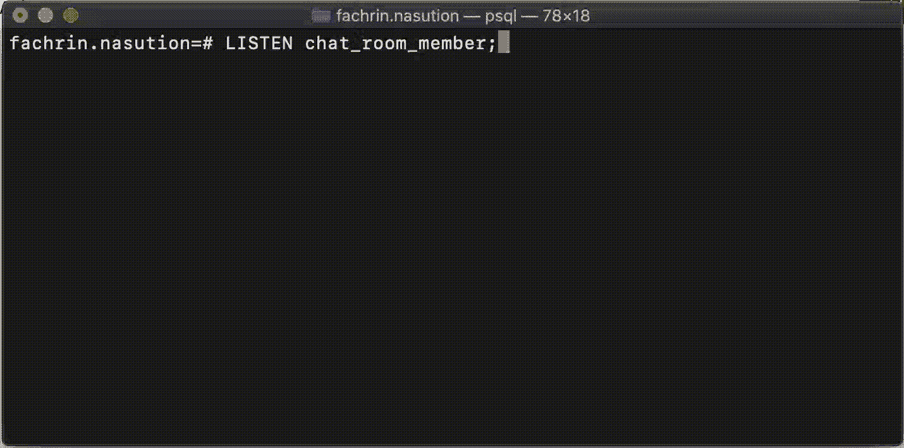
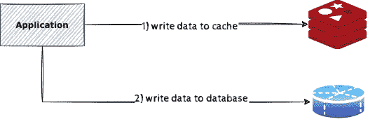
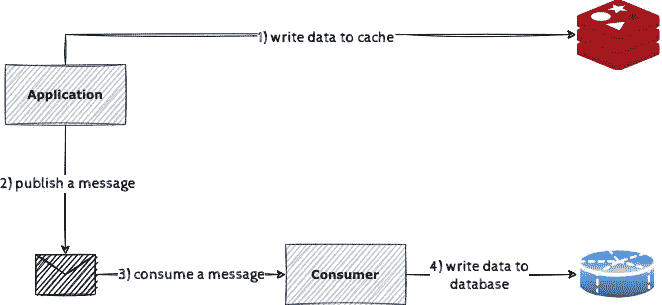
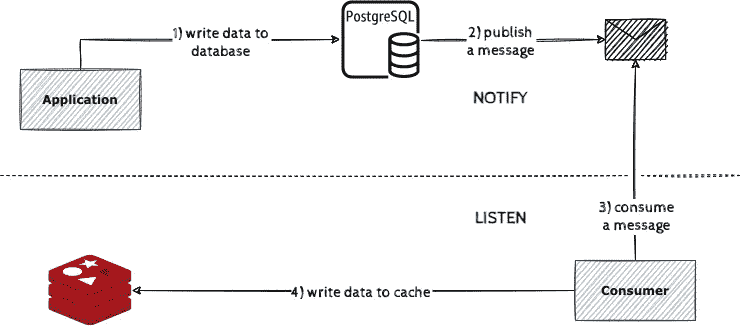
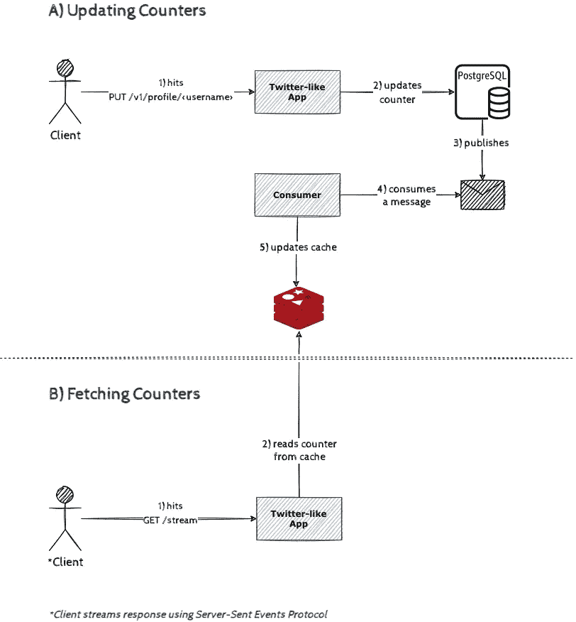
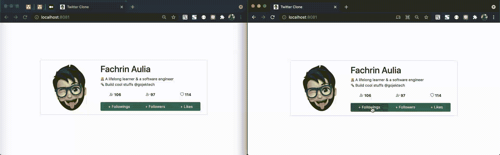
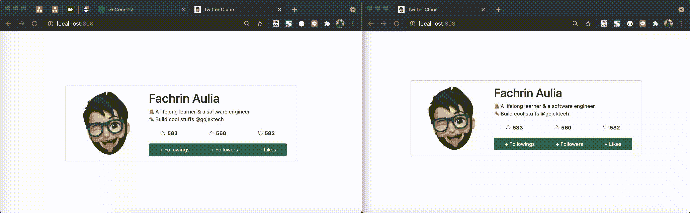

# PostgreSQL 作为应用反应式缓存策略的消息代理

> 原文：<https://medium.com/geekculture/postgresql-as-a-message-broker-to-apply-a-reactive-caching-strategy-57e7f8f7dd0e?source=collection_archive---------5----------------------->

# 介绍

我们一直在使用 PostgreSQL 或其他数据库引擎作为构建模块来开发解决我们日常摩擦问题的软件。它可以是一个简单的待办事项清单应用程序，也可以是一个使用这些数据库引擎来记忆和存储东西的支出追踪应用程序。

我想分享一下我们使用 PostgreSQL 的其他用例，这些用例不仅可以完成我们所做的基本工作，还可以完成一些我们中的一些人可能永远也不会在本文中探索的事情。

# 作为消息代理的 PostgreSQL

Message broker 是一个软件，它使我们能够在两方或多方之间进行异步通信。这里的各方可以是一些基于微服务的应用程序，这些应用程序侦听一些主题以共享和获取他们需要的一些信息，并在他们的业务逻辑下处理这些信息。

我们可以在那里找到许多可以充当消息代理的技术，例如

*   Redis 发布/订阅
*   RabbitMQ，以及
*   阿帕奇卡夫卡

我想列表上的这三种技术是每个人想到消息代理软件时脑海中最常见的技术。反过来说，没有人会认为 PostgreSQL 会首先满足需求。

## 听并通知

PostgreSQL 拥有一个 API，它通过 **LISTEN** 和 **NOTIFY** 命令类似于消息代理的发布-订阅模式。

我们可以使用 **NOTIFY** 命令发布一个通知，告诉订阅者某个通道中发生了一个事件。同时，对于 **LISTEN** 命令，我们可以使用它来订阅通道的事件，并使用其中的信息来做一些事情。

这就像消息代理软件中常见的任何其他发布-订阅模式一样。为了更清楚地了解它，我们可以在下图中看到它的样子。



使用这些命令非常简单，对吗？👀

```
# to subscribe to a channel (topic)**LISTEN** *channel*;# to publish an event to a channel (topic), payload is optional**NOTIFY** *channel****,*** *payload****;***
```

你可以在这里了解更多:[监听](https://www.postgresql.org/docs/current/sql-listen.html)和[通知](https://www.postgresql.org/docs/current/sql-notify.html)。

# 使用 PostgreSQL 的反应式缓存策略

这是有趣的部分，我们现在知道 PostgreSQL 可以像任何其他消息代理软件一样做事情。问题是:是什么使它与缓存策略有关系？

因此，在进入主要话题之前，最好有一些概念和一致的定义，用*概括地说*它实际上是什么意思。

## **缓存策略**

缓存策略是一种维护主要数据源和缓存系统之间的数据集成的技术，以及我们稍后可以与数据交互的方式。

有几种常见的缓存策略变体，但这里我们只讨论一些写策略变体。我们去找他们。

## 直写变体

直写变体允许我们以一种一次性的方式在缓存系统和数据源之间同步数据。



1.  应用程序将数据写入缓存，然后
2.  在将数据写入缓存后，应用程序将数据写入数据库

这是一个非常简单的方法，但是缺点是非常明显的。这个操作代价很高，因为我们必须维护对缓存和数据库的两次网络调用。

对数据库的写入可能会很慢，并被视为繁重的操作，因此会进一步增加网络延迟。

## 写在变体后面

后写变体实际上类似于通过写的*变体。它们之间唯一的区别是，这种变体需要消息代理或中间件来异步同步缓存和数据库之间的数据。*



1.  应用程序将数据写入缓存
2.  应用程序发布一条消息，通知数据已经更改
3.  消费者应用程序消费消息，然后
4.  它将数据写回数据库

这种变体需要更多的步骤来完成，但我们可以从中受益，我们可以通过消息代理或中间的中间件来同步数据，从而减少网络延迟。

将消息写入消息代理比将数据直接寻址到数据库会产生更少的延迟。

## 👻反应式缓存变体👻

这个变种其实是我自己的叫法。名字中的反应词反映了缓存更新的方式。这个想法是，只有当数据库中的相应数据发生变化时，才会更新缓存。



这是这个变体的情况:

1.  **应用程序只向数据库写入一次数据**
2.  数据库发布一条消息，告诉用户数据已经更改
3.  消费者应用程序消费一条消息，然后
4.  它将数据写回缓存

通过使用这种方法，我们可以显著减少网络延迟。

请注意，我们只对数据库进行了一次网络调用，然后让它生成一条消息，协调消费者将数据异步写回缓存。 ***火而忘之。***

不仅如此，我们也不再需要任何额外的消息代理软件来完成它。让 PostgreSQL 通过它的 **Listen/Notify** API 发挥作用。

很酷吧？😎

# 作为用例的 Twitter 个人资料应用程序

让我们变脏。以上这些听起来都很有希望，对吧？因此，我构建了一个“半”工作应用程序，它实现了幕后的反应式缓存策略。

我设计了一个类似 Twitter 的应用程序架构来显示一个用户资料页面，该页面包含关于关注者、追随者和喜欢计数器的数量的信息。

这是建筑的样子。



1.  更新计数器将受益于反应式缓存策略。客户端可以访问 ***/v1/profile/ <用户名>*** 端点来执行此操作，并且
2.  为了获取计数器，客户端可以流式传输**/流式传输**端点。它将通过 ***服务器发送的事件协议*** 与端点连接，从服务器端获取实时数据。每当缓存中发生变化时，服务器都会将数据推送到客户端。

好了，你可以看到下面的演示，或者[点击此链接](https://rc.fachr.in/)进行实际操作。



我们可以看到这里打开了两个铬合金窗口。每个窗口都呈现我们的 Twitter 个人资料应用程序。每当一个窗口中的计数器发生变化时，另一个窗口将立即更新并对变化做出反应。**挺快的**。

注意 ***这不仅仅是典型的 Javascript 的 DOM 操作*** 。它调用一个 API 来更新计数器并对计数器进行流式处理。因此，应该会有网络延迟，但这是在眨眼之间完成的😜

还对此持怀疑态度？我们可以通过在浏览器控制台上执行这个函数来加速使用浏览器黑客的更新计数器操作。

这就是结果。*预计帧率下降，因为它是一个 GIF 反正*。原始文件显示了更快的计数器更改。



应用程序可以毫不费力地满足请求，它无缝地工作🐛

# 结论

嘿，我们已经到结论部分了。我希望通过阅读这篇文章，我们可以更好地认识到 Postgres 的 **Listen/Notify** API 的存在，并开始思考我们可以使用这项技术应用什么样的其他用例。

就可伸缩性和性能而言，不幸的是，我没有深入探究。如果您可能想构建一个简单的应用程序，并且不想过度设计它，那么您可以开始考虑使用 PostgreSQL 这样熟悉的技术，而不是使用 Apache Kafka 这样更高级的消息代理软件。

使用 PostgreSQL 作为一个消息代理软件来替代其他软件是非常可能的。

## 源代码

您可以通过我的 Github 资源库访问本文中展示的所有源代码:[https://github.com/parinpan/reactive-cache](https://github.com/parinpan/reactive-cache)

**使用的技术栈:** Python3，Flask 框架，PostgreSQL，Redis。

## 进一步讨论

如果您有任何疑问或想讨论任何事情。我对此很开放。请通过我的社交媒体账户联系我:

*   [推特](https://twitter.com/fachrinFAN)
*   [Linkedin](https://www.linkedin.com/in/fachrinfan/) ，以及
*   [网站](https://fachr.in/)